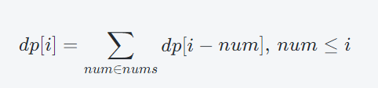

# [ 001. 整数除法](https://leetcode.cn/problems/xoh6Oh)

## 题目描述

<p>给定两个整数 <code>a</code> 和 <code>b</code> ，求它们的除法的商 <code>a/b</code> ，要求不得使用乘号 <code>'*'</code>、除号 <code>'/'</code> 以及求余符号 <code>'%'</code> 。</p>

<p><strong>注意：</strong></p>

<ul>
	<li>整数除法的结果应当截去（<code>truncate</code>）其小数部分，例如：<code>truncate(8.345) = 8</code> 以及 <code>truncate(-2.7335) = -2</code></li>
	<li>假设我们的环境只能存储 32 位有符号整数，其数值范围是 <code>[−2<sup>31</sup>, 2<sup>31</sup>−1]</code>。本题中，如果除法结果溢出，则返回 <code>2<sup>31 </sup>− 1</code></li>
</ul>

<p><strong>示例 1：</strong></p>

<pre>
<strong>输入：</strong>a = 15, b = 2
<strong>输出：</strong>7
<strong><span style="white-space: pre-wrap;">解释：</span></strong>15/2 = truncate(7.5) = 7
</pre>

<p><strong>示例 2：</strong></p>

<pre>
<strong>输入：</strong>a = 7, b = -3
<strong>输出：</strong><span style="white-space: pre-wrap;">-2</span>
<strong><span style="white-space: pre-wrap;">解释：</span></strong>7/-3 = truncate(-2.33333..) = -2</pre>

<p><strong>示例 3：</strong></p>

<pre>
<strong>输入：</strong>a = 0, b = 1
<strong>输出：</strong><span style="white-space: pre-wrap;">0</span></pre>

<p><strong>示例 4：</strong></p>

<pre>
<strong>输入：</strong>a = 1, b = 1
<strong>输出：</strong><span style="white-space: pre-wrap;">1</span></pre>

<p><strong>提示:</strong></p>

<ul>
	<li><code>-2<sup>31</sup> <= a, b <= 2<sup>31</sup> - 1</code></li>
	<li><code>b != 0</code></li>
</ul>

<p>注意：本题与主站 29 题相同：<a href="https://leetcode.cn/problems/divide-two-integers/">https://leetcode.cn/problems/divide-two-integers/</a></p>

## 解法

### **Java**

```java
class Solution {
    public int divide(int a, int b) {
        int sign = 1;
        if ((a < 0) != (b < 0)) {
            sign = -1;
        }
        long x = abs(a);
        long y = abs(b);
        long tot = 0;
        while (x >= y) {
            int cnt = 0;
            while (x >= (y << (cnt + 1))) {
                cnt++;
            }
            tot += 1L << cnt;
            x -= y << cnt;
        }
        long ans = sign * tot;
        if (ans >= Integer.MIN_VALUE && ans <= Integer.MAX_VALUE) {
            return (int) ans;
        }
        return Integer.MAX_VALUE;
    }

    private long abs(long a) {
        if (a < 0) {
            return -a;
        }
        return a;
    }
}
```

位运算

```java
public class Solution {

    public static int divide2(int a, int b) {
        int quotient = 0; // 商
        int remainder = a; // 余数
        while (remainder >= b) {
            int shift = 0; // 移位数
            while ((b << shift) <= remainder) { // 找到最大的移位数
                shift++;
            }
            shift--; // 因为最后一次移位是多余的，所以需要减去1
            quotient += (1 << shift); // 将移位数加到商中
            remainder -= (b << shift); // 减去移位后的值
        }
        return quotient;
    }
}
```

# [ 002. 二进制加法](https://leetcode.cn/problems/JFETK5)

## 题目描述

<p>给定两个 01 字符串 <code>a</code> 和 <code>b</code> ，请计算它们的和，并以二进制字符串的形式输出。</p>

<p>输入为 <strong>非空 </strong>字符串且只包含数字 <code>1</code> 和 <code>0</code>。</p>

<p><strong>示例 1:</strong></p>

<pre>
<strong>输入:</strong> a = "11", b = "10"
<strong>输出:</strong> "101"</pre>

<p><strong>示例 2:</strong></p>

<pre>
<strong>输入:</strong> a = "1010", b = "1011"
<strong>输出:</strong> "10101"</pre>

<p><strong>提示：</strong></p>

<ul>
	<li>每个字符串仅由字符 <code>'0'</code> 或 <code>'1'</code> 组成。</li>
	<li><code>1 <= a.length, b.length <= 10^4</code></li>
	<li>字符串如果不是 <code>"0"</code> ，就都不含前导零。</li>
</ul>

<p><meta charset="UTF-8" />注意：本题与主站 67 题相同：<a href="https://leetcode.cn/problems/add-binary/">https://leetcode.cn/problems/add-binary/</a></p>

## 解法

模拟笔算加法的过程，注意进位

### **Java**

```java
class Solution {
    public String addBinary(String a, String b) {
        int x = a.length() - 1, y = b.length() - 1;
        StringBuilder builder = new StringBuilder();
        int carry = 0;
        while (x >= 0 || y >= 0) {
            if (x >= 0) {
                if (a.charAt(x) == '1') {
                    carry += 1;
                }
                x--;
            }
            if (y >= 0) {
                if (b.charAt(y) == '1') {
                    carry += 1;
                }
                y--;
            }
            builder.append((char) ((carry & 1) + '0'));
            carry >>= 1;
        }
        if (carry == 1) {
            builder.append('1');
        }
        return builder.reverse().toString();
    }
}
```

```java
class Solution {
    public String addBinary(String a, String b) {
        StringBuilder result = new StringBuilder(); // 存储最终结果
        int carry = 0; // 进位

        // 将两个字符串补齐到相同的长度
        while (a.length() < b.length()) {
            a = "0" + a;
        }
        while (a.length() > b.length()) {
            b = "0" + b;
        }

        // 从右往左逐位相加
        for (int i = a.length() - 1; i >= 0; i--) {
            int sum = Character.getNumericValue(a.charAt(i)) + Character.getNumericValue(b.charAt(i)) + carry;
            result.insert(0, sum % 2); // 将当前位的值插入到最终结果的左边
            carry = sum / 2; // 更新进位
        }

        // 如果最终进位不为 0，将进位插入到最终结果的左边
        if (carry != 0) {
            result.insert(0, carry);
        }

        return result.toString();
    }
}
```

# [ 003. 前 n 个数字二进制中 1 的个数](https://leetcode.cn/problems/w3tCBm)

## 题目描述

<p>给定一个非负整数 <code>n</code><b> </b>，请计算 <code>0</code> 到 <code>n</code> 之间的每个数字的二进制表示中 1 的个数，并输出一个数组。</p>

<p><strong>示例 1:</strong></p>

<pre>
<strong>输入: </strong>n =<strong> </strong>2
<strong>输出: </strong>[0,1,1]
<strong>解释: 
</strong>0 --> 0
1 --> 1
2 --> 10
</pre>

<p><strong>示例 2:</strong></p>

<pre>
<strong>输入: </strong>n =<strong> </strong>5
<strong>输出: </strong><code>[0,1,1,2,1,2]
</code><span style="white-space: pre-wrap;"><strong>解释:</strong>
</span>0 --> 0
1 --> 1
2 --> 10
3 --> 11
4 --> 100
5 --> 101
</pre>

<p><strong>说明 :</strong></p>

<ul>
	<li><code>0 <= n <= 10<sup>5</sup></code></li>
</ul>

<p><strong>进阶:</strong></p>

<ul>
	<li>给出时间复杂度为 <code>O(n*sizeof(integer))</code><strong> </strong>的解答非常容易。但你可以在线性时间 <code>O(n)</code><strong> </strong>内用一趟扫描做到吗？</li>
	<li>要求算法的空间复杂度为 <code>O(n)</code> 。</li>
	<li>你能进一步完善解法吗？要求在C++或任何其他语言中不使用任何内置函数（如 C++ 中的 <code>__builtin_popcount</code><strong> </strong>）来执行此操作。</li>
</ul>

<p><meta charset="UTF-8" />注意：本题与主站 338 题相同：<a href="https://leetcode.cn/problems/counting-bits/">https://leetcode.cn/problems/counting-bits/</a></p>

## 解法

### **Java**

```java
class Solution {
    public int[] countBits(int n) {
        int[] dp = new int[n + 1];
        for (int i = 1; i <= n; i++) {
            dp[i] = dp[i & (i - 1)] + 1;
        }
        return dp;
    }
}
```

```java
public class Solution {
    public static int[] countBits2(int n) {
        int[] res = new int[n + 1];
        for (int i = 0; i <= n; i++) {
            res[i] = countOne(i);
        }
        return res;
    }

    //    计算一个整数num的二进制表示中1的个数
    private static int countOne(int num) {
        int count = 0;
        while (num != 0) {
            count++;
            num &= (num - 1);
        }
        return count;
    }

    /*
    对于每个正整数i，它的二进制表示中1的个数可以看作是i右移1位的数字二进制表示中1的个数加上最低位是否为1的结果
    其中，i >> 1表示将i右移1位，即将i的二进制表示向右移动一位，去掉最低位；i & 1表示将i与1进行按位与运算，结果
    为1表示i的最低位是1，结果为0表示i的最低位是0。
    例如，i=7时，i=111,i>>1=011,i&1=001
     */
    public static int[] countBits3(int n) {
        int[] count = new int[n + 1];
        for (int i = 1; i <= n; i++) {
            count[i] = count[i >> 1] + (i & 1);
        }
        return count;
    }
}
```

暴力法

```java
public class CountBits {
    public static int[] countBits(int n) {
        int[] result = new int[n + 1]; // 创建结果数组，长度为 n+1
        for (int i = 0; i <= n; i++) { // 遍历从 0 到 n 的每个数字
            result[i] = countOnes(i); // 调用 countOnes 方法计算当前数字的二进制表示中 1 的个数，并存入结果数组
        }
        return result;
    }

    private static int countOnes(int num) {
        int count = 0;
        while (num > 0) { // 当数字大于 0 时进行循环
            count += num & 1; // 判断当前位是否为 1，如果是则计数器加一
            num >>= 1; // 将数字右移一位，继续判断下一位
        }
        return count;
    }
}
```

# [ 004. 只出现一次的数字](https://leetcode.cn/problems/WGki4K)

## 题目描述

<p>给你一个整数数组 <code>nums</code> ，除某个元素仅出现 <strong>一次</strong> 外，其余每个元素都恰出现 <strong>三次 。</strong>请你找出并返回那个只出现了一次的元素。</p>

<p><strong>示例 1：</strong></p>

<pre>
<strong>输入：</strong>nums = [2,2,3,2]
<strong>输出：</strong>3
</pre>

<p><strong>示例 2：</strong></p>

<pre>
<strong>输入：</strong>nums = [0,1,0,1,0,1,100]
<strong>输出：</strong>100
</pre>

<p><strong>提示：</strong></p>

<ul>
	<li><code>1 <= nums.length <= 3 * 10<sup>4</sup></code></li>
	<li><code>-2<sup>31</sup> <= nums[i] <= 2<sup>31</sup> - 1</code></li>
	<li><code>nums</code> 中，除某个元素仅出现 <strong>一次</strong> 外，其余每个元素都恰出现 <strong>三次</strong></li>
</ul>

<p><strong>进阶：</strong>你的算法应该具有线性时间复杂度。 你可以不使用额外空间来实现吗？</p>
<p><meta charset="UTF-8" />注意：本题与主站 137 题相同：<a href="https://leetcode.cn/problems/single-number-ii/">https://leetcode.cn/problems/single-number-ii/</a></p>

## 解法

统计所有数字每个位中 1 出现的次数，对于某个位，1 出现的次数一定是 3 的倍数 +1 或 0。对这个数 %3 得到的结果就是那个出现一次的数字在该位上的值。

### **Java**

```java
class Solution {
    public int singleNumber(int[] nums) {
        int ans = 0;
        for (int i = 0; i < 32; i++) {
            int cnt = 0;
            for (int num : nums) {
                cnt += num >> i & 1;
            }
            cnt %= 3;
            ans |= cnt << i;
        }
        return ans;
    }
}
```

位运算

```java
public class Solution {
    /*
    使用两个二进制数 ones 和 twos 来分别表示在当前位上出现了一次和两次的二进制位。具体来说，假设当前处理到第 i 位：
    如果 nums 中的第 j 个数在第 i 位上为 1，我们将 ones 的第 i 位和 twos 的第 i 位都设为 1。
    如果 nums 中的第 j 个数在第 i 位上为 0，我们保持 ones 和 twos 的第 i 位都为 0。
    但是，我们需要保证 ones 和 twos 的第 i 位上的数字不同，即 twos 上的第 i 位为 0 时，ones 上的第 i 位为 1，反之亦然。这可以使用位运算的技巧来实现：
    首先，对于出现了一次的数字 x，我们有 ones = x，twos = 0。
    当一个数字出现了两次时，它将会从 ones 中消失，并出现在 twos 中：ones = ones ^ x; twos = x ^ (ones & x)。
    当一个数字出现了三次时，它在 ones 和 twos 中都会消失。
    因此，最终的结果就是 ones。
    时间复杂度为 O(N)，空间复杂度为 O(1)。
     */
    public int singleNumber2(int[] nums) {
        int ones = 0, twos = 0;
        for (int num : nums) {
            ones = ones ^ num & ~twos;
            twos = twos ^ num & ~ones;
        }
        return ones;
    }
}
```

# [ 005. 单词长度的最大乘积](https://leetcode.cn/problems/aseY1I)

## 题目描述

<p>给定一个字符串数组 <code>words</code>，请计算当两个字符串 <code>words[i]</code> 和 <code>words[j]</code> 不包含相同字符时，它们长度的乘积的最大值。假设字符串中只包含英语的小写字母。如果没有不包含相同字符的一对字符串，返回 0。</p>

<p><strong>示例 1:</strong></p>

<pre>
<strong>输入:</strong> words = <code>["abcw","baz","foo","bar","fxyz","abcdef"]</code>
<strong>输出: </strong><code>16 
<strong>解释:</strong> 这两个单词为<strong> </strong></code><code>"abcw", "fxyz"</code>。它们不包含相同字符，且长度的乘积最大。</pre>

<p><strong>示例 2:</strong></p>

<pre>
<strong>输入:</strong> words = <code>["a","ab","abc","d","cd","bcd","abcd"]</code>
<strong>输出: </strong><code>4 
<strong>解释: </strong></code>这两个单词为 <code>"ab", "cd"</code>。</pre>

<p><strong>示例 3:</strong></p>

<pre>
<strong>输入:</strong> words = <code>["a","aa","aaa","aaaa"]</code>
<strong>输出: </strong><code>0 
<strong>解释: </strong>不存在这样的两个单词。</code>
</pre>

<p><strong>提示：</strong></p>

<ul>
	<li><code>2 <= words.length <= 1000</code></li>
	<li><code>1 <= words[i].length <= 1000</code></li>
	<li><code>words[i]</code> 仅包含小写字母</li>
</ul>

<p><meta charset="UTF-8" />注意：本题与主站 318 题相同：<a href="https://leetcode.cn/problems/maximum-product-of-word-lengths/">https://leetcode.cn/problems/maximum-product-of-word-lengths/</a></p>

## 解法

因为只有 26 个小写字符，所以可以用一个 `int32` 存储字符的出现情况，然后枚举最大乘积。

### **Java**

```java
class Solution {
    public int maxProduct(String[] words) {
        int n = words.length;
        int[] masks = new int[n]; // 存储每个字符串的位掩码

        // 构建位掩码数组
        for (int i = 0; i < n; i++) {
            for (char ch : words[i].toCharArray()) {
                masks[i] |= (1 << (ch - 'a')); // 将当前字符对应的二进制位置为1
            }
        }

        int maxProduct = 0; // 最大乘积

        // 计算最大乘积
        for (int i = 0; i < n - 1; i++) {
            for (int j = i + 1; j < n; j++) {
                if ((masks[i] & masks[j]) == 0) { // 判断两个字符串是否含有相同字符，位掩码按位与的结果为0表示不含有相同字符
                    int product = words[i].length() * words[j].length(); // 计算长度乘积
                    maxProduct = Math.max(maxProduct, product); // 更新最大乘积
                }
            }
        }

        return maxProduct;
    }
}
```

hash表

```java
public class Solution {
    public static int maxProduct(String[] words) {
        int n = words.length;
        int maxProduct = 0;

        // 构造每个字符串对应的字符集合
        Set<Character>[] charSets = new HashSet[n];
        for (int i = 0; i < n; i++) {
            charSets[i] = new HashSet<>();
            for (char c : words[i].toCharArray()) {
                charSets[i].add(c);
            }
        }

        // 遍历所有组合，计算乘积的最大值
        for (int i = 0; i < n - 1; i++) {
            for (int j = i + 1; j < n; j++) {
                if (!hasCommonCharacters(charSets[i], charSets[j])) { // 判断两个字符串的字符集合是否不重叠
                    int product = words[i].length() * words[j].length();
                    maxProduct = Math.max(maxProduct, product);
                }
            }
        }

        return maxProduct;
    }

    private static boolean hasCommonCharacters(Set<Character> set1, Set<Character> set2) {
        for (char c : set1) {
            if (set2.contains(c)) {
                return true;
            }
        }
        return false;
    }
}
```

# [ 006. 排序数组中两个数字之和](https://leetcode.cn/problems/kLl5u1)

## 题目描述

<p>给定一个已按照<strong><em> </em>升序排列  </strong>的整数数组 <code>numbers</code> ，请你从数组中找出两个数满足相加之和等于目标数 <code>target</code> 。</p>

<p>函数应该以长度为 <code>2</code> 的整数数组的形式返回这两个数的下标值<em>。</em><code>numbers</code> 的下标 <strong>从 0 开始计数</strong> ，所以答案数组应当满足 <code>0 <= answer[0] < answer[1] < numbers.length</code> 。</p>

<p>假设数组中存在且只存在一对符合条件的数字，同时一个数字不能使用两次。</p>

<p><strong>示例 1：</strong></p>

<pre>
<strong>输入：</strong>numbers = [1,2,4,6,10], target = 8
<strong>输出：</strong>[1,3]
<strong>解释：</strong>2 与 6 之和等于目标数 8 。因此 index1 = 1, index2 = 3 。
</pre>

<p><strong>示例 2：</strong></p>

<pre>
<strong>输入：</strong>numbers = [2,3,4], target = 6
<strong>输出：</strong>[0,2]
</pre>

<p><strong>示例 3：</strong></p>

<pre>
<strong>输入：</strong>numbers = [-1,0], target = -1
<strong>输出：</strong>[0,1]
</pre>

<p><strong>提示：</strong></p>

<ul>
	<li><code>2 <= numbers.length <= 3 * 10<sup>4</sup></code></li>
	<li><code>-1000 <= numbers[i] <= 1000</code></li>
	<li><code>numbers</code> 按 <strong>递增顺序</strong> 排列</li>
	<li><code>-1000 <= target <= 1000</code></li>
	<li>仅存在一个有效答案</li>
</ul>

<p>注意：本题与主站 167 题相似（下标起点不同）：<a href="https://leetcode.cn/problems/two-sum-ii-input-array-is-sorted/">https://leetcode.cn/problems/two-sum-ii-input-array-is-sorted/</a></p>

## 解法

双指针

### **Java**

```java
class Solution {
    public int[] twoSum(int[] numbers, int target) {
        int i = 0, j = numbers.length - 1;
        for (; ; ) {
            if (numbers[i] + numbers[j] < target) {
                i++;
            } else if (numbers[i] + numbers[j] > target) {
                j--;
            } else {
                return new int[]{i, j};
            }
        }
    }
}
```

# [ 007. 数组中和为 0 的三个数](https://leetcode.cn/problems/1fGaJU)

## 题目描述

<p>给定一个包含 <code>n</code> 个整数的数组 <code>nums</code>，判断 <code>nums</code> 中是否存在三个元素 <code>a</code> ，<code>b</code> ，<code>c</code> <em>，</em>使得 <code>a + b + c = 0</code> ？请找出所有和为 <code>0</code> 且 <strong>不重复 </strong>的三元组。</p>

<p><strong>示例 1：</strong></p>

<pre>
<strong>输入：</strong>nums = [-1,0,1,2,-1,-4]
<strong>输出：</strong>[[-1,-1,2],[-1,0,1]]
</pre>

<p><strong>示例 2：</strong></p>

<pre>
<strong>输入：</strong>nums = []
<strong>输出：</strong>[]
</pre>

<p><strong>示例 3：</strong></p>

<pre>
<strong>输入：</strong>nums = [0]
<strong>输出：</strong>[]
</pre>

<p><strong>提示：</strong></p>

<ul>
	<li><code>0 <= nums.length <= 3000</code></li>
	<li><code>-10<sup>5</sup> <= nums[i] <= 10<sup>5</sup></code></li>
</ul>

<p><meta charset="UTF-8" />注意：本题与主站 15 题相同：<a href="https://leetcode.cn/problems/3sum/">https://leetcode.cn/problems/3sum/</a></p>

## 解法

枚举第一个数，然后用双指针确定另外两个数

### **Java**

```java
class Solution {
    public List<List<Integer>> threeSum(int[] nums) {
        int n = nums.length; // 数组长度
        List<List<Integer>> ans = new ArrayList<>(); // 存储结果的列表
        Arrays.sort(nums); // 对数组进行排序，方便后续处理
        for (int i = 0; i < n - 2; i++) { // 遍历数组，寻找三个数之和为0的组合
            if (i > 0 && nums[i] == nums[i - 1]) {
                // 如果当前数字与前一个数字相等，则跳过，避免重复计算
                continue;
            }
            int left = i + 1, right = n - 1; // 设置左右指针
            while (left < right) { // 左右指针未相遇时循环
                int cur = nums[i] + nums[left] + nums[right]; // 当前三个数之和
                if (cur < 0) { // 如果小于0，左指针右移
                    left++;
                } else if (cur > 0) { // 如果大于0，右指针左移
                    right--;
                } else { // 等于0，找到一组解
                    ans.add(Arrays.asList(nums[i], nums[left], nums[right])); // 添加解到结果列表
                    while (left < right && nums[left] == nums[left + 1]) {
                        // 跳过左指针指向的重复元素
                        left++;
                    }
                    while (left < right && nums[right] == nums[right - 1]) {
                        // 跳过右指针指向的重复元素
                        right--;
                    }
                    left++; // 左指针右移
                    right--; // 右指针左移
                }
            }
        }
        return ans; // 返回结果列表
    }
}
```

# [ 008. 和大于等于 target 的最短子数组](https://leetcode.cn/problems/2VG8Kg)

## 题目描述

<p>给定一个含有 <code>n</code><strong> </strong>个正整数的数组和一个正整数 <code>target</code><strong> 。</strong></p>

<p>找出该数组中满足其和<strong> </strong><code>≥ target</code><strong> </strong>的长度最小的 <strong>连续子数组</strong> <code>[nums<sub>l</sub>, nums<sub>l+1</sub>, ..., nums<sub>r-1</sub>, nums<sub>r</sub>]</code> ，并返回其长度<strong>。</strong>如果不存在符合条件的子数组，返回 <code>0</code> 。</p>

<p><strong>示例 1：</strong></p>

<pre>
<strong>输入：</strong>target = 7, nums = [2,3,1,2,4,3]
<strong>输出：</strong>2
<strong>解释：</strong>子数组 <code>[4,3]</code> 是该条件下的长度最小的子数组。
</pre>

<p><strong>示例 2：</strong></p>

<pre>
<strong>输入：</strong>target = 4, nums = [1,4,4]
<strong>输出：</strong>1
</pre>

<p><strong>示例 3：</strong></p>

<pre>
<strong>输入：</strong>target = 11, nums = [1,1,1,1,1,1,1,1]
<strong>输出：</strong>0
</pre>

<p>提示：</p>

<ul>
	<li><code>1 <= target <= 10<sup>9</sup></code></li>
	<li><code>1 <= nums.length <= 10<sup>5</sup></code></li>
	<li><code>1 <= nums[i] <= 10<sup>5</sup></code></li>
</ul>

<p>进阶：</p>

<ul>
	<li>如果你已经实现<em> </em><code>O(n)</code> 时间复杂度的解法, 请尝试设计一个 <code>O(n log(n))</code> 时间复杂度的解法。</li>
</ul>

<p><meta charset="UTF-8" />注意：本题与主站 209 题相同：<a href="https://leetcode.cn/problems/minimum-size-subarray-sum/">https://leetcode.cn/problems/minimum-size-subarray-sum/</a></p>

## 解法

### **Java**

```java
public class Solution {
    /*
    滑动窗口，时间复杂度：O(n)
     */
    public static int minSubArrayLen(int target, int[] nums) {
        int n = nums.length;
        int ans = Integer.MAX_VALUE;
        int sum = 0;
        int left = 0, right = 0;
        while (right < n) {
            sum += nums[right++];
            while (sum >= target) {
                ans = Math.min(ans, right - left);
                sum -= nums[left++];
            }
        }
        return ans == Integer.MAX_VALUE ? 0 : ans;
    }

    /*
    前缀和+二分查找,时间复杂度：O(nlogn)
     */
    public static int minSubArrayLen2(int s, int[] nums) {
        int n = nums.length;
        if (n == 0) {
            return 0;
        }
        int ans = Integer.MAX_VALUE;
        int[] sums = new int[n + 1];
        // 为了方便计算，令 size = n + 1
        // sums[0] = 0 意味着前 0 个元素的前缀和为 0
        // sums[1] = A[0] 前 1 个元素的前缀和为 A[0]
        // 以此类推
        for (int i = 1; i <= n; i++) {
            sums[i] = sums[i - 1] + nums[i - 1];
        }
        for (int i = 1; i <= n; i++) {
            //相加后再去找大于等于target的元素，区间就是[i-1,bound] ==>sums[bound]-sums[i-1]>=s
            int target = s + sums[i - 1];
            int bound = Arrays.binarySearch(sums, target);
            if (bound < 0) {
                bound = -bound - 1;
            }
            if (bound <= n) {
                ans = Math.min(ans, bound - (i - 1));
            }
        }
        return ans == Integer.MAX_VALUE ? 0 : ans;
    }

}
```

# [ 009. 乘积小于 K 的子数组](https://leetcode.cn/problems/ZVAVXX)

## 题目描述

<p>给定一个正整数数组 <code>nums</code>和整数 <code>k</code> ，请找出该数组内乘积小于 <code>k</code> 的连续的子数组的个数。</p>

<p><strong>示例 1:</strong></p>

<pre>
<strong>输入:</strong> nums = [10,5,2,6], k = 100
<strong>输出:</strong> 8
<strong>解释:</strong> 8 个乘积小于 100 的子数组分别为: [10], [5], [2], [6], [10,5], [5,2], [2,6], [5,2,6]。
需要注意的是 [10,5,2] 并不是乘积小于100的子数组。
</pre>

<p><strong>示例 2:</strong></p>

<pre>
<strong>输入:</strong> nums = [1,2,3], k = 0
<strong>输出:</strong> 0</pre>

<p><strong>提示: </strong></p>

<ul>
	<li><code>1 <= nums.length <= 3 * 10<sup>4</sup></code></li>
	<li><code>1 <= nums[i] <= 1000</code></li>
	<li><code>0 <= k <= 10<sup>6</sup></code></li>
</ul>

<p><meta charset="UTF-8" />注意：本题与主站 713 题相同：<a href="https://leetcode.cn/problems/subarray-product-less-than-k/">https://leetcode.cn/problems/subarray-product-less-than-k/</a> </p>

## 解法

利用滑动窗口，我们能求出每个不同 `right` 结尾的合法子数组的个数

### **Java**

```java
class Solution {
    public int numSubarrayProductLessThanK(int[] nums, int k) {
        int n = nums.length; // 数组长度
        int ans = 0; // 结果计数器
        int sum = 1; // 当前子数组的乘积
        int left = 0, right = 0; // 左右指针
        while (right < n) { // 右指针未到达数组末尾时循环
            sum *= nums[right++]; // 更新当前子数组的乘积并将右指针右移
            while (sum >= k && left < right) {
                // 当当前子数组的乘积大于等于k且左指针小于右指针时循环
                sum /= nums[left++]; // 更新当前子数组的乘积并将左指针右移
            }
            ans += right - left; // 统计乘积小于k的子数组个数
        }
        return ans; // 返回结果
    }
}
```

# [ 010. 和为 k 的子数组](https://leetcode.cn/problems/QTMn0o)

## 题目描述

<p>给定一个正整数数组和一个整数 <code>k</code><strong> ，</strong>请找到该数组中和为 <code>k</code><strong> </strong>的连续子数组的个数。</p>

<p><strong>示例 1 :</strong></p>

<pre>
<strong>输入:</strong>nums = [1,1,1], k = 2
<strong>输出:</strong> 2
<strong>解释:</strong> 此题 [1,1] 与 [1,1] 为两种不同的情况
</pre>

<p><strong>示例 2 :</strong></p>

<pre>
<strong>输入:</strong>nums = [1,2,3], k = 3
<strong>输出:</strong> 2
</pre>

<p><strong>提示:</strong></p>

<ul>
	<li><code>1 <= nums.length <= 2 * 10<sup>4</sup></code></li>
	<li><code>1000 <= nums[i] <= 1000</code></li>
	<li>
	<p><code>-10<sup>7</sup> <= k <= 10<sup>7</sup></code></p>
	</li>
</ul>

<p>注意：本题与主站 560 题相同： <a href="https://leetcode.cn/problems/subarray-sum-equals-k/">https://leetcode.cn/problems/subarray-sum-equals-k/</a></p>

## 解法

数组中既有正数又有负数，无法使用双指针。可以利用前缀和思想，快速判断子数组的和

### **Java**

```java
class Solution {
    /*
    首先用一个数组presum来存储原数组的前缀和，即presum[i]表示原数组中前i个数的和。
    然后用一个哈希表map来存储presum中每个数出现的次数。map的key为presum中的值，value为该值出现的次数。
    从前往后遍历presum数组，设当前遍历到的位置为i。假设我们要找到和为k的连续子数组个数，那么我们需要找到presum[j]和presum[i]之间的差为k。
    也就是说，如果presum[i]-k在map中出现过，那么说明从presum[j+1]到presum[i]这个区间的和为k，将这个区间的个数累加到答案中。
    将presum[i]加入到map中，表示该值出现了一次，继续遍历下一个元素。
     */
    public static int subarraySum(int[] nums, int k) {
        Map<Integer, Integer> map = new HashMap<>();
        int ans = 0, sumVal = 0;//前缀和：数组从头到尾的sum列表，例如数组[1,2,3,4,5]的前缀和为[1,3,6,10,15]
        map.put(0, 1);
        for (int num : nums) {
            sumVal += num;
//            假设map[j]~map[i]连续且map[j]-map[i]=k,则i~j中和为k的连续数组个数为map[j]-k
            ans += map.getOrDefault(sumVal - k, 0);
//            如果key存在，则value=新value+旧value；Integer::sum为求和的静态方法
            map.merge(sumVal, 1, Integer::sum);
        }
        return ans;
    }
}
```

前缀和

```java
public class Solution {
    public static int subarraySum(int[] nums, int k) {
        int count = 0;
        int n = nums.length;

        for (int start = 0; start < n; start++) {
            int sum = 0;
            for (int end = start; end < n; end++) {
                sum += nums[end];
                if (sum == k) {
                    count++;
                }
            }
        }
        return count;
    }
}
```

# [ 011. 0 和 1 个数相同的子数组](https://leetcode.cn/problems/A1NYOS)

## 题目描述

<p>给定一个二进制数组 <code>nums</code> , 找到含有相同数量的 <code>0</code> 和 <code>1</code> 的最长连续子数组，并返回该子数组的长度。</p>

<p><strong>示例 1:</strong></p>

<pre>
<strong>输入:</strong> nums = [0,1]
<strong>输出:</strong> 2
<strong>说明:</strong> [0, 1] 是具有相同数量 0 和 1 的最长连续子数组。</pre>

<p><strong>示例 2:</strong></p>

<pre>
<strong>输入:</strong> nums = [0,1,0]
<strong>输出:</strong> 2
<strong>说明:</strong> [0, 1] (或 [1, 0]) 是具有相同数量 0 和 1 的最长连续子数组。</pre>

<p><strong>提示：</strong></p>

<ul>
	<li><code>1 <= nums.length <= 10<sup>5</sup></code></li>
	<li><code>nums[i]</code> 不是 <code>0</code> 就是 <code>1</code></li>
</ul>

<p><meta charset="UTF-8" />注意：本题与主站 525 题相同： <a href="https://leetcode.cn/problems/contiguous-array/">https://leetcode.cn/problems/contiguous-array/</a></p>

## 解法

前缀和 + 哈希表，把 0 当作 -1 处理，题目变成求和为 0 的子数组。

遍历数组，用哈希表 mp 记录某个前缀和第一次出现的位置。初始值 `mp[0] = -1`。

当前缀和 s 在此前出现过，说明这两个前缀和区间差构成的所有元素和为 0，满足条件，更新 ans 值。否则将 s 记录到 mp 中。

最后返回 ans。

> 这里初始化 `mp[0] = -1`，是为了统一操作。当数组从第一个元素开始的前 n 个元素的和为 0 时，也可以用 `ans = max(ans, i - mp[s])`。

### **Java**

```java
class Solution {
    public int findMaxLength(int[] nums) {
        Map<Integer, Integer> mp = new HashMap<>();
        mp.put(0, -1);
        int s = 0, ans = 0;
        for (int i = 0; i < nums.length; ++i) {
            s += nums[i] == 1 ? 1 : -1;
            if (mp.containsKey(s)) {
                ans = Math.max(ans, i - mp.get(s));
            } else {
                mp.put(s, i);
            }
        }
        return ans;
    }
}
```

# [ 012. 左右两边子数组的和相等](https://leetcode.cn/problems/tvdfij)

## 题目描述

<p>给你一个整数数组 <code>nums</code> ，请计算数组的 <strong>中心下标 </strong>。</p>

<p>数组<strong> 中心下标</strong><strong> </strong>是数组的一个下标，其左侧所有元素相加的和等于右侧所有元素相加的和。</p>

<p>如果中心下标位于数组最左端，那么左侧数之和视为 <code>0</code> ，因为在下标的左侧不存在元素。这一点对于中心下标位于数组最右端同样适用。</p>

<p>如果数组有多个中心下标，应该返回 <strong>最靠近左边</strong> 的那一个。如果数组不存在中心下标，返回 <code>-1</code> 。</p>

<p><strong>示例 1：</strong></p>

<pre>
<strong>输入：</strong>nums = [1,7,3,6,5,6]
<strong>输出：</strong>3
<strong>解释：</strong>
中心下标是 3 。
左侧数之和 sum = nums[0] + nums[1] + nums[2] = 1 + 7 + 3 = 11 ，
右侧数之和 sum = nums[4] + nums[5] = 5 + 6 = 11 ，二者相等。
</pre>

<p><strong>示例 2：</strong></p>

<pre>
<strong>输入：</strong>nums = [1, 2, 3]
<strong>输出：</strong>-1
<strong>解释：</strong>
数组中不存在满足此条件的中心下标。</pre>

<p><strong>示例 3：</strong></p>

<pre>
<strong>输入：</strong>nums = [2, 1, -1]
<strong>输出：</strong>0
<strong>解释：</strong>
中心下标是 0 。
左侧数之和 sum = 0 ，（下标 0 左侧不存在元素），
右侧数之和 sum = nums[1] + nums[2] = 1 + -1 = 0 。</pre>

<p><strong>提示：</strong></p>

<ul>
	<li><code>1 <= nums.length <= 10<sup>4</sup></code></li>
	<li><code>-1000 <= nums[i] <= 1000</code></li>
</ul>

<p><meta charset="UTF-8" />注意：本题与主站 724 题相同： <a href="https://leetcode.cn/problems/find-pivot-index/">https://leetcode.cn/problems/find-pivot-index/</a></p>

## 解法

用前缀和进行预处理，避免重复计算

### **Java**

```java
class Solution {
    public int pivotIndex(int[] nums) {
        int n = nums.length;
        int[] sum = new int[n + 1];
        for (int i = 1; i <= n; i++) {
            sum[i] = sum[i - 1] + nums[i - 1];
        }
        for (int i = 0; i < n; i++) {
            if (sum[i] == sum[n] - sum[i + 1]) {
                return i;
            }
        }
        return -1;
    }
}
```

# [ 013. 二维子矩阵的和](https://leetcode.cn/problems/O4NDxx)

## 题目描述

<p><big><small>给定一个二维矩阵 <code>matrix</code>，</small></big>以下类型的多个请求：</p>

<ul>
	<li><big><small>计算其子矩形范围内元素的总和，该子矩阵的左上角为 <code>(row1, col1)</code> ，右下角为 <code>(row2, col2)</code> 。</small></big></li>
</ul>

<p>实现 <code>NumMatrix</code> 类：</p>

<ul>
	<li><code>NumMatrix(int[][] matrix)</code> 给定整数矩阵 <code>matrix</code> 进行初始化</li>
	<li><code>int sumRegion(int row1, int col1, int row2, int col2)</code> 返回<big><small>左上角</small></big><big><small> <code>(row1, col1)</code> 、右下角 <code>(row2, col2)</code></small></big> 的子矩阵的元素总和。</li>
</ul>

<p><strong>示例 1：</strong></p>

<p></p>

<pre>
<strong>输入:</strong>
["NumMatrix","sumRegion","sumRegion","sumRegion"]
[[[[3,0,1,4,2],[5,6,3,2,1],[1,2,0,1,5],[4,1,0,1,7],[1,0,3,0,5]]],[2,1,4,3],[1,1,2,2],[1,2,2,4]]
<strong>输出:</strong>
[null, 8, 11, 12]
 
<strong>解释:</strong>
NumMatrix numMatrix = new NumMatrix([[3,0,1,4,2],[5,6,3,2,1],[1,2,0,1,5],[4,1,0,1,7],[1,0,3,0,5]]]);
numMatrix.sumRegion(2, 1, 4, 3); // return 8 (红色矩形框的元素总和)
numMatrix.sumRegion(1, 1, 2, 2); // return 11 (绿色矩形框的元素总和)
numMatrix.sumRegion(1, 2, 2, 4); // return 12 (蓝色矩形框的元素总和)
</pre>

<p><strong>提示：</strong></p>

<ul>
	<li><code>m == matrix.length</code></li>
	<li><code>n == matrix[i].length</code></li>
	<li><code>1 <= m, n <= 200</code><meta charset="UTF-8" /></li>
	<li><code>-10<sup>5</sup> <= matrix[i][j] <= 10<sup>5</sup></code></li>
	<li><code>0 <= row1 <= row2 < m</code></li>
	<li><code>0 <= col1 <= col2 < n</code></li>
	<li><meta charset="UTF-8" />最多调用 <code>10<sup>4</sup></code> 次 <code>sumRegion</code> 方法</li>
</ul>

<p><meta charset="UTF-8" />注意：本题与主站 304 题相同： <a href="https://leetcode.cn/problems/range-sum-query-2d-immutable/">https://leetcode.cn/problems/range-sum-query-2d-immutable/</a></p>

## 解法

动态规划-二维前缀和。

### **Java**

```java
class NumMatrix {
    private int[][] pre;

    public Solution(int[][] matrix) {
        int m = matrix.length, n = matrix[0].length;
        pre = new int[m + 1][n + 1];
//        计算二维矩阵的前缀和
        for (int i = 1; i <= m; ++i) {
            for (int j = 1; j <= n; ++j) {
                pre[i][j] = pre[i - 1][j] + pre[i][j - 1] - pre[i - 1][j - 1] + matrix[i - 1][j - 1];
            }
        }
    }

    /*
    当前前缀和-行的前缀和-列的前缀和
     */
    public int sumRegion(int row1, int col1, int row2, int col2) {
        return pre[row2 + 1][col2 + 1] - pre[row2 + 1][col1] - pre[row1][col2 + 1] + pre[row1][col1];
    }
}
```

# [ 014. 字符串中的变位词](https://leetcode.cn/problems/MPnaiL)

## 题目描述

<p>给定两个字符串 <code>s1</code> 和 <code>s2</code>，写一个函数来判断 <code>s2</code> 是否包含 <code>s1</code><strong> </strong>的某个变位词。</p>

<p>换句话说，第一个字符串的排列之一是第二个字符串的 <strong>子串</strong> 。</p>

<p><strong>示例 1：</strong></p>

<pre>
<strong>输入: </strong>s1 = "ab" s2 = "eidbaooo"
<strong>输出: </strong>True
<strong>解释:</strong> s2 包含 s1 的排列之一 ("ba").
</pre>

<p><strong>示例 2：</strong></p>

<pre>
<strong>输入: </strong>s1= "ab" s2 = "eidboaoo"
<strong>输出:</strong> False
</pre>

<p><strong>提示：</strong></p>

<ul>
	<li><code>1 <= s1.length, s2.length <= 10<sup>4</sup></code></li>
	<li><code>s1</code> 和 <code>s2</code> 仅包含小写字母</li>
</ul>

<p><meta charset="UTF-8" />注意：本题与主站 567 题相同： <a href="https://leetcode.cn/problems/permutation-in-string/">https://leetcode.cn/problems/permutation-in-string/</a></p>

## 解法

维护一个长度固定的窗口向前滑动

### **Java**

```java
class Solution {
    /*
  滑动窗口
   */
    public static boolean checkInclusion(String s1, String s2) {
        int len1 = s1.length();
        int len2 = s2.length();
        if (len1 > len2) {
            return false;
        }
        int[] count = new int[26];
        //count=[1, 1, 1, 0, 0, 0, 0, 0, 0, 0, 0, 0, 0, 0, 0, 0, 0, 0, 0, 0, 0, 0, 0, 0, 0, 0]
        for (int i = 0; i < len1; i++) {
            count[s1.charAt(i) - 'a']++;
        }
        int[] window = new int[26];
        //window=[0, 0, 0, 1, 1, 0, 0, 0, 1, 0, 0, 0, 0, 0, 0, 0, 0, 0, 0, 0, 0, 0, 0, 0, 0, 0]
        //取前len1长度作为滑动窗口
        for (int i = 0; i < len1; i++) {
            window[s2.charAt(i) - 'a']++;
        }

        if (Arrays.equals(count, window)) {
            return true;
        }
        for (int i = len1; i < len2; i++) {
            //s2的长度为len1的滑动窗口右移，所以要把前面添加到s2里的元素-1
            window[s2.charAt(i - len1) - 'a']--;
            window[s2.charAt(i) - 'a']++;
            if (Arrays.equals(count, window)) {
                return true;
            }
        }
        return false;
    }
}
```

# [ 015. 字符串中的所有变位词](https://leetcode.cn/problems/VabMRr)

## 题目描述

<p>给定两个字符串 <code>s</code> 和<b> </b><code>p</code>，找到 <code>s</code><strong> </strong>中所有 <code>p</code> 的 <strong>变位词 </strong>的子串，返回这些子串的起始索引。不考虑答案输出的顺序。</p>

<p><strong>变位词 </strong>指字母相同，但排列不同的字符串。</p>

<p><strong>示例 1:</strong></p>

<pre>
<strong>输入: </strong>s = "cbaebabacd", p = "abc"
<strong>输出: </strong>[0,6]
<strong>解释:</strong>
起始索引等于 0 的子串是 "cba", 它是 "abc" 的变位词。
起始索引等于 6 的子串是 "bac", 它是 "abc" 的变位词。
</pre>

<p><strong> 示例 2:</strong></p>

<pre>
<strong>输入: </strong>s = "abab", p = "ab"
<strong>输出: </strong>[0,1,2]
<strong>解释:</strong>
起始索引等于 0 的子串是 "ab", 它是 "ab" 的变位词。
起始索引等于 1 的子串是 "ba", 它是 "ab" 的变位词。
起始索引等于 2 的子串是 "ab", 它是 "ab" 的变位词。
</pre>

<p><strong>提示:</strong></p>

<ul>
	<li><code>1 <= s.length, p.length <= 3 * 10<sup>4</sup></code></li>
	<li><code>s</code> 和 <code>p</code> 仅包含小写字母</li>
</ul>

<p>注意：本题与主站 438 题相同： <a href="https://leetcode.cn/problems/find-all-anagrams-in-a-string/" style="background-color: rgb(255, 255, 255);">https://leetcode.cn/problems/find-all-anagrams-in-a-string/</a></p>

## 解法

和上一题一样的思路，利用固定长度滑动窗口

### **Java**

```java
class Solution {
    public List<Integer> findAnagrams(String s, String p) {
        List<Integer> ans = new ArrayList<>();
        int m = s.length(), n = p.length();
        if (n > m) {
            return ans;
        }
        int[] window = new int[26];
        for (int i = 0; i < n; i++) {
            window[p.charAt(i) - 'a']++;
            window[s.charAt(i) - 'a']--;
        }
        if (check(window)) {
            ans.add(0);
        }
        for (int i = n; i < m; i++) {
            window[s.charAt(i) - 'a']--;
            window[s.charAt(i - n) - 'a']++;
            if (check(window)) {
                ans.add(i - n + 1);
            }
        }
        return ans;
    }

    private boolean check(int[] window) {
        return Arrays.stream(window).allMatch(cnt -> cnt == 0);
    }
}
```

# [ 016. 不含重复字符的最长子字符串](https://leetcode.cn/problems/wtcaE1)

## 题目描述

<p>给定一个字符串 <code>s</code> ，请你找出其中不含有重复字符的 <strong>最长连续子字符串 </strong>的长度。</p>

<p><strong>示例 1:</strong></p>

<pre>
<strong>输入: </strong>s = "abcabcbb"
<strong>输出: </strong>3
<strong>解释:</strong> 因为无重复字符的最长子字符串是 <code>"abc"，所以其</code>长度为 3。
</pre>

<p><strong>示例 2:</strong></p>

<pre>
<strong>输入: </strong>s = "bbbbb"
<strong>输出: </strong>1
<strong>解释: </strong>因为无重复字符的最长子字符串是 <code>"b"</code>，所以其长度为 1。
</pre>

<p><strong>示例 3:</strong></p>

<pre>
<strong>输入: </strong>s = "pwwkew"
<strong>输出: </strong>3
<strong>解释: </strong>因为无重复字符的最长子串是 <code>"wke"</code>，所以其长度为 3。
     请注意，你的答案必须是 <strong>子串 </strong>的长度，<code>"pwke"</code> 是一个<em>子序列，</em>不是子串。
</pre>

<p><strong>示例 4:</strong></p>

<pre>
<strong>输入: </strong>s = ""
<strong>输出: </strong>0
</pre>

<p><strong>提示：</strong></p>

<ul>
	<li><code>0 <= s.length <= 5 * 10<sup>4</sup></code></li>
	<li><code>s</code> 由英文字母、数字、符号和空格组成</li>
</ul>

<p><meta charset="UTF-8" />注意：本题与主站 3 题相同： <a href="https://leetcode.cn/problems/longest-substring-without-repeating-characters/">https://leetcode.cn/problems/longest-substring-without-repeating-characters/</a></p>

## 解法

因为 `s` 中可能会出现字母、数字、符号和空格，所以可以用哈希表表示窗口

### **Java**

```java
class Solution {
    public int lengthOfLongestSubstring(String s) {
        Map<Character, Integer> window = new HashMap<>(); // 用于存储字符及其出现次数
        int n = s.length(); // 字符串的长度
        int ans = 0; // 最长连续子字符串的长度
        int left = 0; // 滑动窗口的左边界
        int right = 0; // 滑动窗口的右边界

        while (right < n) { // 右指针未到达字符串末尾时
            char ch = s.charAt(right++); // 获取当前字符并将右指针右移一位
            window.merge(ch, 1, Integer::sum); // 将字符添加到窗口中，并更新出现次数

            while (window.get(ch) > 1) { // 当前字符重复
                window.merge(s.charAt(left++), -1, Integer::sum); // 移动左指针，删除窗口中最左边的字符，并更新出现次数
            }

            ans = Math.max(ans, right - left); // 更新最长连续子字符串的长度
        }

        return ans; // 返回最长连续子字符串的长度
    }
}
```

# [ 017. 含有所有字符的最短字符串](https://leetcode.cn/problems/M1oyTv)

## 题目描述

<p>给定两个字符串 <code>s</code> 和 <code>t</code> 。返回 <code>s</code> 中包含 <code>t</code> 的所有字符的最短子字符串。如果 <code>s</code> 中不存在符合条件的子字符串，则返回空字符串 <code>""</code> 。</p>

<p>如果 <code>s</code> 中存在多个符合条件的子字符串，返回任意一个。</p>

<p><strong>注意： </strong>对于 <code>t</code> 中重复字符，我们寻找的子字符串中该字符数量必须不少于 <code>t</code> 中该字符数量。</p>

<p><strong>示例 1：</strong></p>

<pre>
<strong>输入：</strong>s = "ADOBECODEBANC", t = "ABC"
<strong>输出：</strong>"BANC"
<strong>解释：</strong>最短子字符串 "BANC" 包含了字符串 t 的所有字符 'A'、'B'、'C'</pre>

<p><strong>示例 2：</strong></p>

<pre>
<strong>输入：</strong>s = "a", t = "a"
<strong>输出：</strong>"a"
</pre>

<p><strong>示例 3：</strong></p>

<pre>
<strong>输入：</strong>s = "a", t = "aa"
<strong>输出：</strong>""
<strong>解释：</strong>t 中两个字符 'a' 均应包含在 s 的子串中，因此没有符合条件的子字符串，返回空字符串。</pre>

<p><strong>提示：</strong></p>

<ul>
	<li><code>1 <= s.length, t.length <= 10<sup>5</sup></code></li>
	<li><code>s</code> 和 <code>t</code> 由英文字母组成</li>
</ul>

<p><strong>进阶：</strong>你能设计一个在 <code>o(n)</code> 时间内解决此问题的算法吗？</p>

<p><meta charset="UTF-8" />注意：本题与主站 76 题相似（本题答案不唯一）：<a href="https://leetcode.cn/problems/minimum-window-substring/">https://leetcode.cn/problems/minimum-window-substring/</a></p>

## 解法

滑动窗口，当窗口包含全部需要的的字符后，进行收缩，以求得最小长度

进阶解法：利用 `count` 变量避免重复对 `need` 和 `window` 进行扫描

### **Java**

```java
class Solution {
    public String minWindow(String s, String t) {
        int m = s.length(), n = t.length();
        if (n > m) {
            return "";
        }
        Map<Character, Integer> need = new HashMap<>();
        Map<Character, Integer> window = new HashMap<>();
        for (char ch : t.toCharArray()) {
            need.merge(ch, 1, Integer::sum);
        }
        int start = 0, minLen = Integer.MAX_VALUE;
        int left = 0, right = 0;
        while (right < m) {
            window.merge(s.charAt(right++), 1, Integer::sum);
            while (check(need, window)) {
                if (right - left < minLen) {
                    minLen = right - left;
                    start = left;
                }
                window.merge(s.charAt(left++), -1, Integer::sum);
            }
        }
        return minLen == Integer.MAX_VALUE ? "" : s.substring(start, start + minLen);
    }

    private boolean check(Map<Character, Integer> need, Map<Character, Integer> window) {
        for (Map.Entry<Character, Integer> entry : need.entrySet()) {
            if (window.getOrDefault(entry.getKey(), 0) < entry.getValue()) {
                return false;
            }
        }
        return true;
    }
}
```

进阶解法

```java
class Solution {
    public String minWindow(String s, String t) {
        int m = s.length(), n = t.length();
        if (n > m) {
            return "";
        }
        Map<Character, Integer> need = new HashMap<>();
        Map<Character, Integer> window = new HashMap<>();
        int needCount = 0, windowCount = 0;
        for (char ch : t.toCharArray()) {
            if (!need.containsKey(ch)) {
                needCount++;
            }
            need.merge(ch, 1, Integer::sum);
        }
        int start = 0, minLen = Integer.MAX_VALUE;
        int left = 0, right = 0;
        while (right < m) {
            char ch = s.charAt(right++);
            if (need.containsKey(ch)) {
                int val = window.getOrDefault(ch, 0) + 1;
                if (val == need.get(ch)) {
                    windowCount++;
                }
                window.put(ch, val);
            }
            while (windowCount == needCount) {
                if (right - left < minLen) {
                    minLen = right - left;
                    start = left;
                }
                ch = s.charAt(left++);
                if (need.containsKey(ch)) {
                    int val = window.get(ch);
                    if (val == need.get(ch)) {
                        windowCount--;
                    }
                    window.put(ch, val - 1);
                }
            }
        }
        return minLen == Integer.MAX_VALUE ? "" : s.substring(start, start + minLen);
    }
}
```

双指针+哈希表,时间复杂度为 O(n)，空间复杂度为 O(m)

首先，用一个哈希表来记录字符串 t 中每个字符出现的次数。然后，用双指针 left 和 right 来表示要查找的子串在 s 中的位置。

将 right 指针不断右移，直到找到了包含 t 所有字符的子串。在移动过程中，使用一个哈希表来记录 s 中每个字符出现的次数，当

哈希表中的某个字符出现次数大于在 t 中出现的次数时，说明当前子串中该字符出现过多，需要将 left 指针右移，直到该字符出现次数满足要求。

最后，如果找到了符合要求的子串，就更新答案；然后将 left 指针右移，继续查找下一个子串。最终，得到的答案就是最短的符合要求的子串。

```java
public class Solution {
    public static String minWindow2(String s, String t) {
        Map<Character, Integer> map = new HashMap<>();  // 用于存储字符及其对应出现次数的映射关系
        for (char c : t.toCharArray()) {
            map.merge(c, 1, Integer::sum);  // 将字符串 t 中的字符及其出现次数添加到映射中
        }
        int left = 0, right = 0, count = map.size();  // 初始化左右指针和字符种类数
        int start = 0, end = Integer.MAX_VALUE;  // 初始化最小窗口的起始位置和结束位置
        while (right < s.length()) {
            char c = s.charAt(right);  // 获取右指针所指向的字符
            if (map.containsKey(c)) {  // 如果映射中包含该字符
                map.put(c, map.get(c) - 1);  // 更新该字符的出现次数
                if (map.get(c) == 0) {  // 如果该字符的出现次数为0
                    count--;  // 减少需要匹配的字符种类数
                }
            }
            right++;  // 右指针右移
            while (count == 0) {  // 当匹配的字符种类数为0时，即达到了一个有效窗口
                if (right - left < end - start) {  // 更新最小窗口的起始位置和结束位置
                    start = left;
                    end = right;
                }
                char c1 = s.charAt(left);  // 获取左指针所指向的字符
                if (map.containsKey(c1)) {  // 如果映射中包含该字符
                    map.put(c1, map.get(c1) + 1);  // 恢复该字符的出现次数
                    if (map.get(c1) > 0) {  // 如果该字符的出现次数大于0
                        count++;  // 增加需要匹配的字符种类数
                    }
                }
                left++;  // 左指针右移
            }
        }
        return end == Integer.MAX_VALUE ? "" : s.substring(start, end);  // 返回最小窗口的子串
    }
}
```

# [ 018. 有效的回文](https://leetcode.cn/problems/XltzEq)

## 题目描述

<p>给定一个字符串 <code>s</code> ，验证 <code>s</code> 是否是 <strong>回文串 </strong>，只考虑字母和数字字符，可以忽略字母的大小写。</p>

<p>本题中，将空字符串定义为有效的 <strong>回文串 </strong>。</p>

<p><strong>示例 1:</strong></p>

<pre>
<strong>输入: </strong>s =<strong> </strong>"A man, a plan, a canal: Panama"
<strong>输出:</strong> true
<strong>解释：</strong>"amanaplanacanalpanama" 是回文串</pre>

<p><strong>示例 2:</strong></p>

<pre>
<strong>输入:</strong> s = "race a car"
<strong>输出:</strong> false
解释："raceacar" 不是回文串</pre>

<p><strong>提示：</strong></p>

<ul>
	<li><code>1 <= s.length <= 2 * 10<sup>5</sup></code></li>
	<li>字符串 <code>s</code> 由 ASCII 字符组成</li>
</ul>

<p><meta charset="UTF-8" />注意：本题与主站 125 题相同： <a href="https://leetcode.cn/problems/valid-palindrome/">https://leetcode.cn/problems/valid-palindrome/</a></p>

## 解法

### **Java**

```java
class Solution {
    public boolean isPalindrome(String s) {
        int i = 0, j = s.length() - 1;
        while (i < j) {
            while (i < j && !Character.isLetterOrDigit(s.charAt(i))) {
                i++;
            }
            while (i < j && !Character.isLetterOrDigit(s.charAt(j))) {
                j--;
            }
            if (Character.toLowerCase(s.charAt(i)) != Character.toLowerCase(s.charAt(j))) {
                return false;
            }
            i++;
            j--;
        }
        return true;
    }
}
```

# [ 019. 最多删除一个字符得到回文](https://leetcode.cn/problems/RQku0D)

## 题目描述

<p>给定一个非空字符串 <code>s</code>，请判断如果 <strong>最多 </strong>从字符串中删除一个字符能否得到一个回文字符串。</p>

<p><strong>示例 1:</strong></p>

<pre>
<strong>输入:</strong> s = "aba"
<strong>输出:</strong> true
</pre>

<p><strong>示例 2:</strong></p>

<pre>
<strong>输入:</strong> s = "abca"
<strong>输出:</strong> true
<strong>解释:</strong> 可以删除 "c" 字符 或者 "b" 字符
</pre>

<p><strong>示例 3:</strong></p>

<pre>
<strong>输入:</strong> s = "abc"
<strong>输出:</strong> false</pre>

<p><strong>提示:</strong></p>

<ul>
	<li><code>1 <= s.length <= 10<sup>5</sup></code></li>
	<li><code>s</code> 由小写英文字母组成</li>
</ul>

<p><meta charset="UTF-8" />注意：本题与主站 680 题相同： <a href="https://leetcode.cn/problems/valid-palindrome-ii/">https://leetcode.cn/problems/valid-palindrome-ii/</a></p>

## 解法

双指针，当 `s[i]` 不等于 `s[j]` 时，分别尝试跳过 `i` 或跳过 `j`。

### **Java**

```java
class Solution {
    public boolean validPalindrome(String s) {
        for (int i = 0, j = s.length() - 1; i < j; ++i, --j) {
            if (s.charAt(i) != s.charAt(j)) {
                return check(s, i + 1, j) || check(s, i, j - 1);
            }
        }
        return true;
    }

    private boolean check(String s, int i, int j) {
        for (; i < j; ++i, --j) {
            if (s.charAt(i) != s.charAt(j)) {
                return false;
            }
        }
        return true;
    }
}
```

# [ 020. 回文子字符串的个数](https://leetcode.cn/problems/a7VOhD)

## 题目描述

<p>给定一个字符串 <code>s</code> ，请计算这个字符串中有多少个回文子字符串。</p>

<p>具有不同开始位置或结束位置的子串，即使是由相同的字符组成，也会被视作不同的子串。</p>

<p><strong>示例 1：</strong></p>

<pre>
<strong>输入：</strong>s = "abc"
<strong>输出：</strong>3
<strong>解释：</strong>三个回文子串: "a", "b", "c"
</pre>

<p><strong>示例 2：</strong></p>

<pre>
<strong>输入：</strong>s =<strong> </strong>"aaa"
<strong>输出：</strong>6
<strong>解释：</strong>6个回文子串: "a", "a", "a", "aa", "aa", "aaa"</pre>

<p><strong>提示：</strong></p>

<ul>
	<li><code>1 <= s.length <= 1000</code></li>
	<li><code>s</code> 由小写英文字母组成</li>
</ul>

<p><meta charset="UTF-8" />注意：本题与主站 647 题相同：<a href="https://leetcode.cn/problems/palindromic-substrings/">https://leetcode.cn/problems/palindromic-substrings/</a> </p>

## 解法

**方法一：从中心向两侧扩展回文串**

我们可以枚举回文串的中间点，然后向左右两边扩展，统计回文串的数量。注意，回文串可能包含奇数个字符，也可能不包含。因此这两种情况都要考虑。

时间复杂度 $O(n^2)$，其中 $n$ 是字符串 `s` 的长度。

**方法二：Manacher 算法**

在 Manacher 算法的计算过程中，用 $p[i]-1$ 表示以第 $i$ 位为中心的最大回文长度，以第 $i$ 位为中心的回文串数量为 $\left \lceil \frac{p[i]-1}{2} \right \rceil$。

时间复杂度 $O(n)$，空间复杂度 $O(n)$。其中 $n$ 是字符串 `s` 的长度。

### **Java**

```java
class Solution {
    private String s;

    public int countSubstrings(String s) {
        int ans = 0;
        this.s = s;
        for (int i = 0; i < s.length(); ++i) {
            ans += f(i, i);
            ans += f(i, i + 1);
        }
        return ans;
    }

    private int f(int i, int j) {
        int cnt = 0;
        for (; i >= 0 && j < s.length() && s.charAt(i) == s.charAt(j); --i, ++j) {
            ++cnt;
        }
        return cnt;
    }
}
```

```java
class Solution {
    public int countSubstrings(String s) {
        StringBuilder sb = new StringBuilder("^#");
        for (char ch : s.toCharArray()) {
            sb.append(ch).append('#');
        }
        String t = sb.append('$').toString();
        int n = t.length();
        int[] p = new int[n];
        int pos = 0, maxRight = 0;
        int ans = 0;
        for (int i = 1; i < n - 1; i++) {
            p[i] = maxRight > i ? Math.min(maxRight - i, p[2 * pos - i]) : 1;
            while (t.charAt(i - p[i]) == t.charAt(i + p[i])) {
                p[i]++;
            }
            if (i + p[i] > maxRight) {
                maxRight = i + p[i];
                pos = i;
            }
            ans += p[i] / 2;
        }
        return ans;
    }
}
```

# [ 021. 删除链表的倒数第 n 个结点](https://leetcode.cn/problems/SLwz0R)

## 题目描述

<p>给定一个链表，删除链表的倒数第 <code>n</code><em> </em>个结点，并且返回链表的头结点。</p>

<p><strong>示例 1：</strong></p>

<p></p>

<pre>
<strong>输入：</strong>head = [1,2,3,4,5], n = 2
<strong>输出：</strong>[1,2,3,5]
</pre>

<p><strong>示例 2：</strong></p>

<pre>
<strong>输入：</strong>head = [1], n = 1
<strong>输出：</strong>[]
</pre>

<p><strong>示例 3：</strong></p>

<pre>
<strong>输入：</strong>head = [1,2], n = 1
<strong>输出：</strong>[1]
</pre>

<p><strong>提示：</strong></p>

<ul>
	<li>链表中结点的数目为 <code>sz</code></li>
	<li><code>1 <= sz <= 30</code></li>
	<li><code>0 <= Node.val <= 100</code></li>
	<li><code>1 <= n <= sz</code></li>
</ul>

<p><strong>进阶：</strong>能尝试使用一趟扫描实现吗？</p>

<p><meta charset="UTF-8" />注意：本题与主站 19 题相同： <a href="https://leetcode.cn/problems/remove-nth-node-from-end-of-list/">https://leetcode.cn/problems/remove-nth-node-from-end-of-list/</a></p>

## 解法

利用快慢指针和虚拟头节点

### **Java**

```java
class Solution {
    public ListNode removeNthFromEnd(ListNode head, int n) {
        ListNode dummy = new ListNode(0, head);
        ListNode fast = dummy, slow = dummy;
        while (n-- > 0) {
            fast = fast.next;
        }
        while (fast.next != null) {
            slow = slow.next;
            fast = fast.next;
        }
        slow.next = slow.next.next;
        return dummy.next;
    }
}
```

# [ 022. 链表中环的入口节点](https://leetcode.cn/problems/c32eOV)

## 题目描述

<p>给定一个链表，返回链表开始入环的第一个节点。 从链表的头节点开始沿着 <code>next</code> 指针进入环的第一个节点为环的入口节点。如果链表无环，则返回 <code>null</code>。</p>

<p>为了表示给定链表中的环，我们使用整数 <code>pos</code> 来表示链表尾连接到链表中的位置（索引从 0 开始）。 如果 <code>pos</code> 是 <code>-1</code>，则在该链表中没有环。<strong>注意，<code>pos</code> 仅仅是用于标识环的情况，并不会作为参数传递到函数中。</strong></p>

<p><strong>说明：</strong>不允许修改给定的链表。</p>

<ul>
</ul>

<p><strong>示例 1：</strong></p>

<p></p>

<pre>
<strong>输入：</strong>head = [3,2,0,-4], pos = 1
<strong>输出：</strong>返回索引为 1 的链表节点
<strong>解释：</strong>链表中有一个环，其尾部连接到第二个节点。
</pre>

<p><strong>示例 2：</strong></p>

<p></p>

<pre>
<strong>输入：</strong>head = [1,2], pos = 0
<strong>输出：</strong>返回索引为 0 的链表节点
<strong>解释：</strong>链表中有一个环，其尾部连接到第一个节点。
</pre>

<p><strong>示例 3：</strong></p>

<p></p>

<pre>
<strong>输入：</strong>head = [1], pos = -1
<strong>输出：</strong>返回 null
<strong>解释：</strong>链表中没有环。
</pre>

<p><strong>提示：</strong></p>

<ul>
	<li>链表中节点的数目范围在范围 <code>[0, 10<sup>4</sup>]</code> 内</li>
	<li><code>-10<sup>5</sup> <= Node.val <= 10<sup>5</sup></code></li>
	<li><code>pos</code> 的值为 <code>-1</code> 或者链表中的一个有效索引</li>
</ul>

<p><strong>进阶：</strong>是否可以使用 <code>O(1)</code> 空间解决此题？</p>

<p><meta charset="UTF-8" />注意：本题与主站 142 题相同： <a href="https://leetcode.cn/problems/linked-list-cycle-ii/">https://leetcode.cn/problems/linked-list-cycle-ii/</a></p>

## 解法

### **Java**

```java
public class Solution {
    public ListNode detectCycle(ListNode head) {
        ListNode slow = head, fast = head;
        boolean hasCycle = false;
        while (!hasCycle && fast != null && fast.next != null) {
            slow = slow.next;
            fast = fast.next.next;
            hasCycle = slow == fast;
        }
        if (!hasCycle) {
            return null;
        }
        ListNode p = head;
        while (p != slow) {
            p = p.next;
            slow = slow.next;
        }
        return p;
    }
}
```

# [ 023. 两个链表的第一个重合节点](https://leetcode.cn/problems/3u1WK4)

## 题目描述

<p>给定两个单链表的头节点 <code>headA</code> 和 <code>headB</code> ，请找出并返回两个单链表相交的起始节点。如果两个链表没有交点，返回 <code>null</code> 。</p>

<p>图示两个链表在节点 <code>c1</code> 开始相交<strong>：</strong></p>

<p><a href="https://gcore.jsdelivr.net/gh/doocs/leetcode@main/lcof2/%E5%89%91%E6%8C%87%20Offer%20II%20023.%20%E4%B8%A4%E4%B8%AA%E9%93%BE%E8%A1%A8%E7%9A%84%E7%AC%AC%E4%B8%80%E4%B8%AA%E9%87%8D%E5%90%88%E8%8A%82%E7%82%B9/images/160_statement.png" target="_blank"></a></p>

<p>题目数据 <strong>保证</strong> 整个链式结构中不存在环。</p>

<p><strong>注意</strong>，函数返回结果后，链表必须 <strong>保持其原始结构</strong> 。</p>

<p><strong>示例 1：</strong></p>

<p><a href="https://gcore.jsdelivr.net/gh/doocs/leetcode@main/lcof2/%E5%89%91%E6%8C%87%20Offer%20II%20023.%20%E4%B8%A4%E4%B8%AA%E9%93%BE%E8%A1%A8%E7%9A%84%E7%AC%AC%E4%B8%80%E4%B8%AA%E9%87%8D%E5%90%88%E8%8A%82%E7%82%B9/images/160_example_1.png" target="_blank"></a></p>

<pre>
<strong>输入：</strong>intersectVal = 8, listA = [4,1,8,4,5], listB = [5,0,1,8,4,5], skipA = 2, skipB = 3
<strong>输出：</strong>Intersected at '8'
<strong>解释：</strong>相交节点的值为 8 （注意，如果两个链表相交则不能为 0）。
从各自的表头开始算起，链表 A 为 [4,1,8,4,5]，链表 B 为 [5,0,1,8,4,5]。
在 A 中，相交节点前有 2 个节点；在 B 中，相交节点前有 3 个节点。
</pre>

<p><strong>示例 2：</strong></p>

<p><a href="https://gcore.jsdelivr.net/gh/doocs/leetcode@main/lcof2/%E5%89%91%E6%8C%87%20Offer%20II%20023.%20%E4%B8%A4%E4%B8%AA%E9%93%BE%E8%A1%A8%E7%9A%84%E7%AC%AC%E4%B8%80%E4%B8%AA%E9%87%8D%E5%90%88%E8%8A%82%E7%82%B9/images/160_example_2.png" target="_blank"></a></p>

<pre>
<strong>输入：</strong>intersectVal = 2, listA = [0,9,1,2,4], listB = [3,2,4], skipA = 3, skipB = 1
<strong>输出：</strong>Intersected at '2'
<strong>解释：</strong>相交节点的值为 2 （注意，如果两个链表相交则不能为 0）。
从各自的表头开始算起，链表 A 为 [0,9,1,2,4]，链表 B 为 [3,2,4]。
在 A 中，相交节点前有 3 个节点；在 B 中，相交节点前有 1 个节点。
</pre>

<p><strong>示例 3：</strong></p>

<p><a href="https://gcore.jsdelivr.net/gh/doocs/leetcode@main/lcof2/%E5%89%91%E6%8C%87%20Offer%20II%20023.%20%E4%B8%A4%E4%B8%AA%E9%93%BE%E8%A1%A8%E7%9A%84%E7%AC%AC%E4%B8%80%E4%B8%AA%E9%87%8D%E5%90%88%E8%8A%82%E7%82%B9/images/160_example_3.png" target="_blank"></a></p>

<pre>
<strong>输入：</strong>intersectVal = 0, listA = [2,6,4], listB = [1,5], skipA = 3, skipB = 2
<strong>输出：</strong>null
<strong>解释：</strong>从各自的表头开始算起，链表 A 为 [2,6,4]，链表 B 为 [1,5]。
由于这两个链表不相交，所以 intersectVal 必须为 0，而 skipA 和 skipB 可以是任意值。
这两个链表不相交，因此返回 null 。
</pre>

<p><strong>提示：</strong></p>

<ul>
	<li><code>listA</code> 中节点数目为 <code>m</code></li>
	<li><code>listB</code> 中节点数目为 <code>n</code></li>
	<li><code>0 <= m, n <= 3 * 10<sup>4</sup></code></li>
	<li><code>1 <= Node.val <= 10<sup>5</sup></code></li>
	<li><code>0 <= skipA <= m</code></li>
	<li><code>0 <= skipB <= n</code></li>
	<li>如果 <code>listA</code> 和 <code>listB</code> 没有交点，<code>intersectVal</code> 为 <code>0</code></li>
	<li>如果 <code>listA</code> 和 <code>listB</code> 有交点，<code>intersectVal == listA[skipA + 1] == listB[skipB + 1]</code></li>
</ul>

<p><strong>进阶：</strong>能否设计一个时间复杂度 <code>O(n)</code> 、仅用 <code>O(1)</code> 内存的解决方案？</p>

<p><meta charset="UTF-8" />注意：本题与主站 160 题相同：<a href="https://leetcode.cn/problems/intersection-of-two-linked-lists/">https://leetcode.cn/problems/intersection-of-two-linked-lists/</a></p>

## 解法

使用两个指针 `cur1`, `cur2` 分别指向两个链表 `headA`, `headB`。

同时遍历链表，当 `cur1` 到达链表 `headA` 的末尾时，重新定位到链表 `headB` 的头节点；当 `cur2` 到达链表 `headB` 的末尾时，重新定位到链表 `headA` 的头节点。

若两指针相遇，所指向的结点就是第一个公共节点。若没相遇，说明两链表无公共节点，此时两个指针都指向 `null`。

### **Java**

```java
public class Solution {
    public ListNode getIntersectionNode(ListNode headA, ListNode headB) {
        ListNode cur1 = headA, cur2 = headB;
        while (cur1 != cur2) {
            cur1 = cur1 == null ? headB : cur1.next;
            cur2 = cur2 == null ? headA : cur2.next;
        }
        return cur1;
    }
}
```

# [ 024. 反转链表](https://leetcode.cn/problems/UHnkqh)

## 题目描述

<p>给定单链表的头节点 <code>head</code> ，请反转链表，并返回反转后的链表的头节点。</p>

<div class="original__bRMd">
<div>
<p><strong>示例 1：</strong></p>

<pre>
<strong>输入：</strong>head = [1,2,3,4,5]
<strong>输出：</strong>[5,4,3,2,1]
</pre>

<p><strong>示例 2：</strong></p>

<pre>
<strong>输入：</strong>head = [1,2]
<strong>输出：</strong>[2,1]
</pre>

<p><strong>示例 3：</strong></p>

<pre>
<strong>输入：</strong>head = []
<strong>输出：</strong>[]
</pre>

<p><strong>提示：</strong></p>

<ul>
	<li>链表中节点的数目范围是 <code>[0, 5000]</code></li>
	<li><code>-5000 <= Node.val <= 5000</code></li>
</ul>

<p><strong>进阶：</strong>链表可以选用迭代或递归方式完成反转。你能否用两种方法解决这道题？</p>
</div>
</div>


<p><meta charset="UTF-8" />注意：本题与主站 206 题相同： <a href="https://leetcode.cn/problems/reverse-linked-list/">https://leetcode.cn/problems/reverse-linked-list/</a></p>

## 解法

定义指针 `p`、`q` 分别指向头节点和下一个节点，`pre` 指向头节点的前一个节点。

遍历链表，改变指针 `p` 指向的节点的指向，将其指向 `pre` 指针指向的节点，即 `p.next = pre`。然后 `pre` 指针指向 `p`，`p`、`q` 指针往前走。

当遍历结束后，返回 `pre` 指针即可。

### **Java**

迭代版本：

```java
class Solution {
    public ListNode reverseList(ListNode head) {
        ListNode pre = null, p = head;
        while (p != null) {
            ListNode q = p.next;
            p.next = pre;
            pre = p;
            p = q;
        }
        return pre;
    }
}
```

递归版本：

```java
class Solution {
    public ListNode reverseList(ListNode head) {
        if (head == null || head.next == null) {
            return head;
        }
        ListNode res = reverseList(head.next);
        head.next.next = head;
        head.next = null;
        return res;
    }
}
```

# [ 025. 链表中的两数相加](https://leetcode.cn/problems/lMSNwu)

## 题目描述

<p>给定两个 <strong>非空链表</strong> <code>l1</code>和 <code>l2</code> 来代表两个非负整数。数字最高位位于链表开始位置。它们的每个节点只存储一位数字。将这两数相加会返回一个新的链表。</p>

<p>可以假设除了数字 0 之外，这两个数字都不会以零开头。</p>

<p><strong>示例1：</strong></p>

<p></p>

<pre>
<strong>输入：</strong>l1 = [7,2,4,3], l2 = [5,6,4]
<strong>输出：</strong>[7,8,0,7]
</pre>

<p><strong>示例2：</strong></p>

<pre>
<strong>输入：</strong>l1 = [2,4,3], l2 = [5,6,4]
<strong>输出：</strong>[8,0,7]
</pre>

<p><strong>示例3：</strong></p>

<pre>
<strong>输入：</strong>l1 = [0], l2 = [0]
<strong>输出：</strong>[0]
</pre>

<p><strong>提示：</strong></p>

<ul>
	<li>链表的长度范围为<code> [1, 100]</code></li>
	<li><code>0 <= node.val <= 9</code></li>
	<li>输入数据保证链表代表的数字无前导 0</li>
</ul>

<p><strong>进阶：</strong>如果输入链表不能修改该如何处理？换句话说，不能对列表中的节点进行翻转。</p>

<p><meta charset="UTF-8" />注意：本题与主站 445 题相同：<a href="https://leetcode.cn/problems/add-two-numbers-ii/">https://leetcode.cn/problems/add-two-numbers-ii/</a></p>

## 解法

利用栈将数字逆序。

### **Java**

```java
class Solution {
    public ListNode addTwoNumbers(ListNode l1, ListNode l2) {
        Deque<Integer> s1 = new ArrayDeque<>();
        Deque<Integer> s2 = new ArrayDeque<>();
        for (; l1 != null; l1 = l1.next) {
            s1.push(l1.val);
        }
        for (; l2 != null; l2 = l2.next) {
            s2.push(l2.val);
        }
        int carry = 0;
        ListNode dummy = new ListNode();
        while (!s1.isEmpty() || !s2.isEmpty() || carry != 0) {
            carry += (s1.isEmpty() ? 0 : s1.pop()) + (s2.isEmpty() ? 0 : s2.pop());
            ListNode node = new ListNode(carry % 10, dummy.next);
            dummy.next = node;
            carry /= 10;
        }
        return dummy.next;
    }
}
```

```java
public class Solution {
    public int[] dailyTemperatures(int[] temperatures) {
        int n = temperatures.length;
        int[] ans = new int[n];
        Deque<Integer> stk = new ArrayDeque<>();
        for (int i = 0; i < n; ++i) {
            //找到第一个比栈顶更大数的index
            while (!stk.isEmpty() && temperatures[stk.peek()] < temperatures[i]) {
                int j = stk.pop();
                ans[j] = i - j;
            }
            stk.push(i);
        }
        return ans;
    }
}
```

# [ 026. 重排链表](https://leetcode.cn/problems/LGjMqU)

## 题目描述

<p>给定一个单链表 <code>L</code><em> </em>的头节点 <code>head</code> ，单链表 <code>L</code> 表示为：</p>

<p><code> L<sub>0 </sub>→ L<sub>1 </sub>→ … → L<sub>n-1 </sub>→ L<sub>n </sub></code><br />
请将其重新排列后变为：</p>

<p><code>L<sub>0 </sub>→ L<sub>n </sub>→ L<sub>1 </sub>→ L<sub>n-1 </sub>→ L<sub>2 </sub>→ L<sub>n-2 </sub>→ …</code></p>

<p>不能只是单纯的改变节点内部的值，而是需要实际的进行节点交换。</p>

<p><strong>示例 1:</strong></p>

<p></p>

<pre>
<strong>输入: </strong>head = [1,2,3,4]
<strong>输出: </strong>[1,4,2,3]</pre>

<p><strong>示例 2:</strong></p>

<p></p>

<pre>
<strong>输入: </strong>head = [1,2,3,4,5]
<strong>输出: </strong>[1,5,2,4,3]</pre>

<p><strong>提示：</strong></p>

<ul>
	<li>链表的长度范围为 <code>[1, 5 * 10<sup>4</sup>]</code></li>
	<li><code>1 <= node.val <= 1000</code></li>
</ul>

<p><meta charset="UTF-8" />注意：本题与主站 143 题相同：<a href="https://leetcode.cn/problems/reorder-list/">https://leetcode.cn/problems/reorder-list/</a> </p>

## 解法

相当于这 3 道问题，只需要 5 行代码将它们组合：

- [链表的中间结点](/solution/0800-0899/0876.Middle%20of%20the%20Linked%20List/README.md)
- [反转链表](/solution/0200-0299/0206.Reverse%20Linked%20List/README.md)
- 合并两个链表

### **Java**

```java
class Solution {
    public void reorderList(ListNode head) {
        ListNode mid = middleNode(head);
        ListNode tmp = mid.next;
        mid.next = null;
        tmp = reverseList(tmp);
        head = mergeTwoLists(head, tmp);
    }

    private ListNode middleNode(ListNode head) {
        ListNode slow = head, fast = head;
        while (fast != null && fast.next != null) {
            slow = slow.next;
            fast = fast.next.next;
        }
        return slow;
    }

    private ListNode reverseList(ListNode head) {
        ListNode pre = null, cur = head;
        while (cur != null) {
            ListNode tmp = cur.next;
            cur.next = pre;
            pre = cur;
            cur = tmp;
        }
        return pre;
    }

    private ListNode mergeTwoLists(ListNode l1, ListNode l2) {
        ListNode dummy = new ListNode();
        ListNode cur = dummy;
        while (l1 != null && l2 != null) {
            cur.next = l1;
            l1 = l1.next;
            cur = cur.next;
            cur.next = l2;
            l2 = l2.next;
            cur = cur.next;
        }
        cur.next = l1 != null ? l1 : l2;
        return dummy.next;
    }
}
```

```java
public class Solution {
    /*
    先将链表中的每个节点都放入一个数组中，然后使用双指针从两端向中间遍历，依次将节点连接起来，最后处理一下最后一个节点的 next 指针即可。
     */
    public static void reorderList2(ListNode head) {
        if (head == null || head.next == null) {
            return;
        }
        List<ListNode> list = new ArrayList<>();
        ListNode curr = head;
        while (curr != null) {
            list.add(curr);
            curr = curr.next;
        }
        int left = 0, right = list.size() - 1;
        while (left < right) {
            list.get(left).next = list.get(right);
            left++;
            if (left == right) {
                break;
            }
            list.get(right).next = list.get(left);
            right--;
        }
        list.get(left).next = null;
    }
}
```

# [ 027. 回文链表](https://leetcode.cn/problems/aMhZSa)

## 题目描述

<p>给定一个链表的 <strong>头节点 </strong><code>head</code><strong> ，</strong>请判断其是否为回文链表。</p>

<p>如果一个链表是回文，那么链表节点序列从前往后看和从后往前看是相同的。</p>

<p><strong>示例 1：</strong></p>

<p><strong></strong></p>

<pre>
<strong>输入:</strong> head = [1,2,3,3,2,1]
<strong>输出:</strong> true</pre>

<p><strong>示例 2：</strong></p>

<p><strong></strong></p>

<pre>
<strong>输入:</strong> head = [1,2]
<strong>输出:</strong> fasle
</pre>

<p><strong>提示：</strong></p>

<ul>
	<li>链表 L 的长度范围为 <code>[1, 10<sup><span style="font-size: 9.449999809265137px;">5</span></sup>]</code></li>
	<li><code>0 <= node.val <= 9</code></li>
</ul>

<p><strong>进阶：</strong>能否用 O(n) 时间复杂度和 O(1) 空间复杂度解决此题？</p>

<p><meta charset="UTF-8" />注意：本题与主站 234 题相同：<a href="https://leetcode.cn/problems/palindrome-linked-list/">https://leetcode.cn/problems/palindrome-linked-list/</a></p>

## 解法

先用快慢指针找到链表的中点，接着反转右半部分的链表。然后同时遍历前后两段链表，若前后两段链表节点对应的值不等，说明不是回文链表，否则说明是回文链表。

### **Java**

```java
class Solution {
    public boolean isPalindrome(ListNode head) {
        if (head == null || head.next == null) {
            return true;
        }
        ListNode slow = head;
        ListNode fast = head.next;
        while (fast != null && fast.next != null) {
            slow = slow.next;
            fast = fast.next.next;
        }
        ListNode cur = slow.next;
        slow.next = null;
        ListNode pre = null;
        while (cur != null) {
            ListNode t = cur.next;
            cur.next = pre;
            pre = cur;
            cur = t;
        }
        while (pre != null) {
            if (pre.val != head.val) {
                return false;
            }
            pre = pre.next;
            head = head.next;
        }
        return true;
    }
}
```

# [ 028. 展平多级双向链表](https://leetcode.cn/problems/Qv1Da2)

## 题目描述

<p>多级双向链表中，除了指向下一个节点和前一个节点指针之外，它还有一个子链表指针，可能指向单独的双向链表。这些子列表也可能会有一个或多个自己的子项，依此类推，生成多级数据结构，如下面的示例所示。</p>

<p>给定位于列表第一级的头节点，请扁平化列表，即将这样的多级双向链表展平成普通的双向链表，使所有结点出现在单级双链表中。</p>

<p><strong>示例 1：</strong></p>

<pre>
<strong>输入：</strong>head = [1,2,3,4,5,6,null,null,null,7,8,9,10,null,null,11,12]
<strong>输出：</strong>[1,2,3,7,8,11,12,9,10,4,5,6]
<strong>解释：
</strong>
输入的多级列表如下图所示：
 

 
扁平化后的链表如下图：
 

</pre>

<p><strong>示例 2：</strong></p>

<pre>
<strong>输入：</strong>head = [1,2,null,3]
<strong>输出：</strong>[1,3,2]
<strong>解释：
 
</strong>输入的多级列表如下图所示：
 
  1---2---NULL
  |
  3---NULL
</pre>

<p><strong>示例 3：</strong></p>

<pre>
<strong>输入：</strong>head = []
<strong>输出：</strong>[]
</pre>

<p><strong>如何表示测试用例中的多级链表？</strong></p>

<p>以 <strong>示例 1</strong> 为例：</p>

<pre>
 1---2---3---4---5---6--NULL
         |
         7---8---9---10--NULL
             |
             11--12--NULL</pre>

<p>序列化其中的每一级之后：</p>

<pre>
[1,2,3,4,5,6,null]
[7,8,9,10,null]
[11,12,null]
</pre>

<p>为了将每一级都序列化到一起，我们需要每一级中添加值为 null 的元素，以表示没有节点连接到上一级的上级节点。</p>

<pre>
[1,2,3,4,5,6,null]
[null,null,7,8,9,10,null]
[null,11,12,null]
</pre>

<p>合并所有序列化结果，并去除末尾的 null 。</p>

<pre>
[1,2,3,4,5,6,null,null,null,7,8,9,10,null,null,11,12]</pre>

<p><strong>提示：</strong></p>

<ul>
	<li>节点数目不超过 <code>1000</code></li>
	<li><code>1 <= Node.val <= 10^5</code></li>
</ul>

<p><meta charset="UTF-8" />注意：本题与主站 430 题相同： <a href="https://leetcode.cn/problems/flatten-a-multilevel-doubly-linked-list/">https://leetcode.cn/problems/flatten-a-multilevel-doubly-linked-list/</a></p>

## 解法

仔细观察一下这个结构，不难发现其实就是前序遍历二叉树

### **Java**

```java
/*
class Node {
    public int val;
    public Node prev;
    public Node next;
    public Node child;
};
*/
class Solution {
    private Node dummy = new Node();  // 虚拟头节点，用于构建展平后的链表
    private Node tail = dummy;  // 尾节点，指向链表的最后一个节点

    public Node flatten(Node head) {
        if (head == null) {
            return null;
        }
        preOrder(head);  // 先序遍历多级双向链表，展平链表
        dummy.next.prev = null;  // 修正展平后链表的头节点的 prev 指针
        return dummy.next;  // 返回展平后的链表的头节点
    }

    private void preOrder(Node node) {
        if (node == null) {
            return;  // 递归终止条件
        }
        Node next = node.next;  // 保存当前节点的 next 指针
        Node child = node.child;  // 保存当前节点的 child 指针
        tail.next = node;  // 将当前节点追加到展平后链表的尾部
        node.prev = tail;  // 更新当前节点的 prev 指针，指向前一个节点
        tail = tail.next;  // 更新尾节点指针
        node.child = null;  // 将当前节点的 child 指针置为空，表示已处理完子链表
        preOrder(child);  // 递归处理当前节点的 child 子链表
        preOrder(next);  // 递归处理当前节点的 next 节点
    }
}
```

# [ 029. 排序的循环链表](https://leetcode.cn/problems/4ueAj6)

## 题目描述

<p>给定循环升序列表中的一个点，写一个函数向这个列表中插入一个新元素 <code>insertVal</code> ，使这个列表仍然是循环升序的。</p>

<p>给定的可以是这个列表中任意一个顶点的指针，并不一定是这个列表中最小元素的指针。</p>

<p>如果有多个满足条件的插入位置，可以选择任意一个位置插入新的值，插入后整个列表仍然保持有序。</p>

<p>如果列表为空（给定的节点是 <code>null</code>），需要创建一个循环有序列表并返回这个节点。否则。请返回原先给定的节点。</p>

<p><strong>示例 1：</strong></p>

<p><br />
 </p>

<pre>
<strong>输入：</strong>head = [3,4,1], insertVal = 2
<strong>输出：</strong>[3,4,1,2]
<strong>解释：</strong>在上图中，有一个包含三个元素的循环有序列表，你获得值为 3 的节点的指针，我们需要向表中插入元素 2 。新插入的节点应该在 1 和 3 之间，插入之后，整个列表如上图所示，最后返回节点 3 。
 

</pre>

<p><strong>示例 2：</strong></p>

<pre>
<strong>输入：</strong>head = [], insertVal = 1
<strong>输出：</strong>[1]
<strong>解释：</strong>列表为空（给定的节点是 <code>null</code>），创建一个循环有序列表并返回这个节点。
</pre>

<p><strong>示例 3：</strong></p>

<pre>
<strong>输入：</strong>head = [1], insertVal = 0
<strong>输出：</strong>[1,0]
</pre>

<p><strong>提示：</strong></p>

<ul>
	<li><code>0 <= Number of Nodes <= 5 * 10^4</code></li>
	<li><code><font face="monospace">-10^6 <= Node.val <= 10^6</font></code></li>
	<li><code>-10^6 <= insertVal <= 10^6</code></li>
</ul>

<p><meta charset="UTF-8" />注意：本题与主站 708 题相同： <a href="https://leetcode.cn/problems/insert-into-a-sorted-circular-linked-list/">https://leetcode.cn/problems/insert-into-a-sorted-circular-linked-list/</a></p>

## 解法

1. 头节点如果为空，直接返回 `node`
2. 如果 `insertVal` 在链表的最小值和最大值之间，找到合适的位置插入
3. 如果 `insertVal` 小于链表的最小值或大于链表的最大值，则在头节点和尾节点之间插入
4. 链表的所有值和 `insertVal` 都相等，任意位置插入

### **Java**

```java
class Solution {
    public Node insert(Node head, int insertVal) {
        Node node = new Node(insertVal);
        if (head == null) {
            node.next = node;
            return node;
        }
        Node p = head;
        for (; ; ) {
            if (p.val <= insertVal && insertVal <= p.next.val
                    || p.val > p.next.val && (insertVal <= p.next.val || insertVal >= p.val)
                    || p.next == head) {
                node.next = p.next;
                p.next = node;
                break;
            }
            p = p.next;
        }
        return head;
    }
}
```

# [ 030. 插入、删除和随机访问都是 O(1) 的容器](https://leetcode.cn/problems/FortPu)

## 题目描述

<p>设计一个支持在<em>平均 </em>时间复杂度 <strong>O(1)</strong> 下，执行以下操作的数据结构：</p>

<ul>
	<li><code>insert(val)</code>：当元素 <code>val</code> 不存在时返回 <code>true</code> ，并向集合中插入该项，否则返回 <code>false</code> 。</li>
	<li><code>remove(val)</code>：当元素 <code>val</code> 存在时返回 <code>true</code> ，并从集合中移除该项，否则f返回 <code>true</code> 。</li>
	<li><code>getRandom</code>：随机返回现有集合中的一项。每个元素应该有 <strong>相同的概率 </strong>被返回。</li>
</ul>

<p><strong>示例 :</strong></p>

<pre>
<strong>输入: </strong>inputs = ["RandomizedSet", "insert", "remove", "insert", "getRandom", "remove", "insert", "getRandom"]
[[], [1], [2], [2], [], [1], [2], []]
<strong>输出: </strong>[null, true, false, true, 2, true, false, 2]
<strong>解释:
</strong>RandomizedSet randomSet = new RandomizedSet();  // 初始化一个空的集合
randomSet.insert(1); // 向集合中插入 1 ， 返回 true 表示 1 被成功地插入
 
randomSet.remove(2); // 返回 false，表示集合中不存在 2
 
randomSet.insert(2); // 向集合中插入 2 返回 true ，集合现在包含 [1,2]
 
randomSet.getRandom(); // getRandom 应随机返回 1 或 2
 
randomSet.remove(1); // 从集合中移除 1 返回 true 。集合现在包含 [2]
 
randomSet.insert(2); // 2 已在集合中，所以返回 false
 
randomSet.getRandom(); // 由于 2 是集合中唯一的数字，getRandom 总是返回 2
</pre>

<p><strong>提示：</strong><meta charset="UTF-8" /></p>

<ul>
	<li><code>-2<sup>31</sup> <= val <= 2<sup>31</sup> - 1</code></li>
	<li>最多进行<code> 2 * 10<sup>5</sup></code> 次 <code>insert</code> ， <code>remove</code> 和 <code>getRandom</code> 方法调用</li>
	<li>当调用 <code>getRandom</code> 方法时，集合中至少有一个元素</li>
</ul>

<p><meta charset="UTF-8" />注意：本题与主站 380 题相同：<a href="https://leetcode.cn/problems/insert-delete-getrandom-o1/">https://leetcode.cn/problems/insert-delete-getrandom-o1/</a></p>

## 解法

“哈希表 + 动态列表”实现。

哈希表存放每个元素的值和对应的下标，而动态列表在每个下标位置存放每个元素。由动态列表实现元素的随机返回。

注意，在 `remove()` 实现上，将列表的最后一个元素设置到待删元素的位置上，然后删除最后一个元素，这样在删除元素的时候，不需要挪动一大批元素，从而实现 `O(1)` 时间内操作。

### **Java**

```java
class RandomizedSet {
    private final Map<Integer, Integer> m;  // 哈希表，存储元素值和索引的映射关系
    private final List<Integer> a;  // 数组，存储元素值

    public RandomizedSet() {
        this.m = new HashMap<>();  // 初始化哈希表
        this.a = new ArrayList<>();  // 初始化数组
    }

    public boolean insert(int val) {
        if (this.m.containsKey(val)) {
            return false;  // 元素已存在，返回 false
        }
        this.m.put(val, this.a.size());  // 将元素值和其在数组中的索引存入哈希表
        this.a.add(val);  // 将元素值添加到数组末尾
        return true;
    }

    public boolean remove(int val) {
        if (this.m.containsKey(val)) {
            int idx = this.m.get(val);  // 获取元素在数组中的索引
            int last = this.a.size() - 1;  // 数组中最后一个元素的索引
            Collections.swap(this.a, idx, last);  // 将要删除的元素与最后一个元素交换位置
            this.m.put(this.a.get(idx), idx);  // 更新哈希表中交换后元素的索引
            this.a.remove(last);  // 删除数组中的最后一个元素
            this.m.remove(val);  // 从哈希表中删除该元素
            return true;
        }
        return false;  // 元素不存在，返回 false
    }

    public int getRandom() {
        return this.a.get(ThreadLocalRandom.current().nextInt(this.a.size()));  // 随机获取数组中的一个元素
    }
}
```

1. 插入

每次添加新数值时，先使用哈希表判断该数值是否存在，存在则直接返回 false。不存在则进行插入操作，只要将该数值添加到数组尾部即可，并将该数值和其下标的映射存入哈希表。

2. 删除

删除同样需使用哈希表判断是否存在，若不存在则返回 false。存在则进行删除操作，在哈希表中删除时间复杂度为 O(1)，但是在数值中删除比较麻烦。若只是直接删除，则为了保证数组内存连续性需将删除数值后面的数值均前移一位，时间复杂度为 O(
n)。比较好的处理方式是，用数组的最后一个数值去填充需要删除的数值的内存，其他数值在数组中的位置保持不变，并将这个拿来填充的数值的下标更新即可，最后只要删除数组最后一个数值，同样可以保证时间复杂度为 O(1)。

3. 随机返回

只要随机生成数组下标范围内一个随机下标值，返回该数组下标内的数值即可。

# [ 031. 最近最少使用缓存](https://leetcode.cn/problems/OrIXps)

## 题目描述

<div class="title__3Vvk">
<p>运用所掌握的数据结构，设计和实现一个  <a href="https://baike.baidu.com/item/LRU" target="_blank">LRU (Least Recently Used，最近最少使用) 缓存机制</a> 。</p>

<p>实现 <code>LRUCache</code> 类：</p>

<ul>
	<li><code>LRUCache(int capacity)</code> 以正整数作为容量 <code>capacity</code> 初始化 LRU 缓存</li>
	<li><code>int get(int key)</code> 如果关键字 <code>key</code> 存在于缓存中，则返回关键字的值，否则返回 <code>-1</code> 。</li>
	<li><code>void put(int key, int value)</code> 如果关键字已经存在，则变更其数据值；如果关键字不存在，则插入该组「关键字-值」。当缓存容量达到上限时，它应该在写入新数据之前删除最久未使用的数据值，从而为新的数据值留出空间。</li>
</ul>

<p><strong>示例：</strong></p>

<pre>
<strong>输入</strong>
["LRUCache", "put", "put", "get", "put", "get", "put", "get", "get", "get"]
[[2], [1, 1], [2, 2], [1], [3, 3], [2], [4, 4], [1], [3], [4]]
<strong>输出</strong>
[null, null, null, 1, null, -1, null, -1, 3, 4]
 
<strong>解释</strong>
LRUCache lRUCache = new LRUCache(2);
lRUCache.put(1, 1); // 缓存是 {1=1}
lRUCache.put(2, 2); // 缓存是 {1=1, 2=2}
lRUCache.get(1);    // 返回 1
lRUCache.put(3, 3); // 该操作会使得关键字 2 作废，缓存是 {1=1, 3=3}
lRUCache.get(2);    // 返回 -1 (未找到)
lRUCache.put(4, 4); // 该操作会使得关键字 1 作废，缓存是 {4=4, 3=3}
lRUCache.get(1);    // 返回 -1 (未找到)
lRUCache.get(3);    // 返回 3
lRUCache.get(4);    // 返回 4
</pre>

<p><strong>提示：</strong></p>

<ul>
	<li><code>1 <= capacity <= 3000</code></li>
	<li><code>0 <= key <= 10000</code></li>
	<li><code>0 <= value <= 10<sup>5</sup></code></li>
	<li>最多调用 <code>2 * 10<sup>5</sup></code> 次 <code>get</code> 和 <code>put</code></li>
</ul>
</div>

<p><strong>进阶</strong>：是否可以在 <code>O(1)</code> 时间复杂度内完成这两种操作？</p>

<p><meta charset="UTF-8" />注意：本题与主站 146 题相同：<a href="https://leetcode.cn/problems/lru-cache/">https://leetcode.cn/problems/lru-cache/</a> </p>

## 解法

“哈希表 + 双向链表”实现。其中：

- 双向链表按照被使用的顺序存储 kv 键值对，靠近头部的 kv 键值对是最近使用的，而靠近尾部的键值对是最久未使用的。
- 哈希表通过缓存的 key 映射到双向链表中的位置。我们可以在 `O(1)` 时间内定位到缓存的 key 所对应的 value 在链表中的位置。

对于 `get` 操作，判断 key 是否存在哈希表中：

- 若不存在，返回 -1
- 若存在，则 key 对应的节点 node 是最近使用的节点。将该节点移动到双向链表的头部，最后返回该节点的值即可。

对于 `put` 操作，同样先判断 key 是否存在哈希表中：

- 若不存在，则创建一个新的 node 节点，放入哈希表中。然后在双向链表的头部添加该节点。接着判断双向链表节点数是否超过 capacity。若超过，则删除双向链表的尾部节点，以及在哈希表中对应的项。
- 若存在，则更新 node 节点的值，然后该节点移动到双向链表的头部。

双向链表节点（哈希表的 value）的结构如下：

```java
class Node {
    int key;
    int value;
    Node prev;
    Node next;

    Node() {

    }

    Node(int key, int value) {
        this.key = key;
        this.value = value;
    }
}
```

你可能会问，哈希表的 value 为何还要存放 key？

这是因为，双向链表有一个删除尾节点的操作。我们定位到双向链表的尾节点，在链表中删除之后，还要找到该尾节点在哈希表中的位置，因此需要根据 value 中存放的 key，定位到哈希表的数据项，然后将其删除。

### **Java**

```java
class LRUCache {
    class Node {
        int key;
        int value;
        Node prev;
        Node next;

        Node() {

        }

        Node(int key, int value) {
            this.key = key;
            this.value = value;
        }
    }

    private Map<Integer, Node> cache;
    private Node head;
    private Node tail;
    private int capacity;
    private int size;

    public LRUCache(int capacity) {
        cache = new HashMap<>();
        this.capacity = capacity;
        head = new Node();
        tail = new Node();
        head.next = tail;
        tail.prev = head;
    }

    public int get(int key) {
        if (!cache.containsKey(key)) {
            return -1;
        }
        Node node = cache.get(key);
        moveToHead(node);
        return node.value;
    }

    public void put(int key, int value) {
        if (cache.containsKey(key)) {
            Node node = cache.get(key);
            node.value = value;
            moveToHead(node);
        } else {
            Node node = new Node(key, value);
            cache.put(key, node);
            addToHead(node);
            ++size;
            if (size > capacity) {
                node = removeTail();
                cache.remove(node.key);
                --size;
            }
        }
    }

    private void moveToHead(Node node) {
        removeNode(node);
        addToHead(node);
    }

    private void removeNode(Node node) {
        node.prev.next = node.next;
        node.next.prev = node.prev;
    }

    private void addToHead(Node node) {
        node.next = head.next;
        head.next.prev = node;
        head.next = node;
        node.prev = head;
    }

    private Node removeTail() {
        Node node = tail.prev;
        removeNode(node);
        return node;
    }
}

```

继承 `LinkedHashMap` 快速实现

```java
class LRUCache extends LinkedHashMap<Integer, Integer> {

    private final int capacity;

    public LRUCache(int capacity) {
        super(capacity, 0.75f, true);
        this.capacity = capacity;
    }

    @Override
    protected boolean removeEldestEntry(Map.Entry eldest) {
        return size() > capacity;
    }

    public int get(int key) {
        return super.getOrDefault(key, -1);
    }

    public void put(int key, int value) {
        super.put(key, value);
    }
}
```

# [ 032. 有效的变位词](https://leetcode.cn/problems/dKk3P7)

## 题目描述

<p>给定两个字符串 <code>s</code> 和 <code>t</code> ，编写一个函数来判断它们是不是一组变位词（字母异位词）。</p>

<p><strong>注意：</strong>若 <code><em>s</em></code> 和 <code><em>t</em></code><em> </em>中每个字符出现的次数都相同且<strong>字符顺序不完全相同</strong>，则称 <code><em>s</em></code> 和 <code><em>t</em></code><em> </em>互为变位词（字母异位词）。</p>

<p><strong>示例 1:</strong></p>

<pre>
<strong>输入:</strong> s = "anagram", t = "nagaram"
<strong>输出:</strong> true
</pre>

<p><strong>示例 2:</strong></p>

<pre>
<strong>输入:</strong> s = "rat", t = "car"
<strong>输出: </strong>false</pre>

<p><strong>示例 3:</strong></p>

<pre>
<strong>输入:</strong> s = "a", t = "a"
<strong>输出: </strong>false</pre>

<p><strong>提示:</strong></p>

<ul>
	<li><code>1 <= s.length, t.length <= 5 * 10<sup>4</sup></code></li>
	<li><code>s</code> and <code>t</code> 仅包含小写字母</li>
</ul>

<p><strong>进阶: </strong>如果输入字符串包含 unicode 字符怎么办？你能否调整你的解法来应对这种情况？</p>

<p><meta charset="UTF-8" />注意：本题与主站 242 题相似（字母异位词定义不同）：<a href="https://leetcode.cn/problems/valid-anagram/">https://leetcode.cn/problems/valid-anagram/</a></p>

## 解法

数组或哈希表累加 s 中每个字符出现的次数，再减去 t 中对应的每个字符出现的次数。遍历结束后，若字符中出现次数不为 0 的情况，返回 false，否则返回 true。

### **Java**

```java
class Solution {
    public boolean isAnagram(String s, String t) {
        int n;
        if ((n = s.length()) != t.length() || (Objects.equals(s, t))) {
            return false;
        }
        int[] chars = new int[26];
        for (int i = 0; i < n; ++i) {
            ++chars[s.charAt(i) - 'a'];
            --chars[t.charAt(i) - 'a'];
        }
        for (int c : chars) {
            if (c != 0) {
                return false;
            }
        }
        return true;
    }
}
```

位运算

```java
public class Solution {
    public static boolean isAnagram2(String s, String t) {
        int bitCode = 0;
        boolean flag = false;//字符串是否相同
        for (int i = 0; i < s.length(); i++) {
            int charA = s.charAt(i) - 'a';
            int charB = t.charAt(i) - 'a';
            bitCode ^= charA ^ charB;
            if (charA != charB) flag = true;
        }
        return bitCode == 0 && flag;
    }
}
```

# [ 033. 变位词组](https://leetcode.cn/problems/sfvd7V)

## 题目描述

<p>给定一个字符串数组 <code>strs</code> ，将 <strong>变位词 </strong>组合在一起。 可以按任意顺序返回结果列表。</p>

<p><strong>注意：</strong>若两个字符串中每个字符出现的次数都相同且<strong>字符顺序不完全相同</strong>，则称它们互为变位词。</p>

<p><strong>示例 1:</strong></p>

<pre>
<strong>输入:</strong> strs = <code>["eat", "tea", "tan", "ate", "nat", "bat"]</code>
<strong>输出: </strong>[["bat"],["nat","tan"],["ate","eat","tea"]]</pre>

<p><strong>示例 2:</strong></p>

<pre>
<strong>输入:</strong> strs = <code>[""]</code>
<strong>输出: </strong>[[""]]
</pre>

<p><strong>示例 3:</strong></p>

<pre>
<strong>输入:</strong> strs = <code>["a"]</code>
<strong>输出: </strong>[["a"]]</pre>

<p><strong>提示：</strong></p>

<ul>
	<li><code>1 <= strs.length <= 10<sup>4</sup></code></li>
	<li><code>0 <= strs[i].length <= 100</code></li>
	<li><code>strs[i]</code> 仅包含小写字母</li>
</ul>

<p><meta charset="UTF-8" />注意：本题与主站 49 题相同： <a href="https://leetcode.cn/problems/group-anagrams/">https://leetcode.cn/problems/group-anagrams/</a></p>

## 解法

遍历字符串，将每个字符串按照字符字典序排序后得到一个新的字符串，将相同的新字符串放在哈希表的同一个 key 对应 value 列表中。


| key     | value                   |
| ------- | ----------------------- |
| `"aet"` | `["eat", "tea", "ate"]` |
| `"ant"` | `["tan", "nat"] `       |
| `"abt"` | `["bat"] `              |

最后返回哈希表的 value 列表即可。

### **Java**

```java
class Solution {
    public List<List<String>> groupAnagrams(String[] strs) {
        Map<String, List<String>> chars = new HashMap<>();
        for (String s : strs) {
            char[] t = s.toCharArray();
            Arrays.sort(t);
            String k = new String(t);
            chars.computeIfAbsent(k, key -> new ArrayList<>()).add(s);
        }
        return new ArrayList<>(chars.values());
    }
}
```

# [ 034. 外星语言是否排序](https://leetcode.cn/problems/lwyVBB)

## 题目描述

<p>某种外星语也使用英文小写字母，但可能顺序 <code>order</code> 不同。字母表的顺序（<code>order</code>）是一些小写字母的排列。</p>

<p>给定一组用外星语书写的单词 <code>words</code>，以及其字母表的顺序 <code>order</code>，只有当给定的单词在这种外星语中按字典序排列时，返回 <code>true</code>；否则，返回 <code>false</code>。</p>

<p><strong>示例 1：</strong></p>

<pre>
<strong>输入：</strong>words = ["hello","leetcode"], order = "hlabcdefgijkmnopqrstuvwxyz"
<strong>输出：</strong>true
<strong>解释：</strong>在该语言的字母表中，'h' 位于 'l' 之前，所以单词序列是按字典序排列的。</pre>

<p><strong>示例 2：</strong></p>

<pre>
<strong>输入：</strong>words = ["word","world","row"], order = "worldabcefghijkmnpqstuvxyz"
<strong>输出：</strong>false
<strong>解释：</strong>在该语言的字母表中，'d' 位于 'l' 之后，那么 words[0] > words[1]，因此单词序列不是按字典序排列的。</pre>

<p><strong>示例 3：</strong></p>

<pre>
<strong>输入：</strong>words = ["apple","app"], order = "abcdefghijklmnopqrstuvwxyz"
<strong>输出：</strong>false
<strong>解释：</strong>当前三个字符 "app" 匹配时，第二个字符串相对短一些，然后根据词典编纂规则 "apple" > "app"，因为 'l' > '∅'，其中 '∅' 是空白字符，定义为比任何其他字符都小（<a href="https://baike.baidu.com/item/%E5%AD%97%E5%85%B8%E5%BA%8F" target="_blank">更多信息</a>）。
</pre>

<p><strong>提示：</strong></p>

<ul>
	<li><code>1 <= words.length <= 100</code></li>
	<li><code>1 <= words[i].length <= 20</code></li>
	<li><code>order.length == 26</code></li>
	<li>在 <code>words[i]</code> 和 <code>order</code> 中的所有字符都是英文小写字母。</li>
</ul>

<p><meta charset="UTF-8" />注意：本题与主站 953 题相同： <a href="https://leetcode.cn/problems/verifying-an-alien-dictionary/">https://leetcode.cn/problems/verifying-an-alien-dictionary/</a></p>

## 解法

用数组或哈希表存放字母顺序。依次遍历单词列表，检测相邻两单词是否满足字典序。

### **Java**

```java
class Solution {
    public boolean isAlienSorted(String[] words, String order) {
        int[] index = new int[26];
        for (int i = 0; i < index.length; ++i) {
            index[order.charAt(i) - 'a'] = i;
        }
        for (int i = 0; i < words.length - 1; ++i) {
            String w1 = words[i];
            String w2 = words[i + 1];
            int l1 = w1.length(), l2 = w2.length();
            for (int j = 0; j < Math.max(l1, l2); ++j) {
                int i1 = j >= l1 ? -1 : index[w1.charAt(j) - 'a'];
                int i2 = j >= l2 ? -1 : index[w2.charAt(j) - 'a'];
                if (i1 > i2) {
                    // 说明不是按字典序排序，直接返回False
                    return false;
                }
                if (i1 < i2) {
                    // 说明当前两单词是按字典序排序，无需再往下进行循环比较
                    break;
                }
            }
        }
        return true;
    }
}
```

# [ 035. 最小时间差](https://leetcode.cn/problems/569nqc)

## 题目描述

<p>给定一个 24 小时制（小时:分钟 <strong>"HH:MM"</strong>）的时间列表，找出列表中任意两个时间的最小时间差并以分钟数表示。</p>

<p><strong>示例 1：</strong></p>

<pre>
<strong>输入：</strong>timePoints = ["23:59","00:00"]
<strong>输出：</strong>1
</pre>

<p><strong>示例 2：</strong></p>

<pre>
<strong>输入：</strong>timePoints = ["00:00","23:59","00:00"]
<strong>输出：</strong>0
</pre>

<p><strong>提示：</strong></p>

<ul>
	<li><code>2 <= timePoints <= 2 * 10<sup>4</sup></code></li>
	<li><code>timePoints[i]</code> 格式为 <strong>"HH:MM"</strong></li>
</ul>

<p><meta charset="UTF-8" />注意：本题与主站 539 题相同： <a href="https://leetcode.cn/problems/minimum-time-difference/">https://leetcode.cn/problems/minimum-time-difference/</a></p>

## 解法

我们注意到，时间点最多只有 `24 * 60` 个，因此，当 timePoints 长度超过 `24 * 60`，说明有重复的时间点，提前返回 0。

接下来：

首先，遍历时间列表，将其转换为“分钟制”列表 `mins`，比如，对于时间点 `13:14`，将其转换为 `13 * 60 + 14`。

接着将“分钟制”列表按升序排列，然后将此列表的最小时间 `mins[0]` 加上 `24 * 60` 追加至列表尾部，用于处理最大值、最小值的差值这种特殊情况。

最后遍历“分钟制”列表，找出相邻两个时间的最小值即可。

### **Java**

```java
class Solution {
    public int findMinDifference(List<String> timePoints) {
        if (timePoints.size() > 24 * 60) {
            return 0;
        }
        List<Integer> mins = new ArrayList<>();
        for (String t : timePoints) {
            String[] time = t.split(":");
            mins.add(Integer.parseInt(time[0]) * 60 + Integer.parseInt(time[1]));
        }
        Collections.sort(mins);
        mins.add(mins.get(0) + 24 * 60);
        int res = 24 * 60;
        for (int i = 1; i < mins.size(); ++i) {
            res = Math.min(res, mins.get(i) - mins.get(i - 1));
        }
        return res;
    }
}
```

# [ 036. 后缀表达式](https://leetcode.cn/problems/8Zf90G)

## 题目描述

<p>根据<a href="https://baike.baidu.com/item/%E9%80%86%E6%B3%A2%E5%85%B0%E5%BC%8F/128437" target="_blank"> 逆波兰表示法</a>，求该后缀表达式的计算结果。</p>

<p>有效的算符包括 <code>+</code>、<code>-</code>、<code>*</code>、<code>/</code> 。每个运算对象可以是整数，也可以是另一个逆波兰表达式。</p>

<p><strong>说明：</strong></p>

<ul>
	<li>整数除法只保留整数部分。</li>
	<li>给定逆波兰表达式总是有效的。换句话说，表达式总会得出有效数值且不存在除数为 0 的情况。</li>
</ul>

<p><strong>示例 1：</strong></p>

<pre>
<strong>输入：</strong>tokens = ["2","1","+","3","*"]
<strong>输出：</strong>9
<strong>解释：</strong>该算式转化为常见的中缀算术表达式为：((2 + 1) * 3) = 9
</pre>

<p><strong>示例 2：</strong></p>

<pre>
<strong>输入：</strong>tokens = ["4","13","5","/","+"]
<strong>输出：</strong>6
<strong>解释：</strong>该算式转化为常见的中缀算术表达式为：(4 + (13 / 5)) = 6
</pre>

<p><strong>示例 3：</strong></p>

<pre>
<strong>输入：</strong>tokens = ["10","6","9","3","+","-11","*","/","*","17","+","5","+"]
<strong>输出：</strong>22
<strong>解释：</strong>
该算式转化为常见的中缀算术表达式为：
  ((10 * (6 / ((9 + 3) * -11))) + 17) + 5
= ((10 * (6 / (12 * -11))) + 17) + 5
= ((10 * (6 / -132)) + 17) + 5
= ((10 * 0) + 17) + 5
= (0 + 17) + 5
= 17 + 5
= 22</pre>

<p><strong>提示：</strong></p>

<ul>
	<li><code>1 <= tokens.length <= 10<sup>4</sup></code></li>
	<li><code>tokens[i]</code> 要么是一个算符（<code>"+"</code>、<code>"-"</code>、<code>"*"</code> 或 <code>"/"</code>），要么是一个在范围 <code>[-200, 200]</code> 内的整数</li>
</ul>

<p><strong>逆波兰表达式：</strong></p>

<p>逆波兰表达式是一种后缀表达式，所谓后缀就是指算符写在后面。</p>

<ul>
	<li>平常使用的算式则是一种中缀表达式，如 <code>( 1 + 2 ) * ( 3 + 4 )</code> 。</li>
	<li>该算式的逆波兰表达式写法为 <code>( ( 1 2 + ) ( 3 4 + ) * )</code> 。</li>
</ul>

<p>逆波兰表达式主要有以下两个优点：</p>

<ul>
	<li>去掉括号后表达式无歧义，上式即便写成 <code>1 2 + 3 4 + * </code>也可以依据次序计算出正确结果。</li>
	<li>适合用栈操作运算：遇到数字则入栈；遇到算符则取出栈顶两个数字进行计算，并将结果压入栈中。</li>
</ul>

<p><meta charset="UTF-8" />注意：本题与主站 150 题相同： <a href="https://leetcode.cn/problems/evaluate-reverse-polish-notation/">https://leetcode.cn/problems/evaluate-reverse-polish-notation/</a></p>

## 解法

利用栈存储运算数，每次遇到符号，对栈顶两个元素进行运算。

需要注意 Python 的整除对负数也是向下取整（例如：`6 // -132 = -1`），和答案对应不上，所以需要特殊处理。

### **Java**

```java
class Solution {
    public int evalRPN(String[] tokens) {
        Deque<Integer> stk = new ArrayDeque<>();
        for (String t : tokens) {
            if (t.length() > 1 || Character.isDigit(t.charAt(0))) {
                stk.push(Integer.parseInt(t));
            } else {
                int y = stk.pop();
                int x = stk.pop();
                switch (t) {
                    case "+":
                        stk.push(x + y);
                        break;
                    case "-":
                        stk.push(x - y);
                        break;
                    case "*":
                        stk.push(x * y);
                        break;
                    default:
                        stk.push(x / y);
                        break;
                }
            }
        }
        return stk.pop();
    }
}
```

# [ 037. 小行星碰撞](https://leetcode.cn/problems/XagZNi)

## 题目描述

<p>给定一个整数数组 <code>asteroids</code>，表示在同一行的小行星。</p>

<p>对于数组中的每一个元素，其绝对值表示小行星的大小，正负表示小行星的移动方向（正表示向右移动，负表示向左移动）。每一颗小行星以相同的速度移动。</p>

<p>找出碰撞后剩下的所有小行星。碰撞规则：两个行星相互碰撞，较小的行星会爆炸。如果两颗行星大小相同，则两颗行星都会爆炸。两颗移动方向相同的行星，永远不会发生碰撞。</p>

<p><strong>示例 1：</strong></p>

<pre>
<strong>输入：</strong>asteroids = [5,10,-5]
<strong>输出：</strong>[5,10]
<b>解释：</b>10 和 -5 碰撞后只剩下 10 。 5 和 10 永远不会发生碰撞。</pre>

<p><strong>示例 2：</strong></p>

<pre>
<strong>输入：</strong>asteroids = [8,-8]
<strong>输出：</strong>[]
<b>解释：</b>8 和 -8 碰撞后，两者都发生爆炸。</pre>

<p><strong>示例 3：</strong></p>

<pre>
<strong>输入：</strong>asteroids = [10,2,-5]
<strong>输出：</strong>[10]
<b>解释：</b>2 和 -5 发生碰撞后剩下 -5 。10 和 -5 发生碰撞后剩下 10 。</pre>

<p><strong>示例 4：</strong></p>

<pre>
<strong>输入：</strong>asteroids = [-2,-1,1,2]
<strong>输出：</strong>[-2,-1,1,2]
<b>解释</b><strong>：</strong>-2 和 -1 向左移动，而 1 和 2 向右移动。 由于移动方向相同的行星不会发生碰撞，所以最终没有行星发生碰撞。 </pre>

<p><strong>提示：</strong></p>

<ul>
	<li><code>2 <= asteroids.length <= 10<sup>4</sup></code></li>
	<li><code>-1000 <= asteroids[i] <= 1000</code></li>
	<li><code>asteroids[i] != 0</code></li>
</ul>

<p><meta charset="UTF-8" />注意：本题与主站 735 题相同： <a href="https://leetcode.cn/problems/asteroid-collision/">https://leetcode.cn/problems/asteroid-collision/</a></p>

## 解法

可以类比成左右括号匹配：

- 向右移动的小行星（左括号）：不会引发碰撞，直接入栈
- 向左移动的小行星（右括号）：可能会和之前向右移动的小行星发生碰撞，特殊处理

因为答案需要碰撞后剩下的所有小行星，相当于栈里最后剩下的元素，所以可以直接用数组表示栈

### **Java**

```java
class Solution {
    public int[] asteroidCollision(int[] asteroids) {
        Deque<Integer> d = new ArrayDeque<>();
        for (int a : asteroids) {
            if (a > 0) {
                //添加右移的小行星
                d.offerLast(a);
            } else {
                while (!d.isEmpty() && d.peekLast() > 0 && d.peekLast() < -a) {
                    //销毁比左移小的右移小行星
                    d.pollLast();
                }
                if (!d.isEmpty() && d.peekLast() == -a) {
                    //左右移都销毁
                    d.pollLast();
                } else if (d.isEmpty() || d.peekLast() < -a) {
                    //添加左移的小行星
                    d.offerLast(a);
                }
            }
        }
        return d.stream().mapToInt(Integer::valueOf).toArray();
    }
}
```

# [ 038. 每日温度](https://leetcode.cn/problems/iIQa4I)

## 题目描述

<p>请根据每日 <code>气温</code> 列表 <code>temperatures</code> ，重新生成一个列表，要求其对应位置的输出为：要想观测到更高的气温，至少需要等待的天数。如果气温在这之后都不会升高，请在该位置用 <code>0</code> 来代替。</p>

<p><strong>示例 1:</strong></p>

<pre>
<strong>输入:</strong> <code>temperatures</code> = [73,74,75,71,69,72,76,73]
<strong>输出:</strong> [1,1,4,2,1,1,0,0]
</pre>

<p><strong>示例 2:</strong></p>

<pre>
<strong>输入:</strong> temperatures = [30,40,50,60]
<strong>输出:</strong> [1,1,1,0]
</pre>

<p><strong>示例 3:</strong></p>

<pre>
<strong>输入:</strong> temperatures = [30,60,90]
<strong>输出: </strong>[1,1,0]</pre>

<p><strong>提示：</strong></p>

<ul>
	<li><code>1 <= temperatures.length <= 10<sup>5</sup></code></li>
	<li><code>30 <= temperatures[i] <= 100</code></li>
</ul>

<p><meta charset="UTF-8" />注意：本题与主站 739 题相同： <a href="https://leetcode.cn/problems/daily-temperatures/">https://leetcode.cn/problems/daily-temperatures/</a></p>

## 解法

**方法一：单调栈**

单调栈常见模型：找出每个数左/右边**离它最近的**且**比它大/小的数**。模板：

### **Java**

```java
class Solution {
    public int[] dailyTemperatures(int[] temperatures) {
        int n = temperatures.length;
        int[] ans = new int[n];
        Deque<Integer> stk = new ArrayDeque<>();
        for (int i = 0; i < n; ++i) {
            //找到第一个比栈顶更大数的index
            while (!stk.isEmpty() && temperatures[stk.peek()] < temperatures[i]) {
                int j = stk.pop();
                ans[j] = i - j;
            }
            stk.push(i);
        }
        return ans;
    }
}
```

# [ 039. 直方图最大矩形面积](https://leetcode.cn/problems/0ynMMM)

## 题目描述

<p>给定非负整数数组 <code>heights</code> ，数组中的数字用来表示柱状图中各个柱子的高度。每个柱子彼此相邻，且宽度为 <code>1</code> 。</p>
<p>求在该柱状图中，能够勾勒出来的矩形的最大面积。</p><p><strong>示例 1:</strong></p>
<p></p>
<pre>
<strong>输入：</strong>heights = [2,1,5,6,2,3]
<strong>输出：</strong>10
<strong>解释：</strong>最大的矩形为图中红色区域，面积为 10
</pre>
<p><strong>示例 2：</strong></p>
<p></p>
<pre>
<strong>输入：</strong> heights = [2,4]
<b>输出：</b> 4</pre><p><strong>提示：</strong></p>
<ul>
	<li><code>1 <= heights.length <=10<sup>5</sup></code></li>
	<li><code>0 <= heights[i] <= 10<sup>4</sup></code></li>
</ul><p><meta charset="UTF-8" />注意：本题与主站 84 题相同： <a href="https://leetcode.cn/problems/largest-rectangle-in-histogram/">https://leetcode.cn/problems/largest-rectangle-in-histogram/</a></p>

## 解法

### **Java**

```java
public class Solution {
    private static int solve(int[] arr) {
        int len = arr.length;
        int[] leftIndex = new int[len];
        int[] rightIndex = new int[len];
        leftIndex[0] = -1;
        rightIndex[0] = -1;
        int min = arr[0];
        //找左边最近最小的index
        for (int i = 1; i < len; i++) {
            int val = arr[i];
            if (val > min) {
                leftIndex[i] = i - 1;
                min = val;
            } else {
                leftIndex[i] = leftIndex[i - 1];
            }
        }
        //找右边最近最小的index
        min = arr[len - 1];
        for (int i = len - 2; i > 0; i--) {
            int val = arr[i];
            if (val < min) {
                rightIndex[i] = i;
                min = val;
            } else {
                rightIndex[i] = rightIndex[i + 1];
            }
        }
        int res = 0;
        for (int i = 0; i < len; i++) {
            res = Math.max(res, arr[i] * (rightIndex[i] - leftIndex[i] - 1));
        }
        return res;
    }
}
````

我们遍历每个柱体，若当前的柱体高度大于等于栈顶柱体的高度，就直接将当前柱体入栈，否则若当前的柱体高度小于栈顶柱体的高度，说明当前栈顶柱体找到了右边的第一个小于自身的柱体，那么就可以将栈顶柱体出栈来计算以其为高的矩形的面积了。

# [ 040. 矩阵中最大的矩形](https://leetcode.cn/problems/PLYXKQ)

## 题目描述

<p>给定一个由 <code>0</code> 和 <code>1</code> 组成的矩阵 <code>matrix</code> ，找出只包含 <code>1</code> 的最大矩形，并返回其面积。</p>

<p><strong>注意：</strong>此题 <code>matrix</code> 输入格式为一维 <code>01</code> 字符串数组。</p>

<p><strong>示例 1：</strong></p>

<p></p>

<pre>
<strong>输入：</strong>matrix = ["10100","10111","11111","10010"]
<strong>输出：</strong>6
<strong>解释：</strong>最大矩形如上图所示。
</pre>

<p><strong>示例 2：</strong></p>

<pre>
<strong>输入：</strong>matrix = []
<strong>输出：</strong>0
</pre>

<p><strong>示例 3：</strong></p>

<pre>
<strong>输入：</strong>matrix = ["0"]
<strong>输出：</strong>0
</pre>

<p><strong>示例 4：</strong></p>

<pre>
<strong>输入：</strong>matrix = ["1"]
<strong>输出：</strong>1
</pre>

<p><strong>示例 5：</strong></p>

<pre>
<strong>输入：</strong>matrix = ["00"]
<strong>输出：</strong>0
</pre>

<p><strong>提示：</strong></p>

<ul>
	<li><code>rows == matrix.length</code></li>
	<li><code>cols == matrix[0].length</code></li>
	<li><code>0 <= row, cols <= 200</code></li>
	<li><code>matrix[i][j]</code> 为 <code>'0'</code> 或 <code>'1'</code></li>
</ul>

<p>注意：本题与主站 85 题相同（输入参数格式不同）： <a href="https://leetcode.cn/problems/maximal-rectangle/">https://leetcode.cn/problems/maximal-rectangle/</a></p>

## 解法

**方法一：单调栈**

把每一行视为柱状图的底部，对每一行求柱状图的最大面积即可。

时间复杂度 $O(mn)$，其中 $m$ 表示 $matrix$ 的行数，$n$ 表示 $matrix$ 的列数。

### **Java**

```java
class Solution {
    public int maximalRectangle(char[][] matrix) {
        if (matrix.length == 0 || matrix[0].length == 0) {
            return 0;
        }
        int m = matrix.length;
        int n = matrix[0].length;
        int[][] heights = new int[m][n];
        // 计算每个元素往上的连续 1 的数量
        for (int i = 0; i < m; i++) {
            for (int j = 0; j < n; j++) {
                if (matrix[i][j] == '1') {
                    heights[i][j] = (i == 0 ? 1 : heights[i-1][j] + 1);
                }
            }
        }
        int maxArea = 0;
        // 对于每一行，使用单调栈计算最大矩形面积
        for (int i = 0; i < m; i++) {
            Stack<Integer> stack = new Stack<>();
            for (int j = 0; j <= n; j++) {
                int height = (j == n ? 0 : heights[i][j]);
                while (!stack.isEmpty() && height < heights[i][stack.peek()]) {
                    int h = heights[i][stack.pop()];
                    int w = (stack.isEmpty() ? j : j - stack.peek() - 1);
                    maxArea = Math.max(maxArea, h * w);
                }
                stack.push(j);
            }
        }
        return maxArea;
    }
}
```

动态规划

使用了三个辅助数组：left、right 和 height，分别记录每个柱子的左边界、右边界和高度。通过遍历矩阵的每一行，逐步更新这三个数组，然后根据计算出的每个柱子的面积来更新最大矩形的面积。

```java
class Solution {
    public int maximalRectangle(char[][] matrix) {
        if (matrix == null || matrix.length == 0) {
            return 0;
        }

        int m = matrix.length; // 矩阵的行数
        int n = matrix[0].length; // 矩阵的列数

        int[] left = new int[n]; // 每个柱子的左边界
        int[] right = new int[n]; // 每个柱子的右边界
        int[] height = new int[n]; // 每个柱子的高度

        int maxArea = 0; // 最大矩形的面积

        Arrays.fill(right, n); // 初始化右边界为 n

        for (char[] chars : matrix) {
            int curLeft = 0; // 当前行的左边界
            int curRight = n; // 当前行的右边界

            // 更新 height 数组和 left 数组
            for (int j = 0; j < n; j++) {
                if (chars[j] == '1') {
                    height[j]++;
                    left[j] = Math.max(left[j], curLeft);
                } else {
                    height[j] = 0;
                    left[j] = 0;
                    curLeft = j + 1;
                }
            }

            // 更新 right 数组
            for (int j = n - 1; j >= 0; j--) {
                if (chars[j] == '1') {
                    right[j] = Math.min(right[j], curRight);
                } else {
                    right[j] = n;
                    curRight = j;
                }
            }

            // 计算每个柱子所能组成的最大矩形面积，并更新最大值
            for (int j = 0; j < n; j++) {
                int area = (right[j] - left[j]) * height[j];
                maxArea = Math.max(maxArea, area);
            }
        }

        return maxArea;
    }
}
```

- 首先在柱状图中求最大矩形面积可以通过单调栈，维护每一列的左边第一个比它小的位置 $L$，和右边第一个比它小的位置 $R$，就能得到以这一列为高的最大矩形面积为 $(R-L-1)*h$。
- 考虑每一行作为底边的柱状图中，能够得到的最大的矩形面积。再对每一行的最大面积取 $max$ 就是最终的答案。
- 柱状图中每一列的高可以通过类似前缀和的方式去维护。
- 假设矩阵大小为 $n*m$，那么时间复杂为 $O(nm)$，空间复杂度为 $O(m)$。

# [ 041. 滑动窗口的平均值](https://leetcode.cn/problems/qIsx9U)

## 题目描述

<p>给定一个整数数据流和一个窗口大小，根据该滑动窗口的大小，计算滑动窗口里所有数字的平均值。</p>

<p>实现 <code>MovingAverage</code> 类：</p>

<ul>
	<li><code>MovingAverage(int size)</code> 用窗口大小 <code>size</code> 初始化对象。</li>
	<li><code>double next(int val)</code> 成员函数 <code>next</code> 每次调用的时候都会往滑动窗口增加一个整数，请计算并返回数据流中最后 <code>size</code> 个值的移动平均值，即滑动窗口里所有数字的平均值。</li>
</ul>

<p><strong>示例：</strong></p>

<pre>
<strong>输入：</strong>
inputs = ["MovingAverage", "next", "next", "next", "next"]
inputs = [[3], [1], [10], [3], [5]]
<strong>输出：</strong>
[null, 1.0, 5.5, 4.66667, 6.0]
 
<strong>解释：</strong>
MovingAverage movingAverage = new MovingAverage(3);
movingAverage.next(1); // 返回 1.0 = 1 / 1
movingAverage.next(10); // 返回 5.5 = (1 + 10) / 2
movingAverage.next(3); // 返回 4.66667 = (1 + 10 + 3) / 3
movingAverage.next(5); // 返回 6.0 = (10 + 3 + 5) / 3
</pre>

<p><strong>提示：</strong></p>

<ul>
	<li><code>1 <= size <= 1000</code></li>
	<li><code>-10<sup>5</sup> <= val <= 10<sup>5</sup></code></li>
	<li>最多调用 <code>next</code> 方法 <code>10<sup>4</sup></code> 次</li>
</ul>

<p><meta charset="UTF-8" />注意：本题与主站 346 题相同： <a href="https://leetcode.cn/problems/moving-average-from-data-stream/">https://leetcode.cn/problems/moving-average-from-data-stream/</a></p>

## 解法

### **Java**

方法一：循环数组

```java
class MovingAverage {
    private int[] arr;
    private int s;
    private int cnt;

    public MovingAverage(int size) {
        arr = new int[size];
    }

    public double next(int val) {
        int idx = cnt % arr.length;
        s += val - arr[idx];
        arr[idx] = val;
        ++cnt;
        return s * 1.0 / Math.min(cnt, arr.length);
    }
}
```

方法二：队列

```java
class MovingAverage {
    private Deque<Integer> q = new ArrayDeque<>();
    private int n;
    private int s;

    public MovingAverage(int size) {
        n = size;
    }

    public double next(int val) {
        if (q.size() == n) {
            s -= q.pollFirst();
        }
        q.offer(val);
        s += val;
        return s * 1.0 / q.size();
    }
}
```

# [ 042. 最近请求次数](https://leetcode.cn/problems/H8086Q)

## 题目描述

<p>写一个 <code>RecentCounter</code> 类来计算特定时间范围内最近的请求。</p>

<p>请实现 <code>RecentCounter</code> 类：</p>

<ul>
	<li><code>RecentCounter()</code> 初始化计数器，请求数为 0 。</li>
	<li><code>int ping(int t)</code> 在时间 <code>t</code> 添加一个新请求，其中 <code>t</code> 表示以毫秒为单位的某个时间，并返回过去 <code>3000</code> 毫秒内发生的所有请求数（包括新请求）。确切地说，返回在 <code>[t-3000, t]</code> 内发生的请求数。</li>
</ul>

<p><strong>保证</strong> 每次对 <code>ping</code> 的调用都使用比之前更大的 <code>t</code> 值。</p>

<p><strong>示例：</strong></p>

<pre>
<strong>输入：</strong>
inputs = ["RecentCounter", "ping", "ping", "ping", "ping"]
inputs = [[], [1], [100], [3001], [3002]]
<strong>输出：</strong>
[null, 1, 2, 3, 3]
 
<strong>解释：</strong>
RecentCounter recentCounter = new RecentCounter();
recentCounter.ping(1);     // requests = [<strong>1</strong>]，范围是 [-2999,1]，返回 1
recentCounter.ping(100);   // requests = [<strong>1</strong>, <strong>100</strong>]，范围是 [-2900,100]，返回 2
recentCounter.ping(3001);  // requests = [<strong>1</strong>, <strong>100</strong>, <strong>3001</strong>]，范围是 [1,3001]，返回 3
recentCounter.ping(3002);  // requests = [1, <strong>100</strong>, <strong>3001</strong>, <strong>3002</strong>]，范围是 [2,3002]，返回 3
</pre>

<p><strong>提示：</strong></p>

<ul>
	<li><code>1 <= t <= 10<sup>9</sup></code></li>
	<li>保证每次对 <code>ping</code> 调用所使用的 <code>t</code> 值都 <strong>严格递增</strong></li>
	<li>至多调用 <code>ping</code> 方法 <code>10<sup>4</sup></code> 次</li>
</ul>

<p><meta charset="UTF-8" />注意：本题与主站 933 题相同： <a href="https://leetcode.cn/problems/number-of-recent-calls/">https://leetcode.cn/problems/number-of-recent-calls/</a></p>

## 解法

在第 1、100、3001、3002 这四个时间点分别进行了 ping 请求， 在 3001 秒的时候， 它前面的 3000 秒指的是区间 `[1,3001]`， 所以一共是有 `1、100、3001` 三个请求， t = 3002 的前
3000 秒指的是区间 `[2,3002]`, 所以有 `100、3001、3002` 三次请求。

可以用队列实现。每次将 t 进入队尾，同时从队头开始依次移除小于 `t-3000` 的元素。然后返回队列的大小 `q.size()` 即可。

### **Java**

```java
class RecentCounter {
    private Deque<Integer> q;

    public RecentCounter() {
        q = new LinkedList<>();
    }

    public int ping(int t) {
        q.offerLast(t);
        while (q.peekFirst() < t - 3000) {
            q.pollFirst();
        }
        return q.size();
    }
}
```

# [ 043. 往完全二叉树添加节点](https://leetcode.cn/problems/NaqhDT)

## 题目描述

<p>完全二叉树是每一层（除最后一层外）都是完全填充（即，节点数达到最大，第 <code>n</code> 层有 <code>2<sup>n-1</sup></code> 个节点）的，并且所有的节点都尽可能地集中在左侧。</p>

<p>设计一个用完全二叉树初始化的数据结构 <code>CBTInserter</code>，它支持以下几种操作：</p>

<ul>
	<li><code>CBTInserter(TreeNode root)</code> 使用根节点为 <code>root</code> 的给定树初始化该数据结构；</li>
	<li><code>CBTInserter.insert(int v)</code>  向树中插入一个新节点，节点类型为 <code>TreeNode</code>，值为 <code>v</code> 。使树保持完全二叉树的状态，<strong>并返回插入的新节点的父节点的值</strong>；</li>
	<li><code>CBTInserter.get_root()</code> 将返回树的根节点。</li>
</ul>

<ol>
</ol>

<p><strong>示例 1：</strong></p>

<pre>
<strong>输入：</strong>inputs = ["CBTInserter","insert","get_root"], inputs = [[[1]],[2],[]]
<strong>输出：</strong>[null,1,[1,2]]
</pre>

<p><strong>示例 2：</strong></p>

<pre>
<strong>输入：</strong>inputs = ["CBTInserter","insert","insert","get_root"], inputs = [[[1,2,3,4,5,6]],[7],[8],[]]
<strong>输出：</strong>[null,3,4,[1,2,3,4,5,6,7,8]]
</pre>

<p><strong>提示：</strong></p>

<ul>
	<li>最初给定的树是完全二叉树，且包含 <code>1</code> 到 <code>1000</code> 个节点。</li>
	<li>每个测试用例最多调用 <code>CBTInserter.insert</code>  操作 <code>10000</code> 次。</li>
	<li>给定节点或插入节点的每个值都在 <code>0</code> 到 <code>5000</code> 之间。</li>
</ul>

<p><meta charset="UTF-8" />注意：本题与主站 919 题相同： <a href="https://leetcode.cn/problems/complete-binary-tree-inserter/">https://leetcode.cn/problems/complete-binary-tree-inserter/</a></p>

## 解法

完全二叉树示意图

```text
       1
     /   \
    2     3
   / \   / \
  4   5 6   7
```

### **Java**

```java
class CBTInserter {
    private List<TreeNode> tree;

    public CBTInserter(TreeNode root) {
        tree = new ArrayList<>();
        Deque<TreeNode> q = new ArrayDeque<>();
        q.offer(root);
        while (!q.isEmpty()) {
            TreeNode node = q.pollFirst();
            tree.add(node);
            if (node.left != null) {
                q.offer(node.left);
            }
            if (node.right != null) {
                q.offer(node.right);
            }
        }
    }

    public int insert(int v) {
        int pid = (tree.size() - 1) >> 1; // 新节点的父节点索引
        TreeNode node = new TreeNode(v);
        tree.add(node);
        TreeNode p = tree.get(pid);// 获取父节点
        if (p.left == null) {
            p.left = node;
        } else {
            p.right = node;
        }
        return p.val;
    }

    public TreeNode getRoot() {
        return tree.get(0);
    }
}
```

# [ 044. 二叉树每层的最大值](https://leetcode.cn/problems/hPov7L)

## 题目描述

<p>给定一棵二叉树的根节点 <code>root</code> ，请找出该二叉树中每一层的最大值。</p>

<p><strong>示例1：</strong></p>

<pre>
<strong>输入: </strong>root = [1,3,2,5,3,null,9]
<strong>输出: </strong>[1,3,9]
<strong>解释:</strong>
          1
         / \
        3   2
       / \   \  
      5   3   9 
</pre>

<p><strong>示例2：</strong></p>

<pre>
<strong>输入: </strong>root = [1,2,3]
<strong>输出: </strong>[1,3]
<strong>解释:</strong>
          1
         / \
        2   3
</pre>

<p><strong>示例3：</strong></p>

<pre>
<strong>输入: </strong>root = [1]
<strong>输出: </strong>[1]
</pre>

<p><strong>示例4：</strong></p>

<pre>
<strong>输入: </strong>root = [1,null,2]
<strong>输出: </strong>[1,2]
<strong>解释:</strong>    
           1 
            \
             2   
</pre>

<p><strong>示例5：</strong></p>

<pre>
<strong>输入: </strong>root = []
<strong>输出: </strong>[]
</pre>

<p><strong>提示：</strong></p>

<ul>
	<li>二叉树的节点个数的范围是 <code>[0,10<sup>4</sup>]</code></li>
	<li><meta charset="UTF-8" /><code>-2<sup>31</sup> <= Node.val <= 2<sup>31</sup> - 1</code></li>
</ul>

<p><meta charset="UTF-8" />注意：本题与主站 515 题相同： <a href="https://leetcode.cn/problems/find-largest-value-in-each-tree-row/">https://leetcode.cn/problems/find-largest-value-in-each-tree-row/</a></p>

## 解法

“BFS 层次遍历”实现。

### **Java**

```java
class Solution {
    public List<Integer> largestValues(TreeNode root) {
        List<Integer> ans = new ArrayList<>();
        if (root == null) {
            return ans;
        }
        Deque<TreeNode> q = new ArrayDeque<>();
        q.offer(root);
        while (!q.isEmpty()) {
            int t = Integer.MIN_VALUE;
            for (int i = q.size(); i > 0; --i) {
                TreeNode node = q.poll();
                t = Math.max(t, node.val);
                if (node.left != null) {
                    q.offer(node.left);
                }
                if (node.right != null) {
                    q.offer(node.right);
                }
            }
            ans.add(t);
        }
        return ans;
    }
}
```

# [ 045. 二叉树最底层最左边的值](https://leetcode.cn/problems/LwUNpT)

## 题目描述

<p>给定一个二叉树的 <strong>根节点</strong> <code>root</code>，请找出该二叉树的 <strong>最底层 最左边 </strong>节点的值。</p>

<p>假设二叉树中至少有一个节点。</p>

<p><strong>示例 1:</strong></p>

<p></p>

<pre>
<strong>输入: </strong>root = [2,1,3]
<strong>输出: </strong>1
</pre>

<p><strong>示例 2: </strong></p>

<p><strong> </strong></p>

<pre>
<strong>输入: </strong>[1,2,3,4,null,5,6,null,null,7]
<strong>输出: </strong>7
</pre>

<p><strong>提示:</strong></p>

<ul>
	<li>二叉树的节点个数的范围是 <code>[1,10<sup>4</sup>]</code></li>
	<li><meta charset="UTF-8" /><code>-2<sup>31</sup> <= Node.val <= 2<sup>31</sup> - 1</code> </li>
</ul>

<p><meta charset="UTF-8" />注意：本题与主站 513 题相同： <a href="https://leetcode.cn/problems/find-bottom-left-tree-value/">https://leetcode.cn/problems/find-bottom-left-tree-value/</a></p>

## 解法

“BFS 层次遍历”实现。

### **Java**

```java
class Solution {
    public int findBottomLeftValue(TreeNode root) {
        Queue<TreeNode> q = new ArrayDeque<>();
        q.offer(root);
        int ans = -1;
        while (!q.isEmpty()) {
            int n = q.size();
            for (int i = 0; i < n; i++) {
                TreeNode node = q.poll();
                if (i == 0) {
                    ans = node.val;
                }
                if (node.left != null) {
                    q.offer(node.left);
                }
                if (node.right != null) {
                    q.offer(node.right);
                }
            }
        }
        return ans;
    }
}
```

# [ 046. 二叉树的右侧视图](https://leetcode.cn/problems/WNC0Lk)

## 题目描述

<p>给定一个二叉树的 <strong>根节点</strong> <code>root</code>，想象自己站在它的右侧，按照从顶部到底部的顺序，返回从右侧所能看到的节点值。</p>

<p><strong>示例 1:</strong></p>

<p></p>

<pre>
<strong>输入:</strong> [1,2,3,null,5,null,4]
<strong>输出:</strong> [1,3,4]
</pre>

<p><strong>示例 2:</strong></p>

<pre>
<strong>输入:</strong> [1,null,3]
<strong>输出:</strong> [1,3]
</pre>

<p><strong>示例 3:</strong></p>

<pre>
<strong>输入:</strong> []
<strong>输出:</strong> []
</pre>

<p><strong>提示:</strong></p>

<ul>
	<li>二叉树的节点个数的范围是 <code>[0,100]</code></li>
	<li><meta charset="UTF-8" /><code>-100 <= Node.val <= 100</code> </li>
</ul>

<p><meta charset="UTF-8" />注意：本题与主站 199 题相同：<a href="https://leetcode.cn/problems/binary-tree-right-side-view/">https://leetcode.cn/problems/binary-tree-right-side-view/</a></p>

## 解法

层序遍历，取每层最后一个元素。

### **Java**

```java
class Solution {
    public List<Integer> rightSideView(TreeNode root) {
        List<Integer> ans = new ArrayList<>();
        if (root == null) {
            return ans;
        }
        Deque<TreeNode> q = new ArrayDeque<>();
        q.offer(root);
        while (!q.isEmpty()) {
            ans.add(q.peekFirst().val);
            for (int i = q.size(); i > 0; --i) {
                TreeNode node = q.poll();
                if (node.right != null) {
                    q.offer(node.right);
                }
                if (node.left != null) {
                    q.offer(node.left);
                }
            }
        }
        return ans;
    }
}
```

# [ 047. 二叉树剪枝](https://leetcode.cn/problems/pOCWxh)

## 题目描述

<p>给定一个二叉树 <strong>根节点</strong> <code>root</code> ，树的每个节点的值要么是 <code>0</code>，要么是 <code>1</code>。请剪除该二叉树中所有节点的值为 <code>0</code> 的子树。</p>

<p>节点 <code>node</code> 的子树为 <code>node</code> 本身，以及所有 <code>node</code> 的后代。</p>

<p><strong>示例 1:</strong></p>

<pre>
<strong>输入:</strong> [1,null,0,0,1]
<strong>输出: </strong>[1,null,0,null,1]
<strong>解释:</strong>
只有红色节点满足条件“所有不包含 1 的子树”。
右图为返回的答案。
 

</pre>

<p><strong>示例 2:</strong></p>

<pre>
<strong>输入:</strong> [1,0,1,0,0,0,1]
<strong>输出: </strong>[1,null,1,null,1]
<strong>解释:</strong>
 

</pre>

<p><strong>示例 3:</strong></p>

<pre>
<strong>输入:</strong> [1,1,0,1,1,0,1,0]
<strong>输出: </strong>[1,1,0,1,1,null,1]
<strong>解释:</strong>
 

</pre>

<p><strong>提示:</strong></p>

<ul>
	<li>二叉树的节点个数的范围是 <code>[1,200]</code></li>
	<li>二叉树节点的值只会是 <code>0</code> 或 <code>1</code></li>
</ul>

<p><meta charset="UTF-8" />注意：本题与主站 814 题相同：<a href="https://leetcode.cn/problems/binary-tree-pruning/">https://leetcode.cn/problems/binary-tree-pruning/</a></p>

## 解法

### **Java**

```java
class Solution {
    public TreeNode pruneTree(TreeNode root) {
        if (root == null) {
            return null;
        }
        root.left = pruneTree(root.left);
        root.right = pruneTree(root.right);
        if (root.val == 0 && root.left == null && root.right == null) {
            return null;
        }
        return root;
    }
}
```

# [ 048. 序列化与反序列化二叉树](https://leetcode.cn/problems/h54YBf)

## 题目描述

<p>序列化是将一个数据结构或者对象转换为连续的比特位的操作，进而可以将转换后的数据存储在一个文件或者内存中，同时也可以通过网络传输到另一个计算机环境，采取相反方式重构得到原数据。</p>

<p>请设计一个算法来实现二叉树的序列化与反序列化。这里不限定你的序列 / 反序列化算法执行逻辑，只需要保证一个二叉树可以被序列化为一个字符串并且将这个字符串反序列化为原始的树结构。</p>

<p><strong>示例 1：</strong></p>

<p></p>

<pre>
<strong>输入：</strong>root = [1,2,3,null,null,4,5]
<strong>输出：</strong>[1,2,3,null,null,4,5]
</pre>

<p><strong>示例 2：</strong></p>

<pre>
<strong>输入：</strong>root = []
<strong>输出：</strong>[]
</pre>

<p><strong>示例 3：</strong></p>

<pre>
<strong>输入：</strong>root = [1]
<strong>输出：</strong>[1]
</pre>

<p><strong>示例 4：</strong></p>

<pre>
<strong>输入：</strong>root = [1,2]
<strong>输出：</strong>[1,2]
</pre>

<p><strong>提示：</strong></p>

<ul>
	<li>输入输出格式与 LeetCode 目前使用的方式一致，详情请参阅 <a href="/faq/#binary-tree">LeetCode 序列化二叉树的格式</a>。你并非必须采取这种方式，也可以采用其他的方法解决这个问题。</li>
	<li>树中结点数在范围 <code>[0, 10<sup>4</sup>]</code> 内</li>
	<li><code>-1000 <= Node.val <= 1000</code></li>
</ul>

<p><meta charset="UTF-8" />注意：本题与主站 297 题相同：<a href="https://leetcode.cn/problems/serialize-and-deserialize-binary-tree/">https://leetcode.cn/problems/serialize-and-deserialize-binary-tree/</a> </p>

## 解法

### **Java**

```java
public class Codec {
    private static final String NULL = "#";
    private static final String SEP = ",";

    public String serialize(TreeNode root) {
        if (root == null) {
            return "";
        }
        StringBuilder sb = new StringBuilder();
        preorder(root, sb);
        return sb.toString();
    }

    private void preorder(TreeNode root, StringBuilder sb) {
        if (root == null) {
            sb.append(NULL + SEP);
            return;
        }
        sb.append(root.val).append(SEP);
        preorder(root.left, sb);
        preorder(root.right, sb);
    }

    public TreeNode deserialize(String data) {
        if (data == null || "".equals(data)) {
            return null;
        }
        List<String> vals = new LinkedList<>();
        for (String x : data.split(SEP)) {
            vals.add(x);
        }
        return deserialize(vals);
    }

    private TreeNode deserialize(List<String> vals) {
        String first = vals.remove(0);
        if (NULL.equals(first)) {
            return null;
        }
        TreeNode root = new TreeNode(Integer.parseInt(first));
        root.left = deserialize(vals);
        root.right = deserialize(vals);
        return root;
    }
}
```

# [ 049. 从根节点到叶节点的路径数字之和](https://leetcode.cn/problems/3Etpl5)

## 题目描述

<p>给定一个二叉树的根节点 <code>root</code> ，树中每个节点都存放有一个 <code>0</code> 到 <code>9</code> 之间的数字。</p>

<div class="original__bRMd">
<div>
<p>每条从根节点到叶节点的路径都代表一个数字：</p>

<ul>
	<li>例如，从根节点到叶节点的路径 <code>1 -> 2 -> 3</code> 表示数字 <code>123</code> 。</li>
</ul>

<p>计算从根节点到叶节点生成的 <strong>所有数字之和</strong> 。</p>

<p><strong>叶节点</strong> 是指没有子节点的节点。</p>

<p><strong>示例 1：</strong></p>

<pre>
<strong>输入：</strong>root = [1,2,3]
<strong>输出：</strong>25
<strong>解释：</strong>
从根到叶子节点路径 <code>1->2</code> 代表数字 <code>12</code>
从根到叶子节点路径 <code>1->3</code> 代表数字 <code>13</code>
因此，数字总和 = 12 + 13 = <code>25</code></pre>

<p><strong>示例 2：</strong></p>

<pre>
<strong>输入：</strong>root = [4,9,0,5,1]
<strong>输出：</strong>1026
<strong>解释：</strong>
从根到叶子节点路径 <code>4->9->5</code> 代表数字 495
从根到叶子节点路径 <code>4->9->1</code> 代表数字 491
从根到叶子节点路径 <code>4->0</code> 代表数字 40
因此，数字总和 = 495 + 491 + 40 = <code>1026</code>
</pre>

<p><strong>提示：</strong></p>

<ul>
	<li>树中节点的数目在范围 <code>[1, 1000]</code> 内</li>
	<li><code>0 <= Node.val <= 9</code></li>
	<li>树的深度不超过 <code>10</code></li>
</ul>
</div>
</div>


<p><meta charset="UTF-8" />注意：本题与主站 129 题相同： <a href="https://leetcode.cn/problems/sum-root-to-leaf-numbers/">https://leetcode.cn/problems/sum-root-to-leaf-numbers/</a></p>

## 解法

DFS。

### **Java**

```java
class Solution {
    public int sumNumbers(TreeNode root) {
        return dfs(root, 0);
    }

    private int dfs(TreeNode root, int presum) {
        if (root == null) {
            return 0;
        }
        int s = presum * 10 + root.val;
        if (root.left == null && root.right == null) {
            return s;
        }
        return dfs(root.left, s) + dfs(root.right, s);
    }
}
```

# [ 050. 向下的路径节点之和](https://leetcode.cn/problems/6eUYwP)

## 题目描述

<p>给定一个二叉树的根节点 <code>root</code> ，和一个整数 <code>targetSum</code> ，求该二叉树里节点值之和等于 <code>targetSum</code> 的 <strong>路径</strong> 的数目。</p>

<p><strong>路径</strong> 不需要从根节点开始，也不需要在叶子节点结束，但是路径方向必须是向下的（只能从父节点到子节点）。</p>

<p><strong>示例 1：</strong></p>

<p></p>

<pre>
<strong>输入：</strong>root = [10,5,-3,3,2,null,11,3,-2,null,1], targetSum = 8
<strong>输出：</strong>3
<strong>解释：</strong>和等于 8 的路径有 3 条，如图所示。
</pre>

<p><strong>示例 2：</strong></p>

<pre>
<strong>输入：</strong>root = [5,4,8,11,null,13,4,7,2,null,null,5,1], targetSum = 22
<strong>输出：</strong>3
</pre>

<p><strong>提示:</strong></p>

<ul>
	<li>二叉树的节点个数的范围是 <code>[0,1000]</code></li>
	<li><meta charset="UTF-8" /><code>-10<sup><span style="font-size: 9.449999809265137px;">9</span></sup> <= Node.val <= 10<sup><span style="font-size: 9.449999809265137px;">9</span></sup></code> </li>
	<li><code>-1000 <= targetSum <= 1000</code> </li>
</ul>

<p><meta charset="UTF-8" />注意：本题与主站 437 题相同：<a href="https://leetcode.cn/problems/path-sum-iii/">https://leetcode.cn/problems/path-sum-iii/</a></p>

## 解法

**方法一：哈希表 + 前缀和 + 递归**

我们可以运用前缀和的思想，对二叉树进行递归遍历，同时用哈希表 $cnt$ 统计从根节点到当前节点的路径上各个前缀和出现的次数。

我们设计一个递归函数 $dfs(node, s)$，表示当前遍历到的节点为 $node$，从根节点到当前节点的路径上的前缀和为 $s$。函数的返回值是统计以 $node$ 节点及其子树节点作为路径终点且路径和为 $targetSum$
的路径数目。那么答案就是 $dfs(root, 0)$。

函数 $dfs(node, s)$ 的递归过程如下：

- 如果当前节点 $node$ 为空，则返回 $0$。
- 计算从根节点到当前节点的路径上的前缀和 $s$。
- 用 $cnt[s - targetSum]$ 表示以当前节点为路径终点且路径和为 $targetSum$ 的路径数目，其中 $cnt[s - targetSum]$ 即为 $cnt$ 中前缀和为 $s - targetSum$ 的个数。
- 将前缀和 $s$ 的计数值加 $1$，即 $cnt[s] = cnt[s] + 1$。
- 递归地遍历当前节点的左右子节点，即调用函数 $dfs(node.left, s)$ 和 $dfs(node.right, s)$，并将它们的返回值相加。
- 在返回值计算完成以后，需要将当前节点的前缀和 $s$ 的计数值减 $1$，即执行 $cnt[s] = cnt[s] - 1$。
- 最后返回答案。

时间复杂度 $O(n)$，空间复杂度 $O(n)$。其中 $n$ 是二叉树的节点个数。

### **Java**

```java
class Solution {
    private Map<Long, Integer> cnt = new HashMap<>();
    private int targetSum;

    public int pathSum(TreeNode root, int targetSum) {
        cnt.put(0L, 1);
        this.targetSum = targetSum;
        return dfs(root, 0);
    }

    private int dfs(TreeNode node, long s) {
        if (node == null) {
            return 0;
        }
        s += node.val;
        int ans = cnt.getOrDefault(s - targetSum, 0);
        cnt.merge(s, 1, Integer::sum);
        ans += dfs(node.left, s);
        ans += dfs(node.right, s);
        cnt.merge(s, -1, Integer::sum);
        return ans;
    }
}
```
解法二
```java
public class Solution {
    public int pathSum(TreeNode root, int targetSum) {
        if (root == null) {
            return 0;
        }
        // 调用辅助函数开始递归求解
        int count = countPath(root, targetSum);
        // 继续向左右子树递归寻找路径
        count += pathSum(root.left, targetSum);
        count += pathSum(root.right, targetSum);
        return count;
    }

    // 辅助函数，计算以当前节点为起点的路径数目
    private int countPath(TreeNode node, int targetSum) {
        if (node == null) {
            return 0;
        }
        int count = 0;
        // 如果当前节点的值等于目标和，则找到一条路径
        if (node.val == targetSum) {
            count++;
        }
        // 继续向左右子树递归寻找路径
        count += countPath(node.left, targetSum - node.val);
        count += countPath(node.right, targetSum - node.val);
        return count;
    }
}
```

# [ 051. 节点之和最大的路径](https://leetcode.cn/problems/jC7MId)

## 题目描述

<p><strong>路径</strong> 被定义为一条从树中任意节点出发，沿父节点-子节点连接，达到任意节点的序列。同一个节点在一条路径序列中 <strong>至多出现一次</strong> 。该路径<strong> 至少包含一个 </strong>节点，且不一定经过根节点。</p>

<p><strong>路径和</strong> 是路径中各节点值的总和。</p>

<p>给定一个二叉树的根节点 <code>root</code> ，返回其 <strong>最大路径和</strong>，即所有路径上节点值之和的最大值。</p>

<p><strong>示例 1：</strong></p>

<p></p>

<pre>
<strong>输入：</strong>root = [1,2,3]
<strong>输出：</strong>6
<strong>解释：</strong>最优路径是 2 -> 1 -> 3 ，路径和为 2 + 1 + 3 = 6</pre>

<p><strong>示例 2：</strong></p>

<p></p>

<pre>
<strong>输入：</strong>root = [-10,9,20,null,null,15,7]
<strong>输出：</strong>42
<strong>解释：</strong>最优路径是 15 -> 20 -> 7 ，路径和为 15 + 20 + 7 = 42
</pre>

<p><strong>提示：</strong></p>

<ul>
	<li>树中节点数目范围是 <code>[1, 3 * 10<sup>4</sup>]</code></li>
	<li><code>-1000 <= Node.val <= 1000</code></li>
</ul>

<p><meta charset="UTF-8" />注意：本题与主站 124 题相同： <a href="https://leetcode.cn/problems/binary-tree-maximum-path-sum/">https://leetcode.cn/problems/binary-tree-maximum-path-sum/</a></p>

## 解法

思考二叉树递归问题的经典套路：

1. 终止条件（何时终止递归）
2. 递归处理左右子树
3. 合并左右子树的计算结果

对于本题，由于要满足题目对“路径”的定义，在返回当前子树对外贡献的最大路径和时，需要取 `left`，`right` 的最大值

### **Java**

```java
class Solution {
    private int ans = Integer.MIN_VALUE;

    public int maxPathSum(TreeNode root) {
        dfs(root);
        return ans;
    }

    private int dfs(TreeNode node) {
        if (node == null) {
            return 0;
        }
        int left = Math.max(0, dfs(node.left));
        int right = Math.max(0, dfs(node.right));
        ans = Math.max(ans, node.val + left + right);
        return node.val + Math.max(left, right);
    }
}
```

# [ 052. 展平二叉搜索树](https://leetcode.cn/problems/NYBBNL)

## 题目描述

<p>给你一棵二叉搜索树，请 <strong>按中序遍历</strong> 将其重新排列为一棵递增顺序搜索树，使树中最左边的节点成为树的根节点，并且每个节点没有左子节点，只有一个右子节点。</p>

<p><strong>示例 1：</strong></p>

<p></p>

<pre>
<strong>输入：</strong>root = [5,3,6,2,4,null,8,1,null,null,null,7,9]
<strong>输出：</strong>[1,null,2,null,3,null,4,null,5,null,6,null,7,null,8,null,9]
</pre>

<p><strong>示例 2：</strong></p>

<p></p>

<pre>
<strong>输入：</strong>root = [5,1,7]
<strong>输出：</strong>[1,null,5,null,7]
</pre>

<p><strong>提示：</strong></p>

<ul>
	<li>树中节点数的取值范围是 <code>[1, 100]</code></li>
	<li><code>0 <= Node.val <= 1000</code></li>
</ul>

<p><meta charset="UTF-8" />注意：本题与主站 897 题相同： <a href="https://leetcode.cn/problems/increasing-order-search-tree/">https://leetcode.cn/problems/increasing-order-search-tree/</a></p>

## 解法

由于二叉搜索树的性质，可以利用中序遍历得到递增序列

### **Java**

```java
class Solution {
    public TreeNode increasingBST(TreeNode root) {
        TreeNode head = null, tail = null; // 定义头节点和尾节点
        Deque<TreeNode> stack = new ArrayDeque<>(); // 使用栈来进行中序遍历
        TreeNode cur = root; // 当前节点指针，初始指向根节点
        while (!stack.isEmpty() || cur != null) { // 当栈不为空或者当前节点不为null时循环
            while (cur != null) { // 当前节点不为null时，将当前节点及其左子节点全部入栈
                stack.push(cur);
                cur = cur.left;
            }
            cur = stack.pop(); // 弹出栈顶节点作为当前节点
            if (head == null) { // 如果头节点为空，则将当前节点设为头节点
                head = cur;
            } else {
                tail.right = cur; // 否则，将当前节点连接到尾节点的右子节点
            }
            tail = cur; // 将尾节点指向当前节点
            cur.left = null; // 将当前节点的左子节点置为空
            cur = cur.right; // 将当前节点指针指向右子节点
        }
        return head; // 返回头节点
    }
}
```

递归

```java
class Solution {
    private TreeNode currNode; // 记录当前节点的指针

    public TreeNode increasingBST(TreeNode root) {
        TreeNode dummyNode = new TreeNode(-1); // 创建一个虚拟节点作为新树的根节点
        currNode = dummyNode;

        inorderTraversal(root); // 中序遍历原始二叉搜索树

        return dummyNode.right; // 返回新树的根节点的右子节点
    }

    private void inorderTraversal(TreeNode node) {
        if (node == null) {
            return;
        }

        inorderTraversal(node.left); // 遍历左子树

        // 将当前节点 node 连接到新树上
        node.left = null;
        currNode.right = node;
        currNode = node;

        inorderTraversal(node.right); // 遍历右子树
    }
}
```

# [ 053. 二叉搜索树中的中序后继](https://leetcode.cn/problems/P5rCT8)

## 题目描述

<p>给定一棵二叉搜索树和其中的一个节点 <code>p</code> ，找到该节点在树中的中序后继。如果节点没有中序后继，请返回 <code>null</code> 。</p>

<p>节点 <code>p</code> 的后继是值比 <code>p.val</code> 大的节点中键值最小的节点，即按中序遍历的顺序节点 <code>p</code> 的下一个节点。</p>

<p><strong>示例 1：</strong></p>

<p></p>

<pre>
<strong>输入：</strong>root = [2,1,3], p = 1
<strong>输出：</strong>2
<strong>解释：</strong>这里 1 的中序后继是 2。请注意 p 和返回值都应是 TreeNode 类型。
</pre>

<p><strong>示例 2：</strong></p>

<p></p>

<pre>
<strong>输入：</strong>root = [5,3,6,2,4,null,null,1], p = 6
<strong>输出：</strong>null
<strong>解释：</strong>因为给出的节点没有中序后继，所以答案就返回 <code>null 了。</code>
</pre>

<p><strong>提示：</strong></p>

<ul>
	<li>树中节点的数目在范围 <code>[1, 10<sup>4</sup>]</code> 内。</li>
	<li><code>-10<sup>5</sup> <= Node.val <= 10<sup>5</sup></code></li>
	<li>树中各节点的值均保证唯一。</li>
</ul>

<p><meta charset="UTF-8" />注意：本题与主站 285 题相同： <a href="https://leetcode.cn/problems/inorder-successor-in-bst/">https://leetcode.cn/problems/inorder-successor-in-bst/</a></p>

## 解法

利用二叉搜索树的特性，`p` 的中序后继一定是所有大于 `p` 的节点中最小的那个

### **Java**

```java
class Solution {
    public TreeNode inorderSuccessor(TreeNode root, TreeNode p) {
        TreeNode cur = root, ans = null;
        while (cur != null) {
            if (cur.val <= p.val) {
                cur = cur.right;
            } else {
                ans = cur;
                cur = cur.left;
            }
        }
        return ans;
    }
}
```

# [ 054. 所有大于等于节点的值之和](https://leetcode.cn/problems/w6cpku)

## 题目描述

<p><span style="font-size:10.5pt"><span style="font-family:Calibri"><span style="font-size:10.5000pt"><span style="font-family:宋体"><font face="宋体">给定一个二叉搜索树，请将它的每个</font></span></span></span></span>节点<span style="font-size:10.5pt"><span style="font-family:Calibri"><span style="font-size:10.5000pt"><span style="font-family:宋体"><font face="宋体">的值替换成树中大于或者等于该</font></span></span></span></span>节点<span style="font-size:10.5pt"><span style="font-family:Calibri"><span style="font-size:10.5000pt"><span style="font-family:宋体"><font face="宋体">值的所有</font></span></span></span></span>节点<span style="font-size:10.5pt"><span style="font-family:Calibri"><span style="font-size:10.5000pt"><span style="font-family:宋体"><font face="宋体">值之和。</font></span></span></span></span></p>

<p style="margin:0pt 0pt 0.0001pt; text-align:justify"> </p>

<p>提醒一下，二叉搜索树满足下列约束条件：</p>

<ul>
	<li>节点的左子树仅包含键<strong> 小于 </strong>节点键的节点。</li>
	<li>节点的右子树仅包含键<strong> 大于</strong> 节点键的节点。</li>
	<li>左右子树也必须是二叉搜索树。</li>
</ul>

<p><strong>示例 1：</strong></p>

<p><strong></strong></p>

<pre>
<strong>输入：</strong>root<strong> </strong>=<strong> </strong>[4,1,6,0,2,5,7,null,null,null,3,null,null,null,8]
<strong>输出：</strong>[30,36,21,36,35,26,15,null,null,null,33,null,null,null,8]
</pre>

<p><strong>示例 2：</strong></p>

<pre>
<strong>输入：</strong>root = [0,null,1]
<strong>输出：</strong>[1,null,1]
</pre>

<p><strong>示例 3：</strong></p>

<pre>
<strong>输入：</strong>root = [1,0,2]
<strong>输出：</strong>[3,3,2]
</pre>

<p><strong>示例 4：</strong></p>

<pre>
<strong>输入：</strong>root = [3,2,4,1]
<strong>输出：</strong>[7,9,4,10]
</pre>

<p><strong>提示：</strong></p>

<ul>
	<li>树中的节点数介于 <code>0</code> 和 <code>10<sup>4</sup></code><sup> </sup>之间。</li>
	<li>每个节点的值介于 <code>-10<sup>4</sup></code> 和 <code>10<sup>4</sup></code> 之间。</li>
	<li>树中的所有值 <strong>互不相同</strong> 。</li>
	<li>给定的树为二叉搜索树。</li>
</ul>

<p><meta charset="UTF-8" />注意：</p>

<ul>
	<li>本题与主站 538 题相同： <a href="https://leetcode.cn/problems/convert-bst-to-greater-tree/">https://leetcode.cn/problems/convert-bst-to-greater-tree/</a></li>
	<li>本题与主站 1038 题相同：<a href="https://leetcode.cn/problems/binary-search-tree-to-greater-sum-tree/">https://leetcode.cn/problems/binary-search-tree-to-greater-sum-tree/</a></li>
</ul>

## 解法

**前言**

二叉搜索树的中序遍历（左根右）结果是一个单调递增的有序序列，我们反序进行中序遍历（右根左），即可以得到一个单调递减的有序序列。通过累加单调递减的有序序列，我们可以得到大于等于 `node.val` 的新值，并重新赋值给 `node`。

关于反序中序遍历，有三种方法，一是递归遍历，二是栈实现非递归遍历，三是 Morris 遍历。

**方法一：递归**

按照“右根左”的顺序，递归遍历二叉搜索树，累加遍历到的所有节点值到 $s$ 中，然后每次赋值给对应的 `node` 节点。

时间复杂度 $O(n)$，空间复杂度 $O(n)$。其中 $n$ 是二叉搜索树的节点数。

**方法二：Morris 遍历**

Morris 遍历无需使用栈，时间复杂度 $O(n)$，空间复杂度为 $O(1)$。核心思想是：

定义 s 表示二叉搜索树节点值累加和。遍历二叉树节点：

1. 若当前节点 root 的右子树为空，**将当前节点值添加至 s** 中，更新当前节点值为 s，并将当前节点更新为 `root.left`。
2. 若当前节点 root 的右子树不为空，找到右子树的最左节点 next（也即是 root 节点在中序遍历下的后继节点）：
   - 若后继节点 next 的左子树为空，将后继节点的左子树指向当前节点 root，并将当前节点更新为 `root.right`。
   - 若后继节点 next 的左子树不为空，**将当前节点值添加 s** 中，更新当前节点值为 s，然后将后继节点左子树指向空（即解除 next 与 root 的指向关系），并将当前节点更新为 `root.left`。
3. 循环以上步骤，直至二叉树节点为空，遍历结束。
4. 最后返回二叉搜索树根节点即可。

> Morris 反序中序遍历跟 Morris 中序遍历思路一致，只是将中序遍历的“左根右”变为“右根左”。

### **Java**

递归遍历：

```java
class Solution {
    private int s;

    public TreeNode convertBST(TreeNode root) {
        dfs(root);
        return root;
    }

    private void dfs(TreeNode root) {
        if (root == null) {
            return;
        }
        dfs(root.right);
        s += root.val;
        root.val = s;
        dfs(root.left);
    }
}
```

Morris 遍历：

```java
class Solution {
    public TreeNode convertBST(TreeNode root) {
        int s = 0;
        TreeNode node = root;
        while (root != null) {
            if (root.right == null) {
                s += root.val;
                root.val = s;
                root = root.left;
            } else {
                TreeNode next = root.right;
                while (next.left != null && next.left != root) {
                    next = next.left;
                }
                if (next.left == null) {
                    next.left = root;
                    root = root.right;
                } else {
                    s += root.val;
                    root.val = s;
                    next.left = null;
                    root = root.left;
                }
            }
        }
        return node;
    }
}
```

# [ 055. 二叉搜索树迭代器](https://leetcode.cn/problems/kTOapQ)

## 题目描述

<p>实现一个二叉搜索树迭代器类<code>BSTIterator</code> ，表示一个按中序遍历二叉搜索树（BST）的迭代器：</p>

<div class="original__bRMd">
<div>
<ul>
	<li><code>BSTIterator(TreeNode root)</code> 初始化 <code>BSTIterator</code> 类的一个对象。BST 的根节点 <code>root</code> 会作为构造函数的一部分给出。指针应初始化为一个不存在于 BST 中的数字，且该数字小于 BST 中的任何元素。</li>
	<li><code>boolean hasNext()</code> 如果向指针右侧遍历存在数字，则返回 <code>true</code> ；否则返回 <code>false</code> 。</li>
	<li><code>int next()</code>将指针向右移动，然后返回指针处的数字。</li>
</ul>

<p>注意，指针初始化为一个不存在于 BST 中的数字，所以对 <code>next()</code> 的首次调用将返回 BST 中的最小元素。</p>
</div>
</div>


<p>可以假设 <code>next()</code> 调用总是有效的，也就是说，当调用 <code>next()</code> 时，BST 的中序遍历中至少存在一个下一个数字。</p>

<p><strong>示例：</strong></p>

<p></p>

<pre>
<strong>输入</strong>
inputs = ["BSTIterator", "next", "next", "hasNext", "next", "hasNext", "next", "hasNext", "next", "hasNext"]
inputs = [[[7, 3, 15, null, null, 9, 20]], [], [], [], [], [], [], [], [], []]
<strong>输出</strong>
[null, 3, 7, true, 9, true, 15, true, 20, false]
 
<strong>解释</strong>
BSTIterator bSTIterator = new BSTIterator([7, 3, 15, null, null, 9, 20]);
bSTIterator.next();    // 返回 3
bSTIterator.next();    // 返回 7
bSTIterator.hasNext(); // 返回 True
bSTIterator.next();    // 返回 9
bSTIterator.hasNext(); // 返回 True
bSTIterator.next();    // 返回 15
bSTIterator.hasNext(); // 返回 True
bSTIterator.next();    // 返回 20
bSTIterator.hasNext(); // 返回 False
</pre>

<p><strong>提示：</strong></p>

<ul>
	<li>树中节点的数目在范围 <code>[1, 10<sup>5</sup>]</code> 内</li>
	<li><code>0 <= Node.val <= 10<sup>6</sup></code></li>
	<li>最多调用 <code>10<sup>5</sup></code> 次 <code>hasNext</code> 和 <code>next</code> 操作</li>
</ul>

<p><strong>进阶：</strong></p>

<ul>
	<li>你可以设计一个满足下述条件的解决方案吗？<code>next()</code> 和 <code>hasNext()</code> 操作均摊时间复杂度为 <code>O(1)</code> ，并使用 <code>O(h)</code> 内存。其中 <code>h</code> 是树的高度。</li>
</ul>

<p><meta charset="UTF-8" />注意：本题与主站 173 题相同： <a href="https://leetcode.cn/problems/binary-search-tree-iterator/">https://leetcode.cn/problems/binary-search-tree-iterator/</a></p>

## 解法

**方法一：递归**

初始化数据时，递归中序遍历，将二叉搜索树每个结点的值保存在列表 `vals` 中。用 `cur` 指针记录外部即将遍历的位置，初始化为 0。

调用 `next()` 时，返回 `vals[cur]`，同时 `cur` 指针自增。调用 `hasNext()` 时，判断 `cur` 指针是否已经达到 `len(vals)` 个数，若是，说明已经遍历结束，返回 false，否则返回
true。

**方法二：栈迭代**

初始化时，从根节点一路遍历所有左子节点，压入栈 `stack` 中。

调用 `next()`时，弹出栈顶元素 `cur`，获取 `cur` 的右子节点 `node`，若 `node` 不为空，一直循环压入左节点。最后返回 `cur.val` 即可。调用 `hasNext()` 时，判断 `stack`
是否为空，空则表示迭代结束。

### **Java**

递归

```java

class BSTIterator {
    private int cur = 0;
    private List<Integer> vals = new ArrayList<>();

    public BSTIterator(TreeNode root) {
        inorder(root);
    }

    public int next() {
        return vals.get(cur++);
    }

    public boolean hasNext() {
        return cur < vals.size();
    }

    private void inorder(TreeNode root) {
        if (root != null) {
            inorder(root.left);
            vals.add(root.val);
            inorder(root.right);
        }
    }
}
```

栈迭代

```java

class BSTIterator {
    private Deque<TreeNode> stack = new LinkedList<>();

    public BSTIterator(TreeNode root) {
        for (; root != null; root = root.left) {
            stack.offerLast(root);
        }
    }

    public int next() {
        TreeNode cur = stack.pollLast();
        for (TreeNode node = cur.right; node != null; node = node.left) {
            stack.offerLast(node);
        }
        return cur.val;
    }

    public boolean hasNext() {
        return !stack.isEmpty();
    }
}
```

# [ 056. 二叉搜索树中两个节点之和](https://leetcode.cn/problems/opLdQZ)

## 题目描述

<p>给定一个二叉搜索树的 <strong>根节点</strong> <code>root</code> 和一个整数 <code>k</code> , 请判断该二叉搜索树中是否存在两个节点它们的值之和等于 <code>k</code> 。假设二叉搜索树中节点的值均唯一。</p>

<p><strong>示例 1：</strong></p>

<pre>
<strong>输入: </strong>root =<strong> </strong>[8,6,10,5,7,9,11], k = 12
<strong>输出: </strong>true
<strong>解释: </strong>节点 5 和节点 7 之和等于 12
</pre>

<p><strong>示例 2：</strong></p>

<pre>
<strong>输入: </strong>root =<strong> </strong>[8,6,10,5,7,9,11], k = 22
<strong>输出: </strong>false
<strong>解释: </strong>不存在两个节点值之和为 22 的节点
</pre>

<p><strong>提示：</strong></p>

<ul>
	<li>二叉树的节点个数的范围是  <code>[1, 10<sup>4</sup>]</code>.</li>
	<li><code>-10<sup>4</sup> <= Node.val <= 10<sup>4</sup></code></li>
	<li><code>root</code> 为二叉搜索树</li>
	<li><code>-10<sup>5</sup> <= k <= 10<sup>5</sup></code></li>
</ul>

<p>注意：本题与主站 653 题相同： <a href="https://leetcode.cn/problems/two-sum-iv-input-is-a-bst/">https://leetcode.cn/problems/two-sum-iv-input-is-a-bst/</a></p>

## 解法

用哈希表记录访问过的节点。

### **Java**

```java
class Solution {
    private Set<Integer> nodes;

    public boolean findTarget(TreeNode root, int k) {
        nodes = new HashSet<>();
        return find(root, k);
    }

    private boolean find(TreeNode root, int k) {
        if (root == null) {
            return false;
        }
        if (nodes.contains(k - root.val)) {
            return true;
        }
        nodes.add(root.val);
        return find(root.left, k) || find(root.right, k);
    }
}
```

# [ 057. 值和下标之差都在给定的范围内](https://leetcode.cn/problems/7WqeDu)

## 题目描述

<p>给你一个整数数组 <code>nums</code> 和两个整数 <code>k</code> 和 <code>t</code> 。请你判断是否存在 <b>两个不同下标</b> <code>i</code> 和 <code>j</code>，使得 <code>abs(nums[i] - nums[j]) <= t</code> ，同时又满足 <code>abs(i - j) <= k</code><em> </em>。</p>

<p>如果存在则返回 <code>true</code>，不存在返回 <code>false</code>。</p>

<p><strong>示例 1：</strong></p>

<pre>
<strong>输入：</strong>nums = [1,2,3,1], k<em> </em>= 3, t = 0
<strong>输出：</strong>true</pre>

<p><strong>示例 2：</strong></p>

<pre>
<strong>输入：</strong>nums = [1,0,1,1], k<em> </em>=<em> </em>1, t = 2
<strong>输出：</strong>true</pre>

<p><strong>示例 3：</strong></p>

<pre>
<strong>输入：</strong>nums = [1,5,9,1,5,9], k = 2, t = 3
<strong>输出：</strong>false</pre>

<p><strong>提示：</strong></p>

<ul>
	<li><code>0 <= nums.length <= 2 * 10<sup>4</sup></code></li>
	<li><code>-2<sup>31</sup> <= nums[i] <= 2<sup>31</sup> - 1</code></li>
	<li><code>0 <= k <= 10<sup>4</sup></code></li>
	<li><code>0 <= t <= 2<sup>31</sup> - 1</code></li>
</ul>

<p><meta charset="UTF-8" />注意：本题与主站 220 题相同： <a href="https://leetcode.cn/problems/contains-duplicate-iii/">https://leetcode.cn/problems/contains-duplicate-iii/</a></p>

## 解法

**方法一：滑动窗口 + 有序集合**

维护一个大小为 $k$ 的滑动窗口，窗口中的元素保持有序。

遍历数组 `nums`，对于每个元素 $nums[i]$，我们在有序集合中查找第一个大于等于 $nums[i] - t$ 的元素，如果元素存在，并且该元素小于等于 $nums[i] + t$，说明找到了一对符合条件的元素，返回 `true`
。否则，我们将 $nums[i]$ 插入到有序集合中，并且如果有序集合的大小超过了 $k$，我们需要将最早加入有序集合的元素删除。

时间复杂度 $O(n\times \log k)$，其中 $n$ 是数组 `nums` 的长度。对于每个元素，我们需要 $O(\log k)$ 的时间来查找有序集合中的元素，一共有 $n$ 个元素，因此总时间复杂度是 $O(n\times
\log k)$。

### **Java**

```java
class Solution {
    public boolean containsNearbyAlmostDuplicate(int[] nums, int k, int t) {
//        自动维护升序排序
        TreeSet<Long> ts = new TreeSet<>();
        for (int i = 0; i < nums.length; ++i) {
            // 使用 TreeSet 的 ceiling() 方法查找 set 中不小于 nums[i] 的最小元素
            Long x = ts.ceiling((long) nums[i] - (long) t);
            if (x != null && x <= (long) nums[i] + (long) t) {
                return true;
            }
            ts.add((long) nums[i]);
            if (i >= k) {
                ts.remove((long) nums[i - k]);
            }
        }
        return false;
    }
}
```

# [ 058. 日程表](https://leetcode.cn/problems/fi9suh)

## 题目描述

<p>请实现一个 <code>MyCalendar</code> 类来存放你的日程安排。如果要添加的时间内没有其他安排，则可以存储这个新的日程安排。</p>

<p><code>MyCalendar</code> 有一个 <code>book(int start, int end)</code>方法。它意味着在 start 到 end 时间内增加一个日程安排，注意，这里的时间是半开区间，即 <code>[start, end)</code>, 实数 <code>x</code> 的范围为，  <code>start <= x < end</code>。</p>

<p>当两个日程安排有一些时间上的交叉时（例如两个日程安排都在同一时间内），就会产生重复预订。</p>

<p>每次调用 <code>MyCalendar.book</code>方法时，如果可以将日程安排成功添加到日历中而不会导致重复预订，返回 <code>true</code>。否则，返回 <code>false</code> 并且不要将该日程安排添加到日历中。</p>

<p>请按照以下步骤调用 <code>MyCalendar</code> 类: <code>MyCalendar cal = new MyCalendar();</code> <code>MyCalendar.book(start, end)</code></p>

<p><strong>示例:</strong></p>

<pre>
<strong>输入:
</strong>["MyCalendar","book","book","book"]
[[],[10,20],[15,25],[20,30]]
<strong>输出:</strong> [null,true,false,true]
<strong>解释:</strong>
MyCalendar myCalendar = new MyCalendar();
MyCalendar.book(10, 20); // returns true
MyCalendar.book(15, 25); // returns false ，第二个日程安排不能添加到日历中，因为时间 15 已经被第一个日程安排预定了
MyCalendar.book(20, 30); // returns true ，第三个日程安排可以添加到日历中，因为第一个日程安排并不包含时间 20
</pre>

<p><strong>提示：</strong></p>

<ul>
	<li>每个测试用例，调用 <code>MyCalendar.book</code> 函数最多不超过 <code>1000</code>次。</li>
	<li><code>0 <= start < end <= 10<sup>9</sup></code></li>
</ul>

<p><meta charset="UTF-8" />注意：本题与主站 729 题相同： <a href="https://leetcode.cn/problems/my-calendar-i/">https://leetcode.cn/problems/my-calendar-i/</a></p>

## 解法

### **Java**

```java
import java.util.Map;
import java.util.TreeMap;

class MyCalendar {

    private final TreeMap<Integer, Integer> tm = new TreeMap<>();

    public MyCalendar() {
    }

    public boolean book(int start, int end) {
        Map.Entry<Integer, Integer> ent = tm.floorEntry(start);
        if (ent != null && ent.getValue() > start) {
            return false;
        }
        ent = tm.ceilingEntry(start);
        if (ent != null && ent.getKey() < end) {
            return false;
        }
        tm.put(start, end);
        return true;
    }
}
```

# [ 059. 数据流的第 K 大数值](https://leetcode.cn/problems/jBjn9C)

## 题目描述

<p>设计一个找到数据流中第 <code>k</code> 大元素的类（class）。注意是排序后的第 <code>k</code> 大元素，不是第 <code>k</code> 个不同的元素。</p>

<p>请实现 <code>KthLargest</code> 类：</p>

<ul>
	<li><code>KthLargest(int k, int[] nums)</code> 使用整数 <code>k</code> 和整数流 <code>nums</code> 初始化对象。</li>
	<li><code>int add(int val)</code> 将 <code>val</code> 插入数据流 <code>nums</code> 后，返回当前数据流中第 <code>k</code> 大的元素。</li>
</ul>

<p><strong>示例：</strong></p>

<pre>
<strong>输入：</strong>
["KthLargest", "add", "add", "add", "add", "add"]
[[3, [4, 5, 8, 2]], [3], [5], [10], [9], [4]]
<strong>输出：</strong>
[null, 4, 5, 5, 8, 8]
 
<strong>解释：</strong>
KthLargest kthLargest = new KthLargest(3, [4, 5, 8, 2]);
kthLargest.add(3);   // return 4
kthLargest.add(5);   // return 5
kthLargest.add(10);  // return 5
kthLargest.add(9);   // return 8
kthLargest.add(4);   // return 8
</pre>

<p><strong>提示：</strong></p>

<ul>
	<li><code>1 <= k <= 10<sup>4</sup></code></li>
	<li><code>0 <= nums.length <= 10<sup>4</sup></code></li>
	<li><code>-10<sup>4</sup> <= nums[i] <= 10<sup>4</sup></code></li>
	<li><code>-10<sup>4</sup> <= val <= 10<sup>4</sup></code></li>
	<li>最多调用 <code>add</code> 方法 <code>10<sup>4</sup></code> 次</li>
	<li>题目数据保证，在查找第 <code>k</code> 大元素时，数组中至少有 <code>k</code> 个元素</li>
</ul>

<p><meta charset="UTF-8" />注意：本题与主站 703 题相同： <a href="https://leetcode.cn/problems/kth-largest-element-in-a-stream/">https://leetcode.cn/problems/kth-largest-element-in-a-stream/</a></p>

## 解法

小根堆存放最大的 k 个元素，那么堆顶就是第 k 大的元素。

### **Java**

```java
class KthLargest {
    private PriorityQueue<Integer> q;
    private int size;

    public KthLargest(int k, int[] nums) {
        q = new PriorityQueue<>(k);
        size = k;
        for (int num : nums) {
            add(num);
        }
    }

    public int add(int val) {
        q.offer(val);
        if (q.size() > size) {
            q.poll();
        }
        return q.peek();
    }
}
```

# [ 060. 出现频率最高的 k 个数字](https://leetcode.cn/problems/g5c51o)

## 题目描述

<p>给定一个整数数组 <code>nums</code> 和一个整数 <code>k</code> ，请返回其中出现频率前 <code>k</code> 高的元素。可以按 <strong>任意顺序</strong> 返回答案。</p>

<p><strong>示例 1:</strong></p>

<pre>
<strong>输入: </strong>nums = [1,1,1,2,2,3], k = 2
<strong>输出: </strong>[1,2]
</pre>

<p><strong>示例 2:</strong></p>

<pre>
<strong>输入: </strong>nums = [1], k = 1
<strong>输出: </strong>[1]</pre>

<p><strong>提示：</strong></p>

<ul>
	<li><code>1 <= nums.length <= 10<sup>5</sup></code></li>
	<li><code>k</code> 的取值范围是 <code>[1, 数组中不相同的元素的个数]</code></li>
	<li>题目数据保证答案唯一，换句话说，数组中前 <code>k</code> 个高频元素的集合是唯一的</li>
</ul>

<p><strong>进阶：</strong>所设计算法的时间复杂度 <strong>必须</strong> 优于 <code>O(n log n)</code> ，其中 <code>n</code><em> </em>是数组大小。</p>

<p><meta charset="UTF-8" />注意：本题与主站 347 题相同：<a href="https://leetcode.cn/problems/top-k-frequent-elements/">https://leetcode.cn/problems/top-k-frequent-elements/</a></p>

## 解法

**方法一：哈希表 + 优先队列（小根堆）**

使用哈希表统计每个元素出现的次数，然后使用优先队列（小根堆）维护前 $k$ 个出现次数最多的元素。

时间复杂度 $O(n\log k)$。

### **Java**

```java
class Solution {
    public int[] topKFrequent(int[] nums, int k) {
        Map<Integer, Long> frequency = Arrays.stream(nums).boxed().collect(
                Collectors.groupingBy(Function.identity(), Collectors.counting()));
        Queue<Map.Entry<Integer, Long>> queue = new PriorityQueue<>(Map.Entry.comparingByValue());
        for (Map.Entry<Integer, Long> entry : frequency.entrySet()) {
            queue.offer(entry);
            if (queue.size() > k) {
                queue.poll();
            }
        }
        return queue.stream().mapToInt(Map.Entry::getKey).toArray();
    }
}
```

Manacher 算法

```java
class Solution {
    public int countSubstrings(String s) {
        // 构造新的字符串 t，方便处理原字符串中的所有回文子串
        StringBuilder sb = new StringBuilder("^#"); // 字符串首尾加上特殊字符 ^ 和 $，避免边界问题
        for (char ch : s.toCharArray()) {
            sb.append(ch).append('#'); // 在每个字符之间插入特殊字符 #
        }
        String t = sb.append('$').toString(); // 字符串结尾再加上特殊字符 $
        int n = t.length(); // 新字符串的长度
        int[] p = new int[n]; // 数组 p，用来记录以每个位置为中心的最长回文半径
        int pos = 0, maxRight = 0; // pos 记录当前已知的最长回文串的中心位置，maxRight 记录其右边界
        int ans = 0; // 记录回文子串数量
        for (int i = 1; i < n - 1; i++) { // 遍历新字符串 t 中的每个位置
            p[i] = maxRight > i ? Math.min(maxRight - i, p[2 * pos - i]) : 1; // 判断是否可以利用前面已经求得的信息来快速计算 p[i]
            while (t.charAt(i - p[i]) == t.charAt(i + p[i])) { // 暴力扩展以当前位置为中心的回文串
                p[i]++;
            }
            if (i + p[i] > maxRight) { // 如果当前回文串的右边界超过了已知的最长回文串的右边界，更新中心位置和右边界
                maxRight = i + p[i];
                pos = i;
            }
            ans += p[i] / 2; // 计算以当前位置为中心的回文子串数量
        }
        return ans;
    }
}
```

# [ 061. 和最小的 k 个数对](https://leetcode.cn/problems/qn8gGX)

## 题目描述

<p>给定两个以升序排列的整数数组 <code>nums1</code> 和<strong> </strong><code>nums2</code><strong> </strong>, 以及一个整数 <code>k</code><strong> </strong>。</p>

<p>定义一对值 <code>(u,v)</code>，其中第一个元素来自 <code>nums1</code>，第二个元素来自 <code>nums2</code><strong> </strong>。</p>

<p>请找到和最小的 <code>k</code> 个数对 <code>(u<sub>1</sub>,v<sub>1</sub>)</code>, <code> (u<sub>2</sub>,v<sub>2</sub>)</code>  ...  <code>(u<sub>k</sub>,v<sub>k</sub>)</code> 。</p>

<p><strong>示例 1:</strong></p>

<pre>
<strong>输入:</strong> nums1 = [1,7,11], nums2 = [2,4,6], k = 3
<strong>输出:</strong> [1,2],[1,4],[1,6]
<strong>解释: </strong>返回序列中的前 3 对数：
    [1,2],[1,4],[1,6],[7,2],[7,4],[11,2],[7,6],[11,4],[11,6]
</pre>

<p><strong>示例 2:</strong></p>

<pre>
<strong>输入: </strong>nums1 = [1,1,2], nums2 = [1,2,3], k = 2
<strong>输出: </strong>[1,1],[1,1]
<strong>解释: </strong>返回序列中的前 2 对数：
     [1,1],[1,1],[1,2],[2,1],[1,2],[2,2],[1,3],[1,3],[2,3]
</pre>

<p><strong>示例 3:</strong></p>

<pre>
<strong>输入: </strong>nums1 = [1,2], nums2 = [3], k = 3
<strong>输出:</strong> [1,3],[2,3]
<strong>解释: </strong>也可能序列中所有的数对都被返回:[1,3],[2,3]
</pre>

<p><strong>提示:</strong></p>

<ul>
	<li><code>1 <= nums1.length, nums2.length <= 10<sup>4</sup></code></li>
	<li><code>-10<sup>9</sup> <= nums1[i], nums2[i] <= 10<sup>9</sup></code></li>
	<li><code>nums1</code>, <code>nums2</code> 均为升序排列</li>
	<li><code>1 <= k <= 1000</code></li>
</ul>

<p><meta charset="UTF-8" />注意：本题与主站 373 题相同：<a href="https://leetcode.cn/problems/find-k-pairs-with-smallest-sums/">https://leetcode.cn/problems/find-k-pairs-with-smallest-sums/</a></p>

## 解法

大顶堆

### **Java**

```java
class Solution {
    public List<List<Integer>> kSmallestPairs(int[] nums1, int[] nums2, int k) {
        Queue<List<Integer>> pq = new PriorityQueue<>((p1, p2) -> p2.get(0) + p2.get(1) - (p1.get(0) + p1.get(1)));
        for (int i = 0; i < nums1.length && i < k; i++) {
            for (int j = 0; j < nums2.length && j < k; j++) {
                pq.offer(Arrays.asList(nums1[i], nums2[j]));
                if (pq.size() > k) {
                    pq.poll();
                }
            }
        }
        return new ArrayList<>(pq);
    }
}
```

# [ 062. 实现前缀树](https://leetcode.cn/problems/QC3q1f)

## 题目描述

<p><strong><a href="https://baike.baidu.com/item/字典树/9825209?fr=aladdin" target="_blank">Trie</a></strong>（发音类似 "try"）或者说 <strong>前缀树</strong> 是一种树形数据结构，用于高效地存储和检索字符串数据集中的键。这一数据结构有相当多的应用情景，例如自动补完和拼写检查。</p>

<p>请你实现 Trie 类：</p>

<ul>
	<li><code>Trie()</code> 初始化前缀树对象。</li>
	<li><code>void insert(String word)</code> 向前缀树中插入字符串 <code>word</code> 。</li>
	<li><code>boolean search(String word)</code> 如果字符串 <code>word</code> 在前缀树中，返回 <code>true</code>（即，在检索之前已经插入）；否则，返回 <code>false</code> 。</li>
	<li><code>boolean startsWith(String prefix)</code> 如果之前已经插入的字符串 <code>word</code> 的前缀之一为 <code>prefix</code> ，返回 <code>true</code> ；否则，返回 <code>false</code> 。</li>
</ul>

<p><strong>示例：</strong></p>

<pre>
<strong>输入</strong>
inputs = ["Trie", "insert", "search", "search", "startsWith", "insert", "search"]
inputs = [[], ["apple"], ["apple"], ["app"], ["app"], ["app"], ["app"]]
<strong>输出</strong>
[null, null, true, false, true, null, true]
 
<strong>解释</strong>
Trie trie = new Trie();
trie.insert("apple");
trie.search("apple");   // 返回 True
trie.search("app");     // 返回 False
trie.startsWith("app"); // 返回 True
trie.insert("app");
trie.search("app");     // 返回 True
</pre>

<p><strong>提示：</strong></p>

<ul>
	<li><code>1 <= word.length, prefix.length <= 2000</code></li>
	<li><code>word</code> 和 <code>prefix</code> 仅由小写英文字母组成</li>
	<li><code>insert</code>、<code>search</code> 和 <code>startsWith</code> 调用次数 <strong>总计</strong> 不超过 <code>3 * 10<sup>4</sup></code> 次</li>
</ul>

<p><meta charset="UTF-8" />注意：本题与主站 208 题相同：<a href="https://leetcode.cn/problems/implement-trie-prefix-tree/">https://leetcode.cn/problems/implement-trie-prefix-tree/</a> </p>

## 解法

**方法一：前缀树**

前缀树每个节点包括两部分：

1. 指向子节点的指针数组 $children$，对于本题而言，数组长度为 $26$，即小写英文字母的数量。$children[0]$ 对应小写字母 $a$，...，$children[25]$ 对应小写字母 $z$。
2. 布尔字段 $isEnd$，表示该节点是否为字符串的结尾。

### 1. 插入字符串

我们从字典树的根开始，插入字符串。对于当前字符对应的子节点，有两种情况：

- 子节点存在。沿着指针移动到子节点，继续处理下一个字符。
- 子节点不存在。创建一个新的子节点，记录在 $children$ 数组的对应位置上，然后沿着指针移动到子节点，继续搜索下一个字符。

重复以上步骤，直到处理字符串的最后一个字符，然后将当前节点标记为字符串的结尾。

### 2. 查找前缀

我们从字典树的根开始，查找前缀。对于当前字符对应的子节点，有两种情况：

- 子节点存在。沿着指针移动到子节点，继续搜索下一个字符。
- 子节点不存在。说明字典树中不包含该前缀，返回空指针。

重复以上步骤，直到返回空指针或搜索完前缀的最后一个字符。

若搜索到了前缀的末尾，就说明字典树中存在该前缀。此外，若前缀末尾对应节点的 $isEnd$ 为真，则说明字典树中存在该字符串。

### **Java**

前缀树示例：

假设插入的单词为apple、app、banana,那么树形图的样式为：

```text
      root
      /  \
     a    b
   / | \   \
  p  p  l   a
 /       \   \
p         e   n
            / \
           p   e
```

```java
class Trie {
    private Trie[] children; // 子节点数组，用来存储当前节点的所有子节点
    private boolean isEnd; // 标记当前节点是否为一个单词的结束节点

    public Trie() {
        children = new Trie[26]; // 初始化子节点数组，每个位置对应一个字符
    }

    public void insert(String word) {
        Trie node = this; // 当前节点初始化为当前Trie对象
        for (char c : word.toCharArray()) { // 遍历单词中的每个字符
            int idx = c - 'a'; // 计算当前字符在子节点数组中的索引
            if (node.children[idx] == null) { // 如果当前节点的子节点数组中对应位置为空
                node.children[idx] = new Trie(); // 创建一个新的节点并赋值给该位置
            }
            node = node.children[idx]; // 将当前节点更新为当前字符对应的子节点
        }
        node.isEnd = true; // 将当前节点标记为一个单词的结束节点
    }

    public boolean search(String word) {
        Trie node = searchPrefix(word); // 查找目标单词的前缀节点
        return node != null && node.isEnd; // 判断前缀节点是否存在且为一个单词的结束节点
    }

    public boolean startsWith(String prefix) {
        Trie node = searchPrefix(prefix); // 查找目标前缀的前缀节点
        return node != null; // 判断前缀节点是否存在
    }

    private Trie searchPrefix(String s) {
        Trie node = this; // 当前节点初始化为当前Trie对象
        for (char c : s.toCharArray()) { // 遍历目标字符串中的每个字符
            int idx = c - 'a'; // 计算当前字符在子节点数组中的索引
            if (node.children[idx] == null) { // 如果当前节点的子节点数组中对应位置为空
                return null; // 返回空，表示前缀节点不存在
            }
            node = node.children[idx]; // 将当前节点更新为当前字符对应的子节点
        }
        return node; // 返回最终的前缀节点
    }
}
```

# [ 063. 替换单词](https://leetcode.cn/problems/UhWRSj)

## 题目描述

<p>在英语中，有一个叫做 <code>词根(root)</code> 的概念，它可以跟着其他一些词组成另一个较长的单词——我们称这个词为 <code>继承词(successor)</code>。例如，词根<code>an</code>，跟随着单词 <code>other</code>(其他)，可以形成新的单词 <code>another</code>(另一个)。</p>

<p>现在，给定一个由许多词根组成的词典和一个句子，需要将句子中的所有<code>继承词</code>用<code>词根</code>替换掉。如果<code>继承词</code>有许多可以形成它的<code>词根</code>，则用最短的词根替换它。</p>

<p>需要输出替换之后的句子。</p>

<p><strong>示例 1：</strong></p>

<pre>
<strong>输入：</strong>dictionary = ["cat","bat","rat"], sentence = "the cattle was rattled by the battery"
<strong>输出：</strong>"the cat was rat by the bat"
</pre>

<p><strong>示例 2：</strong></p>

<pre>
<strong>输入：</strong>dictionary = ["a","b","c"], sentence = "aadsfasf absbs bbab cadsfafs"
<strong>输出：</strong>"a a b c"
</pre>

<p><strong>示例 3：</strong></p>

<pre>
<strong>输入：</strong>dictionary = ["a", "aa", "aaa", "aaaa"], sentence = "a aa a aaaa aaa aaa aaa aaaaaa bbb baba ababa"
<strong>输出：</strong>"a a a a a a a a bbb baba a"
</pre>

<p><strong>示例 4：</strong></p>

<pre>
<strong>输入：</strong>dictionary = ["catt","cat","bat","rat"], sentence = "the cattle was rattled by the battery"
<strong>输出：</strong>"the cat was rat by the bat"
</pre>

<p><strong>示例 5：</strong></p>

<pre>
<strong>输入：</strong>dictionary = ["ac","ab"], sentence = "it is abnormal that this solution is accepted"
<strong>输出：</strong>"it is ab that this solution is ac"
</pre>

<p><strong>提示：</strong></p>

<ul>
	<li><code>1 <= dictionary.length <= 1000</code></li>
	<li><code>1 <= dictionary[i].length <= 100</code></li>
	<li><code>dictionary[i]</code> 仅由小写字母组成。</li>
	<li><code>1 <= sentence.length <= 10^6</code></li>
	<li><code>sentence</code> 仅由小写字母和空格组成。</li>
	<li><code>sentence</code> 中单词的总量在范围 <code>[1, 1000]</code> 内。</li>
	<li><code>sentence</code> 中每个单词的长度在范围 <code>[1, 1000]</code> 内。</li>
	<li><code>sentence</code> 中单词之间由一个空格隔开。</li>
	<li><code>sentence</code> 没有前导或尾随空格。</li>
</ul>

<p><meta charset="UTF-8" />注意：本题与主站 648 题相同： <a href="https://leetcode.cn/problems/replace-words/">https://leetcode.cn/problems/replace-words/</a></p>

## 解法

### **Java**

哈希表

```java
class Solution {
    public String replaceWords(List<String> dictionary, String sentence) {
        Set<String> s = new HashSet<>(dictionary); // 将字典转换成HashSet，以便快速判断某个单词的前缀是否在字典中
        String[] words = sentence.split(" "); // 将句子拆分成单词数组
        for (int i = 0; i < words.length; ++i) {
            String word = words[i]; // 获取当前单词
            for (int j = 1; j <= word.length(); ++j) {
                String t = word.substring(0, j); // 获取当前单词的前缀
                if (s.contains(t)) { // 判断字典中是否存在这个前缀
                    words[i] = t; // 如果存在，将单词替换为该前缀
                    break; // 替换后，跳出内层循环
                }
            }
        }
        return String.join(" ", words); // 将替换后的单词数组拼接成字符串并返回
    }
}
```

前缀树

```java
class Trie {
    Trie[] children = new Trie[26]; // 存储子节点的数组，每个元素对应一个字母
    String v; // 存储当前节点对应的单词

    void insert(String word) {
        Trie node = this;
        for (char c : word.toCharArray()) { // 遍历单词的每个字符
            c -= 'a'; // 将字符转换成索引，范围从0到25，对应字母a到z
            if (node.children[c] == null) { // 如果当前节点的子节点中不存在该字符对应的节点
                node.children[c] = new Trie(); // 创建新的节点
            }
            node = node.children[c]; // 将当前节点指向子节点，继续往下遍历
        }
        node.v = word; // 在最后一个节点存储单词
    }

    String search(String word) {
        Trie node = this;
        for (char c : word.toCharArray()) { // 遍历单词的每个字符
            c -= 'a'; // 将字符转换成索引，范围从0到25，对应字母a到z
            if (node.children[c] == null) { // 如果当前节点的子节点中不存在该字符对应的节点
                return word; // 返回原始单词
            }
            node = node.children[c]; // 将当前节点指向子节点，继续往下遍历
            if (node.v != null) { // 如果找到了节点对应的单词
                return node.v; // 返回该单词
            }
        }
        return word; // 没有找到匹配的前缀，返回原始单词
    }
}

class Solution {
    public String replaceWords(List<String> dictionary, String sentence) {
        Trie trie = new Trie(); // 创建Trie树
        for (String v : dictionary) {
            trie.insert(v); // 将字典中的每个单词插入到Trie树中
        }
        List<String> ans = new ArrayList<>(); // 存储替换后的单词列表
        for (String v : sentence.split("\\s")) { // 按空格拆分句子为单词数组
            ans.add(trie.search(v)); // 对每个单词进行搜索和替换操作
        }
        return String.join(" ", ans); // 将替换后的单词列表拼接成字符串并返回
    }
}
```

# [ 064. 神奇的字典](https://leetcode.cn/problems/US1pGT)

## 题目描述

<p>设计一个使用单词列表进行初始化的数据结构，单词列表中的单词 <strong>互不相同</strong> 。 如果给出一个单词，请判定能否只将这个单词中<strong>一个</strong>字母换成另一个字母，使得所形成的新单词存在于已构建的神奇字典中。</p>

<p>实现 <code>MagicDictionary</code> 类：</p>

<ul>
	<li><code>MagicDictionary()</code> 初始化对象</li>
	<li><code>void buildDict(String[] dictionary)</code> 使用字符串数组 <code>dictionary</code> 设定该数据结构，<code>dictionary</code> 中的字符串互不相同</li>
	<li><code>bool search(String searchWord)</code> 给定一个字符串 <code>searchWord</code> ，判定能否只将字符串中<strong> 一个 </strong>字母换成另一个字母，使得所形成的新字符串能够与字典中的任一字符串匹配。如果可以，返回 <code>true</code> ；否则，返回 <code>false</code> 。</li>
</ul>

<div class="top-view__1vxA">
<div class="original__bRMd">
<div>
<p><strong>示例：</strong></p>

<pre>
<strong>输入</strong>
inputs = ["MagicDictionary", "buildDict", "search", "search", "search", "search"]
inputs = [[], [["hello", "leetcode"]], ["hello"], ["hhllo"], ["hell"], ["leetcoded"]]
<strong>输出</strong>
[null, null, false, true, false, false]
 
<strong>解释</strong>
MagicDictionary magicDictionary = new MagicDictionary();
magicDictionary.buildDict(["hello", "leetcode"]);
magicDictionary.search("hello"); // 返回 False
magicDictionary.search("hhllo"); // 将第二个 'h' 替换为 'e' 可以匹配 "hello" ，所以返回 True
magicDictionary.search("hell"); // 返回 False
magicDictionary.search("leetcoded"); // 返回 False
</pre>

<p><strong>提示：</strong></p>

<ul>
	<li><code>1 <= dictionary.length <= 100</code></li>
	<li><code>1 <= dictionary[i].length <= 100</code></li>
	<li><code>dictionary[i]</code> 仅由小写英文字母组成</li>
	<li><code>dictionary</code> 中的所有字符串 <strong>互不相同</strong></li>
	<li><code>1 <= searchWord.length <= 100</code></li>
	<li><code>searchWord</code> 仅由小写英文字母组成</li>
	<li><code>buildDict</code> 仅在 <code>search</code> 之前调用一次</li>
	<li>最多调用 <code>100</code> 次 <code>search</code></li>
</ul>
</div>
</div>
</div>

<p><meta charset="UTF-8" />注意：本题与主站 676 题相同： <a href="https://leetcode.cn/problems/implement-magic-dictionary/">https://leetcode.cn/problems/implement-magic-dictionary/</a></p>

## 解法

哈希表实现。

### **Java**

```java
class MagicDictionary {
    private Set<String> words; // 存储字典中的单词
    private Map<String, Integer> counter; // 存储模式串出现次数的计数器

    public MagicDictionary() { // 构造函数，初始化数据结构
        words = new HashSet<>();
        counter = new HashMap<>();
    }

    public void buildDict(String[] dictionary) { // 构建魔术字典
        for (String word : dictionary) { // 遍历字典中的每个单词
            words.add(word); // 将单词加入到集合中
            for (String p : patterns(word)) { // 对每个单词生成模式串，并进行处理
                counter.put(p, counter.getOrDefault(p, 0) + 1); // 更新模式串计数器
            }
        }
    }

    public boolean search(String searchWord) { // 查找是否存在与搜索词类似的单词
        for (String p : patterns(searchWord)) { // 对搜索词生成模式串，并进行处理
            int cnt = counter.getOrDefault(p, 0); // 获取模式串的计数值
            if (cnt > 1 || (cnt == 1 && !words.contains(searchWord))) { // 判断是否存在符合条件的单词
                return true; // 存在符合条件的单词
            }
        }
        return false; // 不存在符合条件的单词
    }

    private List<String> patterns(String word) { // 生成单词的模式串
        List<String> res = new ArrayList<>(); // 存储模式串的列表
        char[] chars = word.toCharArray(); // 将单词转换为字符数组
        for (int i = 0; i < chars.length; ++i) { // 遍历字符数组
            char c = chars[i]; // 获取当前字符
            chars[i] = '*'; // 将当前字符替换为通配符
            res.add(new String(chars)); // 将替换后的字符数组转换为字符串，并加入到结果列表中
            chars[i] = c; // 还原当前字符
        }
        return res; // 返回模式串列表
    }
}
```

# [ 065. 最短的单词编码](https://leetcode.cn/problems/iSwD2y)

## 题目描述

<p>单词数组 <code>words</code> 的 <strong>有效编码</strong> 由任意助记字符串 <code>s</code> 和下标数组 <code>indices</code> 组成，且满足：</p>

<ul>
	<li><code>words.length == indices.length</code></li>
	<li>助记字符串 <code>s</code> 以 <code>'#'</code> 字符结尾</li>
	<li>对于每个下标 <code>indices[i]</code> ，<code>s</code> 的一个从 <code>indices[i]</code> 开始、到下一个 <code>'#'</code> 字符结束（但不包括 <code>'#'</code>）的 <strong>子字符串</strong> 恰好与 <code>words[i]</code> 相等</li>
</ul>

<p>给定一个单词数组 <code>words</code> ，返回成功对 <code>words</code> 进行编码的最小助记字符串 <code>s</code> 的长度 。</p>

<p><strong>示例 1：</strong></p>

<pre>
<strong>输入：</strong>words = ["time", "me", "bell"]
<strong>输出：</strong>10
<strong>解释：</strong>一组有效编码为 s = <code>"time#bell#" 和 indices = [0, 2, 5</code>] 。
words[0] = "time" ，s 开始于 indices[0] = 0 到下一个 '#' 结束的子字符串，如加粗部分所示 "<strong>time</strong>#bell#"
words[1] = "me" ，s 开始于 indices[1] = 2 到下一个 '#' 结束的子字符串，如加粗部分所示 "ti<strong>me</strong>#bell#"
words[2] = "bell" ，s 开始于 indices[2] = 5 到下一个 '#' 结束的子字符串，如加粗部分所示 "time#<strong>bell</strong>#"
</pre>

<p><strong>示例 2：</strong></p>

<pre>
<strong>输入：</strong>words = ["t"]
<strong>输出：</strong>2
<strong>解释：</strong>一组有效编码为 s = "t#" 和 indices = [0] 。
</pre>

<p><strong>提示：</strong></p>

<ul>
	<li><code>1 <= words.length <= 2000</code></li>
	<li><code>1 <= words[i].length <= 7</code></li>
	<li><code>words[i]</code> 仅由小写字母组成</li>
</ul>

<p><meta charset="UTF-8" />注意：本题与主站 820 题相同： <a href="https://leetcode.cn/problems/short-encoding-of-words/">https://leetcode.cn/problems/short-encoding-of-words/</a></p>

## 解法

**方法一：前缀树**

题目大意：充分利用重叠的后缀，使有效编码尽可能短。

判断当前单词是否是其他单词的后缀，若是，就不用写入助记字符串中，否则需要写入并且加上一个 # 后缀。

### **Java**

```java
class Trie {
    Trie[] children = new Trie[26]; // 子节点数组，用来存储当前节点的所有子节点
}

class Solution {
    public int minimumLengthEncoding(String[] words) {
        Trie root = new Trie(); // 创建字典树的根节点
        for (String w : words) { // 遍历单词数组
            Trie cur = root; // 当前节点初始化为根节点
            for (int i = w.length() - 1; i >= 0; i--) { // 从单词的最后一个字符开始向前遍历
                int idx = w.charAt(i) - 'a'; // 计算当前字符在子节点数组中的索引
                if (cur.children[idx] == null) { // 如果当前节点的子节点数组中对应位置为空
                    cur.children[idx] = new Trie(); // 创建一个新的节点并赋值给该位置
                }
                cur = cur.children[idx]; // 将当前节点更新为当前字符对应的子节点
            }
        }
        return dfs(root, 1); // 从根节点开始进行深度优先搜索，计算编码长度
    }

    private int dfs(Trie cur, int l) {
        boolean isLeaf = true; // 标记当前节点是否为叶子节点
        int ans = 0; // 编码长度的累计值
        for (int i = 0; i < 26; i++) { // 遍历当前节点的所有子节点
            if (cur.children[i] != null) {
                isLeaf = false; // 存在子节点，当前节点不是叶子节点
                ans += dfs(cur.children[i], l + 1); // 递归调用深度优先搜索，并将编码长度累加到结果中
            }
        }
        if (isLeaf) { // 如果当前节点是叶子节点
            ans += l; // 将当前节点的深度（编码前缀的长度）累加到结果中
        }
        return ans; // 返回最终的编码长度
    }
}
```

```java
class Trie {
    Trie[] children = new Trie[26]; // 子节点数组，用来存储当前节点的所有子节点

    int insert(String w) {
        Trie node = this; // 当前节点初始化为当前Trie对象
        boolean pref = true; // 标记是否存在更长的单词作为当前单词的前缀
        for (int i = w.length() - 1; i >= 0; --i) { // 从单词的最后一个字符开始向前遍历
            int idx = w.charAt(i) - 'a'; // 计算当前字符在子节点数组中的索引
            if (node.children[idx] == null) { // 如果当前节点的子节点数组中对应位置为空
                pref = false; // 标记不存在更长的单词作为当前单词的前缀
                node.children[idx] = new Trie(); // 创建一个新的节点并赋值给该位置
            }
            node = node.children[idx]; // 将当前节点更新为当前字符对应的子节点
        }
        return pref ? 0 : w.length() + 1; // 返回是否存在更长的单词作为当前单词的前缀，若存在返回0，否则返回当前单词长度+1
    }
}

class Solution {
    public int minimumLengthEncoding(String[] words) {
        Arrays.sort(words, (a, b) -> b.length() - a.length()); // 根据单词长度降序排序数组
        int ans = 0; // 编码长度的累计值
        Trie trie = new Trie(); // 创建字典树
        for (String w : words) { // 遍历单词数组
            ans += trie.insert(w); // 将单词插入字典树并累加编码长度到结果中
        }
        return ans; // 返回最终的编码长度
    }
}

```

# [ 066. 单词之和](https://leetcode.cn/problems/z1R5dt)

## 题目描述

<p>实现一个 <code>MapSum</code> 类，支持两个方法，<code>insert</code> 和 <code>sum</code>：</p>

<ul>
	<li><code>MapSum()</code> 初始化 <code>MapSum</code> 对象</li>
	<li><code>void insert(String key, int val)</code> 插入 <code>key-val</code> 键值对，字符串表示键 <code>key</code> ，整数表示值 <code>val</code> 。如果键 <code>key</code> 已经存在，那么原来的键值对将被替代成新的键值对。</li>
	<li><code>int sum(string prefix)</code> 返回所有以该前缀 <code>prefix</code> 开头的键 <code>key</code> 的值的总和。</li>
</ul>

<p><strong>示例：</strong></p>

<pre>
<strong>输入：</strong>
inputs = ["MapSum", "insert", "sum", "insert", "sum"]
inputs = [[], ["apple", 3], ["ap"], ["app", 2], ["ap"]]
<strong>输出：</strong>
[null, null, 3, null, 5]
 
<strong>解释：</strong>
MapSum mapSum = new MapSum();
mapSum.insert("apple", 3);  
mapSum.sum("ap");           // return 3 (<u>ap</u>ple = 3)
mapSum.insert("app", 2);  
mapSum.sum("ap");           // return 5 (<u>ap</u>ple + <u>ap</u>p = 3 + 2 = 5)
</pre>

<p><strong>提示：</strong></p>

<ul>
	<li><code>1 <= key.length, prefix.length <= 50</code></li>
	<li><code>key</code> 和 <code>prefix</code> 仅由小写英文字母组成</li>
	<li><code>1 <= val <= 1000</code></li>
	<li>最多调用 <code>50</code> 次 <code>insert</code> 和 <code>sum</code></li>
</ul>

<p><meta charset="UTF-8" />注意：本题与主站 677 题相同： <a href="https://leetcode.cn/problems/map-sum-pairs/">https://leetcode.cn/problems/map-sum-pairs/</a></p>

## 解法

利用哈希表存储每个键的所有前缀子串。

### **Java**

```java
class MapSum {
    private Map<String, Integer> data;
    private Map<String, Integer> t;

    public MapSum() {
        data = new HashMap<>();
        t = new HashMap<>();
    }

    public void insert(String key, int val) {
        int old = t.getOrDefault(key, 0);
        t.put(key, val);
        for (int i = 1; i < key.length() + 1; ++i) {
            String k = key.substring(0, i);
            data.put(k, data.getOrDefault(k, 0) + (val - old));
        }
    }

    public int sum(String prefix) {
        return data.getOrDefault(prefix, 0);
    }
}
```

# [ 067. 最大的异或](https://leetcode.cn/problems/ms70jA)

## 题目描述

<p>给定一个整数数组 <code>nums</code> ，返回<em> </em><code>nums[i] XOR nums[j]</code> 的最大运算结果，其中 <code>0 ≤ i ≤ j < n</code> 。</p>

<div class="original__bRMd">
<div>
<p><strong>示例 1：</strong></p>

<pre>
<strong>输入：</strong>nums = [3,10,5,25,2,8]
<strong>输出：</strong>28
<strong>解释：</strong>最大运算结果是 5 XOR 25 = 28.</pre>

<p><strong>示例 2：</strong></p>

<pre>
<strong>输入：</strong>nums = [0]
<strong>输出：</strong>0
</pre>

<p><strong>示例 3：</strong></p>

<pre>
<strong>输入：</strong>nums = [2,4]
<strong>输出：</strong>6
</pre>

<p><strong>示例 4：</strong></p>

<pre>
<strong>输入：</strong>nums = [8,10,2]
<strong>输出：</strong>10
</pre>

<p><strong>示例 5：</strong></p>

<pre>
<strong>输入：</strong>nums = [14,70,53,83,49,91,36,80,92,51,66,70]
<strong>输出：</strong>127
</pre>

<p><strong>提示：</strong></p>

<ul>
	<li><code>1 <= nums.length <= 2 * 10<sup>4</sup></code></li>
	<li><code>0 <= nums[i] <= 2<sup>31</sup> - 1</code></li>
</ul>
</div>
</div>


<p><strong>进阶：</strong>你可以在 <code>O(n)</code> 的时间解决这个问题吗？</p>

<p><meta charset="UTF-8" />注意：本题与主站 421 题相同： <a href="https://leetcode.cn/problems/maximum-xor-of-two-numbers-in-an-array/">https://leetcode.cn/problems/maximum-xor-of-two-numbers-in-an-array/</a></p>

## 解法

**方法一：哈希表**

**方法二：前缀树**

题目是求两个元素的异或最大值，可以从最高位开始考虑。

我们把数组中的每个元素 $x$ 看作一个 $32$ 位的 $01$ 串，按二进制从高位到低位的顺序，插入前缀树（最低位为叶子节点）。

搜索 $x$ 时，尽量走相反的 $01$ 字符指针的策略，因为异或运算的法则是相同得 $0$，不同得 $1$，所以我们尽可能往与 $x$ 当前位相反的字符方向走，才能得到能和 $x$ 产生最大值的结果。

### **Java**

```java
class Solution {

    public int findMaximumXOR(int[] numbers) {
        int max = 0;
        int mask = 0;
        for (int i = 30; i >= 0; i--) {
            int current = 1 << i;
            // 期望的二进制前缀
            mask = mask ^ current;
            // 在当前前缀下, 数组内的前缀位数所有情况集合
            Set<Integer> set = new HashSet<>();
            for (int number : numbers) {
                set.add(mask & number);
            }
            // 期望最终异或值的从右数第i位为1, 再根据异或运算的特性推算假设是否成立
            int flag = max | current;
            for (Integer prefix : set) {
                if (set.contains(prefix ^ flag)) {
                    max = flag;
                    break;
                }
            }
        }
        return max;
    }
}
```

前缀树：

```java
class Trie {
    Trie[] children = new Trie[2];

    void insert(int x) {
        Trie node = this;
        for (int i = 30; i >= 0; --i) {
            int v = (x >> i) & 1;
            if (node.children[v] == null) {
                node.children[v] = new Trie();
            }
            node = node.children[v];
        }
    }

    int search(int x) {
        Trie node = this;
        int res = 0;
        for (int i = 30; i >= 0; --i) {
            int v = (x >> i) & 1;
            if (node.children[v ^ 1] != null) {
                res = res << 1 | 1;
                node = node.children[v ^ 1];
            } else {
                res <<= 1;
                node = node.children[v];
            }
        }
        return res;
    }
}

class Solution {
    public int findMaximumXOR(int[] nums) {
        Trie trie = new Trie();
        int ans = 0;
        for (int v : nums) {
            trie.insert(v);
            ans = Math.max(ans, trie.search(v));
        }
        return ans;
    }
}
```

# [ 068. 查找插入位置](https://leetcode.cn/problems/N6YdxV)

## 题目描述

<p>给定一个排序的整数数组 <code>nums</code> 和一个整数目标值<code> target</code> ，请在数组中找到 <code>target </code>，并返回其下标。如果目标值不存在于数组中，返回它将会被按顺序插入的位置。</p>

<p>请必须使用时间复杂度为 <code>O(log n)</code> 的算法。</p>

<p><strong>示例 1:</strong></p>

<pre>
<strong>输入:</strong> nums = [1,3,5,6], target = 5
<strong>输出:</strong> 2
</pre>

<p><strong>示例 2:</strong></p>

<pre>
<strong>输入:</strong> nums = [1,3,5,6], target = 2
<strong>输出:</strong> 1
</pre>

<p><strong>示例 3:</strong></p>

<pre>
<strong>输入:</strong> nums = [1,3,5,6], target = 7
<strong>输出:</strong> 4
</pre>

<p><strong>示例 4:</strong></p>

<pre>
<strong>输入:</strong> nums = [1,3,5,6], target = 0
<strong>输出:</strong> 0
</pre>

<p><strong>示例 5:</strong></p>

<pre>
<strong>输入:</strong> nums = [1], target = 0
<strong>输出:</strong> 0
</pre>

<p><strong>提示:</strong></p>

<ul>
	<li><code>1 <= nums.length <= 10<sup>4</sup></code></li>
	<li><code>-10<sup>4</sup> <= nums[i] <= 10<sup>4</sup></code></li>
	<li><code>nums</code> 为<strong>无重复元素</strong>的<strong>升序</strong>排列数组</li>
	<li><code>-10<sup>4</sup> <= target <= 10<sup>4</sup></code></li>
</ul>

<p><meta charset="UTF-8" />注意：本题与主站 35 题相同： <a href="https://leetcode.cn/problems/search-insert-position/">https://leetcode.cn/problems/search-insert-position/</a></p>

## 解法

二分查找。

### **Java**

```java
class Solution {
    public int searchInsert(int[] nums, int target) {
        int left = 0, right = nums.length;
        while (left < right) {
            int mid = (left + right) >>> 1;
            if (nums[mid] >= target) {
                right = mid;
            } else {
                left = mid + 1;
            }
        }
        return left;
    }
}
```

# [ 069. 山峰数组的顶部](https://leetcode.cn/problems/B1IidL)

## 题目描述

<p>符合下列属性的数组 <code>arr</code> 称为 <strong>山峰数组</strong>（<strong>山脉数组）</strong> ：</p>

<ul>
	<li><code>arr.length >= 3</code></li>
	<li>存在 <code>i</code>（<code>0 < i < arr.length - 1</code>）使得：
	<ul>
		<li><code>arr[0] < arr[1] < ... arr[i-1] < arr[i] </code></li>
		<li><code>arr[i] > arr[i+1] > ... > arr[arr.length - 1]</code></li>
	</ul>
	</li>
</ul>

<p>给定由整数组成的山峰数组 <code>arr</code> ，返回任何满足 <code>arr[0] < arr[1] < ... arr[i - 1] < arr[i] > arr[i + 1] > ... > arr[arr.length - 1]</code> 的下标 <code>i</code> ，即山峰顶部。</p>

<p><strong>示例 1：</strong></p>

<pre>
<strong>输入：</strong>arr = [0,1,0]
<strong>输出：</strong>1
</pre>

<p><strong>示例 2：</strong></p>

<pre>
<strong>输入：</strong>arr = [1,3,5,4,2]
<strong>输出：2</strong>
</pre>

<p><strong>示例 3：</strong></p>

<pre>
<strong>输入：</strong>arr = [0,10,5,2]
<strong>输出：</strong>1
</pre>

<p><strong>示例 4：</strong></p>

<pre>
<strong>输入：</strong>arr = [3,4,5,1]
<strong>输出：</strong>2
</pre>

<p><strong>示例 5：</strong></p>

<pre>
<strong>输入：</strong>arr = [24,69,100,99,79,78,67,36,26,19]
<strong>输出：</strong>2
</pre>

<p><strong>提示：</strong></p>

<ul>
	<li><code>3 <= arr.length <= 10<sup>4</sup></code></li>
	<li><code>0 <= arr[i] <= 10<sup>6</sup></code></li>
	<li>题目数据保证 <code>arr</code> 是一个山脉数组</li>
</ul>

<p><strong>进阶：</strong>很容易想到时间复杂度 <code>O(n)</code> 的解决方案，你可以设计一个 <code>O(log(n))</code> 的解决方案吗？</p>

<p><meta charset="UTF-8" />注意：本题与主站 852 题相同：<a href="https://leetcode.cn/problems/peak-index-in-a-mountain-array/">https://leetcode.cn/problems/peak-index-in-a-mountain-array/</a></p>

## 解法

二分查找。

### **Java**

```java
class Solution {
    public int peakIndexInMountainArray(int[] arr) {
        int left = 1, right = arr.length - 2;
        while (left < right) {
            int mid = (left + right) >> 1;
            if (arr[mid] > arr[mid + 1]) {
                right = mid;
            } else {
                left = mid + 1;
            }
        }
        return left;
    }
}
```

# [ 070. 排序数组中只出现一次的数字](https://leetcode.cn/problems/skFtm2)

## 题目描述

<p>给定一个只包含整数的有序数组 <code>nums</code> ，每个元素都会出现两次，唯有一个数只会出现一次，请找出这个唯一的数字。</p>

<p><strong>示例 1:</strong></p>

<pre>
<strong>输入:</strong> nums = [1,1,2,3,3,4,4,8,8]
<strong>输出:</strong> 2
</pre>

<p><strong>示例 2:</strong></p>

<pre>
<strong>输入:</strong> nums =  [3,3,7,7,10,11,11]
<strong>输出:</strong> 10
</pre>

<p><meta charset="UTF-8" /></p>

<p><strong>提示:</strong></p>

<ul>
	<li><code>1 <= nums.length <= 10<sup>5</sup></code></li>
	<li><code>0 <= nums[i] <= 10<sup>5</sup></code></li>
</ul>

<p><strong>进阶:</strong> 采用的方案可以在 <code>O(log n)</code> 时间复杂度和 <code>O(1)</code> 空间复杂度中运行吗？</p>

<p><meta charset="UTF-8" />注意：本题与主站 540 题相同：<a href="https://leetcode.cn/problems/single-element-in-a-sorted-array/">https://leetcode.cn/problems/single-element-in-a-sorted-array/</a></p>

## 解法

二分查找。

### **Java**

二分

```java
class Solution {
    public int singleNonDuplicate(int[] nums) {
        int left = 0, right = nums.length - 1;
        while (left < right) {
            int mid = (left + right) >> 1;
            // 判断中间元素与其后一个元素是否相等,如果mid为奇数，则mid^1=mid-1,否则=mid+1
            if (nums[mid] != nums[mid ^ 1]) {
                right = mid;
            } else {
                left = mid + 1;
            }
        }
        return nums[left];
    }
}
```

抑或

```java
public class Main {
    public static int findUniqueNumber(int[] nums) {
        int result = 0;
        for (int num : nums) {
            result ^= num;
        }
        return result;
    }
}
```

# [ 071. 按权重生成随机数](https://leetcode.cn/problems/cuyjEf)

## 题目描述

<p>给定一个正整数数组 <code>w</code> ，其中 <code>w[i]</code> 代表下标 <code>i</code> 的权重（下标从 <code>0</code> 开始），请写一个函数 <code>pickIndex</code> ，它可以随机地获取下标 <code>i</code>，选取下标 <code>i</code> 的概率与 <code>w[i]</code> 成正比。</p>

<ol>
</ol>

<p>例如，对于 <code>w = [1, 3]</code>，挑选下标 <code>0</code> 的概率为 <code>1 / (1 + 3) = 0.25</code> （即，25%），而选取下标 <code>1</code> 的概率为 <code>3 / (1 + 3) = 0.75</code>（即，75%）。</p>

<p>也就是说，选取下标 <code>i</code> 的概率为 <code>w[i] / sum(w)</code> 。</p>

<p><strong>示例 1：</strong></p>

<pre>
<strong>输入：</strong>
inputs = ["Solution","pickIndex"]
inputs = [[[1]],[]]
<strong>输出：</strong>
[null,0]
<strong>解释：</strong>
Solution solution = new Solution([1]);
solution.pickIndex(); // 返回 0，因为数组中只有一个元素，所以唯一的选择是返回下标 0。</pre>

<p><strong>示例 2：</strong></p>

<pre>
<strong>输入：</strong>
inputs = ["Solution","pickIndex","pickIndex","pickIndex","pickIndex","pickIndex"]
inputs = [[[1,3]],[],[],[],[],[]]
<strong>输出：</strong>
[null,1,1,1,1,0]
<strong>解释：</strong>
Solution solution = new Solution([1, 3]);
solution.pickIndex(); // 返回 1，返回下标 1，返回该下标概率为 3/4 。
solution.pickIndex(); // 返回 1
solution.pickIndex(); // 返回 1
solution.pickIndex(); // 返回 1
solution.pickIndex(); // 返回 0，返回下标 0，返回该下标概率为 1/4 。
 
由于这是一个随机问题，允许多个答案，因此下列输出都可以被认为是正确的:
[null,1,1,1,1,0]
[null,1,1,1,1,1]
[null,1,1,1,0,0]
[null,1,1,1,0,1]
[null,1,0,1,0,0]
......
诸若此类。
</pre>

<p><strong>提示：</strong></p>

<ul>
	<li><code>1 <= w.length <= 10000</code></li>
	<li><code>1 <= w[i] <= 10^5</code></li>
	<li><code>pickIndex</code> 将被调用不超过 <code>10000</code> 次</li>
</ul>

<p><meta charset="UTF-8" />注意：本题与主站 528 题相同： <a href="https://leetcode.cn/problems/random-pick-with-weight/">https://leetcode.cn/problems/random-pick-with-weight/</a></p>

## 解法

“前缀和 + 二分查找”。

### **Java**

```java
class Solution {
    private int[] presum;

    public Solution(int[] w) {
        int n = w.length;
        presum = new int[n + 1];
        for (int i = 0; i < n; ++i) {
            presum[i + 1] = presum[i] + w[i];
        }
    }

    public int pickIndex() {
        int n = presum.length;
        int x = (int) (Math.random() * presum[n - 1]) + 1;
        int left = 0, right = n - 2;
        while (left < right) {
            int mid = (left + right) >> 1;
            if (presum[mid + 1] >= x) {
                right = mid;
            } else {
                left = mid + 1;
            }
        }
        return left;
    }
}
```

# [ 072. 求平方根](https://leetcode.cn/problems/jJ0w9p)

## 题目描述

<p>实现 <code>int sqrt(int x)</code> 函数。</p>

<p>计算并返回 <em>x</em> 的平方根，其中 <em>x </em>是非负整数。</p>

<p>由于返回类型是整数，结果只保留整数的部分，小数部分将被舍去。</p>

<p><strong>示例 1:</strong></p>

<pre><strong>输入:</strong> 4
<strong>输出:</strong> 2
</pre>

<p><strong>示例 2:</strong></p>

<pre><strong>输入:</strong> 8
<strong>输出:</strong> 2
<strong>说明:</strong> 根号 8 是 2.82842..., 
     由于返回类型是整数，小数部分将被舍去。
</pre>

<p><meta charset="UTF-8" />注意：本题与主站 69 题相同： <a href="https://leetcode.cn/problems/sqrtx/">https://leetcode.cn/problems/sqrtx/</a></p>

## 解法

二分查找。

### **Java**

```java
class Solution {
    public int mySqrt(int x) {
        int left = 0, right = x;
        while (left < right) {
            int mid = (left + right + 1) >>> 1;
            if (mid <= x / mid) {
                // mid*mid <= x
                left = mid;
            } else {
                right = mid - 1;
            }
        }
        return left;
    }
}
```

# [ 073. 狒狒吃香蕉](https://leetcode.cn/problems/nZZqjQ)

## 题目描述

<p>狒狒喜欢吃香蕉。这里有 <code>N</code> 堆香蕉，第 <code>i</code> 堆中有 <code>piles[i]</code> 根香蕉。警卫已经离开了，将在 <code>H</code> 小时后回来。</p>

<p>狒狒可以决定她吃香蕉的速度 <code>K</code> （单位：根/小时）。每个小时，她将会选择一堆香蕉，从中吃掉 <code>K</code> 根。如果这堆香蕉少于 <code>K</code> 根，她将吃掉这堆的所有香蕉，然后这一小时内不会再吃更多的香蕉，下一个小时才会开始吃另一堆的香蕉。  </p>

<p>狒狒喜欢慢慢吃，但仍然想在警卫回来前吃掉所有的香蕉。</p>

<p>返回她可以在 <code>H</code> 小时内吃掉所有香蕉的最小速度 <code>K</code>（<code>K</code> 为整数）。</p>

<ul>
</ul>

<p><strong>示例 1：</strong></p>

<pre>
<strong>输入: </strong>piles = [3,6,7,11], H = 8
<strong>输出: </strong>4
</pre>

<p><strong>示例 2：</strong></p>

<pre>
<strong>输入: </strong>piles = [30,11,23,4,20], H = 5
<strong>输出: </strong>30
</pre>

<p><strong>示例 3：</strong></p>

<pre>
<strong>输入: </strong>piles = [30,11,23,4,20], H = 6
<strong>输出: </strong>23
</pre>

<p><strong>提示：</strong></p>

<ul>
	<li><code>1 <= piles.length <= 10^4</code></li>
	<li><code>piles.length <= H <= 10^9</code></li>
	<li><code>1 <= piles[i] <= 10^9</code></li>
</ul>

<p><meta charset="UTF-8" />注意：本题与主站 875 题相同： <a href="https://leetcode.cn/problems/koko-eating-bananas/">https://leetcode.cn/problems/koko-eating-bananas/</a></p>

## 解法

二分查找。

### **Java**

```java
class Solution {
    public int minEatingSpeed(int[] piles, int H) {
        int n = piles.length;
        int l = 1, r = Arrays.stream(piles).sum(); // 左右边界
        while (l < r) {
            int mid = (l + r) / 2; // 中间速度
            int eatTime = 0;
            for (int pile : piles) {
                // 计算在当前速度下吃完这一堆需要的时间
                eatTime += (pile - 1) / mid + 1;
            }
            if (eatTime <= H) { // 可行，缩小右边界
                r = mid;
            } else { // 不可行，增大左边界
                l = mid + 1;
            }
        }
        return l;
    }
}
```

# [ 074. 合并区间](https://leetcode.cn/problems/SsGoHC)

## 题目描述

<p>以数组 <code>intervals</code> 表示若干个区间的集合，其中单个区间为 <code>intervals[i] = [start<sub>i</sub>, end<sub>i</sub>]</code> 。请你合并所有重叠的区间，并返回一个不重叠的区间数组，该数组需恰好覆盖输入中的所有区间。</p>

<p><strong>示例 1：</strong></p>

<pre>
<strong>输入：</strong>intervals = [[1,3],[2,6],[8,10],[15,18]]
<strong>输出：</strong>[[1,6],[8,10],[15,18]]
<strong>解释：</strong>区间 [1,3] 和 [2,6] 重叠, 将它们合并为 [1,6].
</pre>

<p><strong>示例 2：</strong></p>

<pre>
<strong>输入：</strong>intervals = [[1,4],[4,5]]
<strong>输出：</strong>[[1,5]]
<strong>解释：</strong>区间 [1,4] 和 [4,5] 可被视为重叠区间。</pre>

<p><strong>提示：</strong></p>

<ul>
	<li><code>1 <= intervals.length <= 10<sup>4</sup></code></li>
	<li><code>intervals[i].length == 2</code></li>
	<li><code>0 <= start<sub>i</sub> <= end<sub>i</sub> <= 10<sup>4</sup></code></li>
</ul>

<p><meta charset="UTF-8" />注意：本题与主站 56 题相同： <a href="https://leetcode.cn/problems/merge-intervals/">https://leetcode.cn/problems/merge-intervals/</a></p>

## 解法

**方法一：区间合并**

区间合并，将所有存在交集的区间进行合并。方法是：先对区间**按照左端点升序排列**，然后遍历区间进行合并。

模板：

### **Java**

```java
class Solution {
    public int[][] merge(int[][] intervals) {
        // 按照区间起始位置进行排序
        Arrays.sort(intervals, Comparator.comparingInt(a -> a[0]));

        int st = intervals[0][0]; // 初始化起始位置为第一个区间的起始位置
        int ed = intervals[0][1]; // 初始化结束位置为第一个区间的结束位置

        List<int[]> ans = new ArrayList<>(); // 存储合并后的区间结果

        for (int i = 1; i < intervals.length; ++i) {
            int s = intervals[i][0]; // 当前区间的起始位置
            int e = intervals[i][1]; // 当前区间的结束位置

            if (ed < s) {
                // 当前区间与前一个区间不重叠，将前一个区间的起始位置和结束位置添加到结果列表中
                ans.add(new int[]{st, ed});
                st = s; // 更新起始位置为当前区间的起始位置
                ed = e; // 更新结束位置为当前区间的结束位置
            } else {
                // 当前区间与前一个区间重叠，更新结束位置为当前区间的结束位置取最大值
                ed = Math.max(ed, e);
            }
        }

        // 将最后一个区间的起始位置和结束位置添加到结果列表中
        ans.add(new int[]{st, ed});

        // 将结果列表转换为数组并返回
        return ans.toArray(new int[ans.size()][]);
    }
}
```

# [ 075. 数组相对排序](https://leetcode.cn/problems/0H97ZC)

## 题目描述

<p>给定两个数组，<code>arr1</code> 和 <code>arr2</code>，</p>

<ul>
	<li><code>arr2</code> 中的元素各不相同</li>
	<li><code>arr2</code> 中的每个元素都出现在 <code>arr1</code> 中</li>
</ul>

<p>对 <code>arr1</code> 中的元素进行排序，使 <code>arr1</code> 中项的相对顺序和 <code>arr2</code> 中的相对顺序相同。未在 <code>arr2</code> 中出现过的元素需要按照升序放在 <code>arr1</code> 的末尾。</p>

<p><strong>示例：</strong></p>

<pre>
<strong>输入：</strong>arr1 = [2,3,1,3,2,4,6,7,9,2,19], arr2 = [2,1,4,3,9,6]
<strong>输出：</strong>[2,2,2,1,4,3,3,9,6,7,19]
</pre>

<p><strong>提示：</strong></p>

<ul>
	<li><code>1 <= arr1.length, arr2.length <= 1000</code></li>
	<li><code>0 <= arr1[i], arr2[i] <= 1000</code></li>
	<li><code>arr2</code> 中的元素 <code>arr2[i]</code> 各不相同</li>
	<li><code>arr2</code> 中的每个元素 <code>arr2[i]</code> 都出现在 <code>arr1</code> 中</li>
</ul>

<p><meta charset="UTF-8" />注意：本题与主站 1122 题相同：<a href="https://leetcode.cn/problems/relative-sort-array/">https://leetcode.cn/problems/relative-sort-array/</a> </p>

## 解法

由于本题数据范围是 `[0, 1000]`，因此我们可以开辟一个长度为 1001 的数组 mp，记录 arr1 的元素以及出现的次数。

接着，遍历 arr2 中每个元素 x，若 `mp[x]` 大于 0，循环将 x 加入到答案数组 arr1 中，并且递减 `mp[x]`。遍历结束后，再从下标 `j = 0` 开始遍历 mp，若遇到 `mp[j]` 大于
0，将 `mp[j]` 个 j 加入到答案数组 arr1 中。

最后返回 arr1 即可。

### **Java**

```java
class Solution {
    public int[] relativeSortArray(int[] arr1, int[] arr2) {
        int[] mp = new int[1001];
        for (int x : arr1) {
            ++mp[x];
        }
        int i = 0;
        for (int x : arr2) {
            while (mp[x]-- > 0) {
                arr1[i++] = x;
            }
        }
        for (int j = 0; j < mp.length; ++j) {
            while (mp[j]-- > 0) {
                arr1[i++] = j;
            }
        }
        return arr1;
    }
}
```

# [ 076. 数组中的第 k 大的数字](https://leetcode.cn/problems/xx4gT2)

## 题目描述

<p>给定整数数组 <code>nums</code> 和整数 <code>k</code>，请返回数组中第 <code><strong>k</strong></code> 个最大的元素。</p>

<p>请注意，你需要找的是数组排序后的第 <code>k</code> 个最大的元素，而不是第 <code>k</code> 个不同的元素。</p>

<p><strong>示例 1:</strong></p>

<pre>
<strong>输入:</strong> <code>[3,2,1,5,6,4] 和</code> k = 2
<strong>输出:</strong> 5
</pre>

<p><strong>示例 2:</strong></p>

<pre>
<strong>输入:</strong> <code>[3,2,3,1,2,4,5,5,6] 和</code> k = 4
<strong>输出:</strong> 4</pre>

<p><strong>提示： </strong></p>

<ul>
	<li><code>1 <= k <= nums.length <= 10<sup>4</sup></code></li>
	<li><code>-10<sup>4</sup> <= nums[i] <= 10<sup>4</sup></code></li>
</ul>

<p><meta charset="UTF-8" />注意：本题与主站 215 题相同： <a href="https://leetcode.cn/problems/kth-largest-element-in-an-array/">https://leetcode.cn/problems/kth-largest-element-in-an-array/</a></p>

## 解法

快速排序 partition 实现。

### **Java**

快排

```java
class Solution {
    public int findKthLargest(int[] nums, int k) {
        int n = nums.length;
        return quickSort(nums, 0, n - 1, n - k);
    }

    private int quickSort(int[] nums, int left, int right, int k) {
        if (left == right) {
            return nums[left];
        }
        int i = left - 1, j = right + 1;
        int x = nums[(left + right) >>> 1];
        while (i < j) {
            while (nums[++i] < x) ;
            while (nums[--j] > x) ;
            if (i < j) {
                int t = nums[i];
                nums[i] = nums[j];
                nums[j] = t;
            }
        }
        if (j < k) {
            return quickSort(nums, j + 1, right, k);
        }
        return quickSort(nums, left, j, k);
    }
}
```

小根堆

```java
import java.util.PriorityQueue;

class Solution {
    public int findKthLargest(int[] nums, int k) {
        // 创建一个大根堆，设置容量为k
        PriorityQueue<Integer> maxHeap = new PriorityQueue<>(k, (a, b) -> a - b);
        // 将数组中的元素依次插入大根堆
        for (int num : nums) {
            maxHeap.offer(num);
            // 如果堆中元素数量超过k个，则移除堆顶最大的元素
            if (maxHeap.size() > k) {
                maxHeap.poll();
            }
        }
        // 返回堆顶的元素，即为第k个最大的元素
        return maxHeap.peek();
    }
}
```

# [ 077. 链表排序](https://leetcode.cn/problems/7WHec2)

## 题目描述

<p>给定链表的头结点 <code>head</code> ，请将其按 <strong>升序</strong> 排列并返回 <strong>排序后的链表</strong> 。</p>

<ul>
</ul>

<p><strong>示例 1：</strong></p>

<p></p>

<pre>
<b>输入：</b>head = [4,2,1,3]
<b>输出：</b>[1,2,3,4]
</pre>

<p><strong>示例 2：</strong></p>

<p></p>

<pre>
<b>输入：</b>head = [-1,5,3,4,0]
<b>输出：</b>[-1,0,3,4,5]
</pre>

<p><strong>示例 3：</strong></p>

<pre>
<b>输入：</b>head = []
<b>输出：</b>[]
</pre>

<p><b>提示：</b></p>

<ul>
	<li>链表中节点的数目在范围 <code>[0, 5 * 10<sup>4</sup>]</code> 内</li>
	<li><code>-10<sup>5</sup> <= Node.val <= 10<sup>5</sup></code></li>
</ul>

<p><b>进阶：</b>你可以在 <code>O(n log n)</code> 时间复杂度和常数级空间复杂度下，对链表进行排序吗？</p>

<p><meta charset="UTF-8" />注意：本题与主站 148 题相同：<a href="https://leetcode.cn/problems/sort-list/">https://leetcode.cn/problems/sort-list/</a></p>

## 解法

先用快慢指针找到链表中点，然后分成左右两个链表，递归排序左右链表。最后合并两个排序的链表即可。

### **Java**

```java
class Solution {
    public ListNode sortList(ListNode head) {
        if (head == null || head.next == null) {
            return head;
        }
        ListNode slow = head, fast = head.next;
        while (fast != null && fast.next != null) {
            slow = slow.next;
            fast = fast.next.next;
        }
        ListNode t = slow.next;
        slow.next = null;//断掉head的后半部分
        ListNode l1 = sortList(head);
        ListNode l2 = sortList(t);
        ListNode dummy = new ListNode();
        ListNode cur = dummy;
        while (l1 != null && l2 != null) {
            if (l1.val <= l2.val) {
                cur.next = l1;
                l1 = l1.next;
            } else {
                cur.next = l2;
                l2 = l2.next;
            }
            cur = cur.next;
        }
        cur.next = l1 == null ? l2 : l1;
        return dummy.next;
    }
}
```

# [ 078. 合并排序链表](https://leetcode.cn/problems/vvXgSW)

## 题目描述

<p>给定一个链表数组，每个链表都已经按升序排列。</p>

<p>请将所有链表合并到一个升序链表中，返回合并后的链表。</p>

<p><strong>示例 1：</strong></p>

<pre>
<strong>输入：</strong>lists = [[1,4,5],[1,3,4],[2,6]]
<strong>输出：</strong>[1,1,2,3,4,4,5,6]
<strong>解释：</strong>链表数组如下：
[
  1->4->5,
  1->3->4,
  2->6
]
将它们合并到一个有序链表中得到。
1->1->2->3->4->4->5->6
</pre>

<p><strong>示例 2：</strong></p>

<pre>
<strong>输入：</strong>lists = []
<strong>输出：</strong>[]
</pre>

<p><strong>示例 3：</strong></p>

<pre>
<strong>输入：</strong>lists = [[]]
<strong>输出：</strong>[]
</pre>

<p><strong>提示：</strong></p>

<ul>
	<li><code>k == lists.length</code></li>
	<li><code>0 <= k <= 10^4</code></li>
	<li><code>0 <= lists[i].length <= 500</code></li>
	<li><code>-10^4 <= lists[i][j] <= 10^4</code></li>
	<li><code>lists[i]</code> 按 <strong>升序</strong> 排列</li>
	<li><code>lists[i].length</code> 的总和不超过 <code>10^4</code></li>
</ul>

<p><meta charset="UTF-8" />注意：本题与主站 23 题相同： <a href="https://leetcode.cn/problems/merge-k-sorted-lists/">https://leetcode.cn/problems/merge-k-sorted-lists/</a></p>

## 解法

合并前后两个链表，结果放在后一个链表位置上，依次循环下去。最后返回链表数组的最后一个元素。

### **Java**

```java
class Solution {
    public ListNode mergeKLists(ListNode[] lists) {
        int n = lists.length;
        if (n == 0) {
            return null;
        }
        for (int i = 0; i < n - 1; ++i) {
            lists[i + 1] = mergeLists(lists[i], lists[i + 1]);
        }
        return lists[n - 1];
    }

    private ListNode mergeLists(ListNode l1, ListNode l2) {
        ListNode dummy = new ListNode();
        ListNode cur = dummy;
        while (l1 != null && l2 != null) {
            if (l1.val <= l2.val) {
                cur.next = l1;
                l1 = l1.next;
            } else {
                cur.next = l2;
                l2 = l2.next;
            }
            cur = cur.next;
        }
        cur.next = l1 == null ? l2 : l1;
        return dummy.next;
    }
}
```

# [ 079. 所有子集](https://leetcode.cn/problems/TVdhkn)

## 题目描述

<p>给定一个整数数组 <code>nums</code> ，数组中的元素 <strong>互不相同</strong> 。返回该数组所有可能的子集（幂集）。</p>

<p>解集 <strong>不能</strong> 包含重复的子集。你可以按 <strong>任意顺序</strong> 返回解集。</p>

<p><strong>示例 1：</strong></p>

<pre>
<strong>输入：</strong>nums = [1,2,3]
<strong>输出：</strong>[[],[1],[2],[1,2],[3],[1,3],[2,3],[1,2,3]]
</pre>

<p><strong>示例 2：</strong></p>

<pre>
<strong>输入：</strong>nums = [0]
<strong>输出：</strong>[[],[0]]
</pre>

<p><strong>提示：</strong></p>

<ul>
	<li><code>1 <= nums.length <= 10</code></li>
	<li><code>-10 <= nums[i] <= 10</code></li>
	<li><code>nums</code> 中的所有元素 <strong>互不相同</strong></li>
</ul>

<p><meta charset="UTF-8" />注意：本题与主站 78 题相同： <a href="https://leetcode.cn/problems/subsets/">https://leetcode.cn/problems/subsets/</a></p>

## 解法

回溯法的基本模板：

```py
res = []
path = []
 
def backtrack(未探索区域, res, path):
    if path 满足条件:
        res.add(path) # 深度拷贝
        # return  # 如果不用继续搜索需要 return
    for 选择 in 未探索区域当前可能的选择:
        if 当前选择符合要求:
            path.add(当前选择)
            backtrack(新的未探索区域, res, path)
            path.pop()
```

### **Java**

```java
class Solution {
    public List<List<Integer>> subsets(int[] nums) {
        List<List<Integer>> res = new ArrayList<>();
        dfs(0, nums, new ArrayList<>(), res);
        return res;
    }

    private void dfs(int i, int[] nums, List<Integer> t, List<List<Integer>> res) {
        res.add(new ArrayList<>(t));
        if (i == nums.length) {
            return;
        }
        for (int j = i; j < nums.length; ++j) {
            t.add(nums[j]);
            dfs(j + 1, nums, t, res);
            t.remove(t.size() - 1);
        }
    }
}
```

# [ 080. 含有 k 个元素的组合](https://leetcode.cn/problems/uUsW3B)

## 题目描述

<p>给定两个整数 <code>n</code> 和 <code>k</code>，返回 <code>1 ... n</code> 中所有可能的 <code>k</code> 个数的组合。</p>

<p><strong>示例 1:</strong></p>

<pre>
<strong>输入:</strong> n = 4, k = 2
<strong>输出:</strong>
[
  [2,4],
  [3,4],
  [2,3],
  [1,2],
  [1,3],
  [1,4],
]</pre>

<p><strong>示例 2:</strong></p>

<pre>
<strong>输入:</strong> n = 1, k = 1
<strong>输出: </strong>[[1]]</pre>

<p><strong>提示:</strong></p>

<ul>
	<li><code>1 <= n <= 20</code></li>
	<li><code>1 <= k <= n</code></li>
</ul>

<p><meta charset="UTF-8" />注意：本题与主站 77 题相同： <a href="https://leetcode.cn/problems/combinations/">https://leetcode.cn/problems/combinations/</a></p>

## 解法

深度优先搜索 DFS。

### **Java**

```java
class Solution {
    public List<List<Integer>> combine(int n, int k) {
        List<List<Integer>> res = new ArrayList<>();
        dfs(1, n, k, new ArrayList<>(), res);
        return res;
    }

    private void dfs(int i, int n, int k, List<Integer> t, List<List<Integer>> res) {
        if (t.size() == k) {
            res.add(new ArrayList<>(t));
            return;
        }
        for (int j = i; j <= n; ++j) {
            t.add(j);
            dfs(j + 1, n, k, t, res);
            t.remove(t.size() - 1);
        }
    }
}
```

# [ 081. 允许重复选择元素的组合](https://leetcode.cn/problems/Ygoe9J)

## 题目描述

<p>给定一个<strong>无重复元素</strong>的正整数数组 <code>candidates</code> 和一个正整数 <code>target</code> ，找出 <code>candidates</code> 中所有可以使数字和为目标数 <code>target</code> 的唯一组合。</p>

<p><code>candidates</code> 中的数字可以无限制重复被选取。如果至少一个所选数字数量不同，则两种组合是唯一的。 </p>

<p>对于给定的输入，保证和为 <code>target</code> 的唯一组合数少于 <code>150</code> 个。</p>

<p><strong>示例 1：</strong></p>

<pre>
<strong>输入: </strong>candidates = <code>[2,3,6,7], </code>target = <code>7</code>
<strong>输出: </strong>[[7],[2,2,3]]
</pre>

<p><strong>示例 2：</strong></p>

<pre>
<strong>输入: </strong>candidates = [2,3,5]<code>, </code>target = 8
<strong>输出: </strong>[[2,2,2,2],[2,3,3],[3,5]]</pre>

<p><strong>示例 3：</strong></p>

<pre>
<strong>输入: </strong>candidates = <code>[2], </code>target = <span style="white-space: pre-wrap;">1</span>
<strong>输出: </strong>[]
</pre>

<p><strong>示例 4：</strong></p>

<pre>
<strong>输入: </strong>candidates = <code>[1], </code>target = <code>1</code>
<strong>输出: </strong>[[1]]
</pre>

<p><strong>示例 5：</strong></p>

<pre>
<strong>输入: </strong>candidates = <code>[1], </code>target = <code>2</code>
<strong>输出: </strong>[[1,1]]
</pre>

<p><strong>提示：</strong></p>

<ul>
	<li><code>1 <= candidates.length <= 30</code></li>
	<li><code>1 <= candidates[i] <= 200</code></li>
	<li><code>candidate</code> 中的每个元素都是独一无二的。</li>
	<li><code>1 <= target <= 500</code></li>
</ul>

<p><meta charset="UTF-8" />注意：本题与主站 39 题相同： <a href="https://leetcode.cn/problems/combination-sum/">https://leetcode.cn/problems/combination-sum/</a></p>

## 解法

DFS。

为了避免重复方案，需要定义一个搜索起点。

### **Java**

```java
class Solution {
    private List<List<Integer>> ans;  // 存储最终结果的列表
    private int target;  // 目标和
    private int[] candidates;  // 数组 candidates，存储可选数字

    public List<List<Integer>> combinationSum(int[] candidates, int target) {
        ans = new ArrayList<>();  // 初始化结果列表
        this.target = target;  // 初始化目标和
        this.candidates = candidates;  // 初始化可选数字数组
        dfs(0, 0, new ArrayList<>());  // 调用深度优先搜索函数
        return ans;  // 返回最终结果列表
    }

    private void dfs(int s, int u, List<Integer> t) {
        if (s == target) {  // 如果当前和等于目标和
            ans.add(new ArrayList<>(t));  // 将当前结果加入最终结果列表
            return;  // 结束当前递归
        }
        if (s > target) {  // 如果当前和大于目标和
            return;  // 结束当前递归
        }
        for (int i = u; i < candidates.length; ++i) {  // 遍历可选数字数组
            int c = candidates[i];  // 获取当前可选数字
            t.add(c);  // 将当前可选数字添加到结果列表中
            dfs(s + c, i, t);  // 递归调用深度优先搜索函数，更新当前和、当前索引和结果列表
            t.remove(t.size() - 1);  // 回溯，移除最后一个添加的数字
        }
    }
}
```

# [ 082. 含有重复元素集合的组合](https://leetcode.cn/problems/4sjJUc)

## 题目描述

<p>给定一个可能有重复数字的整数数组 <code>candidates</code> 和一个目标数 <code>target</code> ，找出 <code>candidates</code> 中所有可以使数字和为 <code>target</code> 的组合。</p>

<p><code>candidates</code> 中的每个数字在每个组合中只能使用一次，解集不能包含重复的组合。 </p>

<p><strong>示例 1:</strong></p>

<pre>
<strong>输入:</strong> candidates = <code>[10,1,2,7,6,1,5]</code>, target = <code>8</code>,
<strong>输出:</strong>
[
[1,1,6],
[1,2,5],
[1,7],
[2,6]
]</pre>

<p><strong>示例 2:</strong></p>

<pre>
<strong>输入:</strong> candidates = [2,5,2,1,2], target = 5,
<strong>输出:</strong>
[
[1,2,2],
[5]
]</pre>

<p><strong>提示:</strong></p>

<ul>
	<li><code>1 <= candidates.length <= 100</code></li>
	<li><code>1 <= candidates[i] <= 50</code></li>
	<li><code>1 <= target <= 30</code></li>
</ul>

<p><meta charset="UTF-8" />注意：本题与主站 40 题相同： <a href="https://leetcode.cn/problems/combination-sum-ii/">https://leetcode.cn/problems/combination-sum-ii/</a></p>

## 解法

DFS 回溯法。需要先对 candidates 数组进行排序。

### **Java**

```java
class Solution {
    private List<List<Integer>> ans; // 存储结果的列表
    private int[] candidates; // 候选数组
    private int target; // 目标值

    public List<List<Integer>> combinationSum2(int[] candidates, int target) {
        ans = new ArrayList<>(); // 初始化结果列表
        Arrays.sort(candidates); // 对候选数组进行排序，以便处理重复数字和提高搜索效率
        this.target = target; // 初始化目标值
        this.candidates = candidates; // 初始化候选数组
        dfs(0, 0, new ArrayList<>()); // 调用深度优先搜索进行求解
        return ans; // 返回结果列表
    }

    private void dfs(int u, int s, List<Integer> t) {
        if (s > target) {
            return; // 如果当前总和已经超过目标值，直接返回
        }
        if (s == target) {
            ans.add(new ArrayList<>(t)); // 如果当前总和等于目标值，将当前组合添加到结果列表中
            return; // 返回上一层
        }
        for (int i = u; i < candidates.length; ++i) {
            if (i > u && candidates[i] == candidates[i - 1]) {
                continue; // 跳过相同的数字，避免产生重复的组合
            }
            t.add(candidates[i]); // 将当前数字加入组合
            dfs(i + 1, s + candidates[i], t); // 递归调用下一层，更新起始位置和总和
            t.remove(t.size() - 1); // 回退操作，将最后一个数字移除组合
        }
    }
}

```

# [ 083. 没有重复元素集合的全排列](https://leetcode.cn/problems/VvJkup)

## 题目描述

<p>给定一个不含重复数字的整数数组 <code>nums</code> ，返回其 <strong>所有可能的全排列</strong> 。可以 <strong>按任意顺序</strong> 返回答案。</p>

<p><strong>示例 1：</strong></p>

<pre>
<strong>输入：</strong>nums = [1,2,3]
<strong>输出：</strong>[[1,2,3],[1,3,2],[2,1,3],[2,3,1],[3,1,2],[3,2,1]]
</pre>

<p><strong>示例 2：</strong></p>

<pre>
<strong>输入：</strong>nums = [0,1]
<strong>输出：</strong>[[0,1],[1,0]]
</pre>

<p><strong>示例 3：</strong></p>

<pre>
<strong>输入：</strong>nums = [1]
<strong>输出：</strong>[[1]]
</pre>

<p><strong>提示：</strong></p>

<ul>
	<li><code>1 <= nums.length <= 6</code></li>
	<li><code>-10 <= nums[i] <= 10</code></li>
	<li><code>nums</code> 中的所有整数 <strong>互不相同</strong></li>
</ul>

<p><meta charset="UTF-8" />注意：本题与主站 46 题相同：<a href="https://leetcode.cn/problems/permutations/">https://leetcode.cn/problems/permutations/</a> </p>

## 解法

深度优先搜索。

### **Java**

```java
class Solution {
    public List<List<Integer>> permute(int[] nums) {
        List<List<Integer>> res = new ArrayList<>();
        List<Integer> path = new ArrayList<>();
        int n = nums.length;
        boolean[] used = new boolean[n];
        dfs(0, n, nums, used, path, res);
        return res;
    }

    private void dfs(int u, int n, int[] nums, boolean[] used, List<Integer> path, List<List<Integer>> res) {
        if (u == n) {
            res.add(new ArrayList<>(path));
            return;
        }
        for (int i = 0; i < n; ++i) {
            if (!used[i]) {
                path.add(nums[i]);
                used[i] = true;
                dfs(u + 1, n, nums, used, path, res);
                used[i] = false;
                path.remove(path.size() - 1);
            }
        }
    }
}
```

# [ 084. 含有重复元素集合的全排列](https://leetcode.cn/problems/7p8L0Z)

## 题目描述

<p>给定一个可包含重复数字的整数集合 <code>nums</code> ，<strong>按任意顺序</strong> 返回它所有不重复的全排列。</p>

<p><strong>示例 1：</strong></p>

<pre>
<strong>输入：</strong>nums = [1,1,2]
<strong>输出：</strong>
[[1,1,2],
 [1,2,1],
 [2,1,1]]
</pre>

<p><strong>示例 2：</strong></p>

<pre>
<strong>输入：</strong>nums = [1,2,3]
<strong>输出：</strong>[[1,2,3],[1,3,2],[2,1,3],[2,3,1],[3,1,2],[3,2,1]]
</pre>

<p><strong>提示：</strong></p>

<ul>
	<li><code>1 <= nums.length <= 8</code></li>
	<li><code>-10 <= nums[i] <= 10</code></li>
</ul>

<p><meta charset="UTF-8" />注意：本题与主站 47 题相同： <a href="https://leetcode.cn/problems/permutations-ii/">https://leetcode.cn/problems/permutations-ii/</a></p>

## 解法

排序 + 深度优先搜索。

### **Java**

```java
class Solution {
    public List<List<Integer>> permuteUnique(int[] nums) {
        List<List<Integer>> res = new ArrayList<>();
        List<Integer> path = new ArrayList<>();
        int n = nums.length;
        boolean[] used = new boolean[n];
        Arrays.sort(nums);
        dfs(0, n, nums, used, path, res);
        return res;
    }

    private void dfs(int u, int n, int[] nums, boolean[] used, List<Integer> path, List<List<Integer>> res) {
        if (u == n) {
            res.add(new ArrayList<>(path));
            return;
        }
        for (int i = 0; i < n; ++i) {
            if (used[i] || (i > 0 && nums[i] == nums[i - 1] && !used[i - 1])) {
                continue;
            }
            path.add(nums[i]);
            used[i] = true;
            dfs(u + 1, n, nums, used, path, res);
            used[i] = false;
            path.remove(path.size() - 1);
        }
    }
}
```

# [ 085. 生成匹配的括号](https://leetcode.cn/problems/IDBivT)

## 题目描述

<p>正整数 <code>n</code> 代表生成括号的对数，请设计一个函数，用于能够生成所有可能的并且 <strong>有效的 </strong>括号组合。</p>

<p><strong>示例 1：</strong></p>

<pre>
<strong>输入：</strong>n = 3
<strong>输出：</strong>["((()))","(()())","(())()","()(())","()()()"]
</pre>

<p><strong>示例 2：</strong></p>

<pre>
<strong>输入：</strong>n = 1
<strong>输出：</strong>["()"]
</pre>

<p><strong>提示：</strong></p>

<ul>
	<li><code>1 <= n <= 8</code></li>
</ul>

<p><meta charset="UTF-8" />注意：本题与主站 22 题相同： <a href="https://leetcode.cn/problems/generate-parentheses/">https://leetcode.cn/problems/generate-parentheses/</a></p>

## 解法

深度优先搜索 DFS。

### **Java**

```java
class Solution {
    public List<String> generateParenthesis(int n) {
        List<String> ans = new ArrayList<>();
        dfs(0, 0, n, "", ans);
        return ans;
    }

    private void dfs(int left, int right, int n, String t, List<String> ans) {
        if (left == n && right == n) {
            ans.add(t);
            return;
        }
        if (left < n) {
            dfs(left + 1, right, n, t + "(", ans);
        }
        if (right < left) {
            dfs(left, right + 1, n, t + ")", ans);
        }
    }
}
```

# [ 086. 分割回文子字符串](https://leetcode.cn/problems/M99OJA)

## 题目描述

<p>给定一个字符串 <code>s</code> ，请将 <code>s</code> 分割成一些子串，使每个子串都是 <strong>回文串</strong> ，返回 s 所有可能的分割方案。</p>

<p><meta charset="UTF-8" /><strong>回文串</strong> 是正着读和反着读都一样的字符串。</p>

<p><strong>示例 1：</strong></p>

<pre>
<strong>输入：</strong>s =<strong> </strong>"google"
<strong>输出：</strong>[["g","o","o","g","l","e"],["g","oo","g","l","e"],["goog","l","e"]]
</pre>

<p><strong>示例 2：</strong></p>

<pre>
<strong>输入：</strong>s = "aab"
<strong>输出：</strong>[["a","a","b"],["aa","b"]]
</pre>

<p><strong>示例 3：</strong></p>

<pre>
<strong>输入：</strong>s = "a"
<strong>输出：</strong>[["a"]<span style="Helvetica, Arial, sans-serif; font-size: 14px; background-color: rgb(255, 255, 255);"> </span></pre>

<p><b>提示：</b></p>

<ul>
	<li><code>1 <= s.length <= 16</code></li>
	<li><code>s </code>仅由小写英文字母组成</li>
</ul>

<p><meta charset="UTF-8" />注意：本题与主站 131 题相同： <a href="https://leetcode.cn/problems/palindrome-partitioning/">https://leetcode.cn/problems/palindrome-partitioning/</a></p>

## 解法

### **Java**

```java
class Solution {
    private boolean[][] dp;  // 动态规划数组，用于判断子串是否回文
    private List<List<String>> ans;  // 存储最终结果的列表
    private int n;  // 字符串的长度

    public String[][] partition(String s) {
        ans = new ArrayList<>();  // 初始化结果列表
        n = s.length();  // 获取字符串的长度
        dp = new boolean[n][n];  // 初始化动态规划数组，默认值为 false

        // 预处理动态规划数组，判断子串是否回文
        for (int i = 0; i < n; ++i) {
            Arrays.fill(dp[i], true);  // 将对角线上的元素设为 true
        }
        for (int i = n - 1; i >= 0; --i) {
            for (int j = i + 1; j < n; ++j) {
                dp[i][j] = s.charAt(i) == s.charAt(j) && dp[i + 1][j - 1];  // 判断当前子串是否回文
            }
        }

        dfs(s, 0, new ArrayList<>());  // 调用深度优先搜索函数
        String[][] res = new String[ans.size()][];  // 将结果转换为二维数组
        for (int i = 0; i < ans.size(); ++i) {
            res[i] = ans.get(i).toArray(new String[0]);
        }
        return res;  // 返回最终结果
    }

    private void dfs(String s, int i, List<String> t) {
        if (i == n) {  // 如果遍历到字符串末尾
            ans.add(new ArrayList<>(t));  // 将当前结果加入最终结果列表
            return;  // 结束当前递归
        }
        for (int j = i; j < n; ++j) {
            if (dp[i][j]) {  // 判断从 i 到 j 的子串是否回文
                t.add(s.substring(i, j + 1));  // 将回文子串添加到结果列表中
                dfs(s, j + 1, t);  // 递归搜索剩余部分的回文子串
                t.remove(t.size() - 1);  // 回溯，移除最后一个添加的子串
            }
        }
    }
}
```

# [ 087. 复原 IP](https://leetcode.cn/problems/0on3uN)

## 题目描述

<p>给定一个只包含数字的字符串 <code>s</code> ，用以表示一个 IP 地址，返回所有可能从 <code>s</code> 获得的 <strong>有效 IP 地址 </strong>。你可以按任何顺序返回答案。</p>

<p><strong>有效 IP 地址</strong> 正好由四个整数（每个整数位于 0 到 255 之间组成，且不能含有前导 <code>0</code>），整数之间用 <code>'.'</code> 分隔。</p>

<p>例如："0.1.2.201" 和 "192.168.1.1" 是 <strong>有效</strong> IP 地址，但是 "0.011.255.245"、"192.168.1.312" 和 "192.168@1.1" 是 <strong>无效</strong> IP 地址。</p>

<p><strong>示例 1：</strong></p>

<pre>
<strong>输入：</strong>s = "25525511135"
<strong>输出：</strong>["255.255.11.135","255.255.111.35"]
</pre>

<p><strong>示例 2：</strong></p>

<pre>
<strong>输入：</strong>s = "0000"
<strong>输出：</strong>["0.0.0.0"]
</pre>

<p><strong>示例 3：</strong></p>

<pre>
<strong>输入：</strong>s = "1111"
<strong>输出：</strong>["1.1.1.1"]
</pre>

<p><strong>示例 4：</strong></p>

<pre>
<strong>输入：</strong>s = "010010"
<strong>输出：</strong>["0.10.0.10","0.100.1.0"]
</pre>

<p><strong>示例 5：</strong></p>

<pre>
<strong>输入：</strong>s = "10203040"
<strong>输出：</strong>["10.20.30.40","102.0.30.40","10.203.0.40"]
</pre>

<p><strong>提示：</strong></p>

<ul>
	<li><code>0 <= s.length <= 3000</code></li>
	<li><code>s</code> 仅由数字组成</li>
</ul>

<p><meta charset="UTF-8" />注意：本题与主站 93 题相同：<a href="https://leetcode.cn/problems/restore-ip-addresses/">https://leetcode.cn/problems/restore-ip-addresses/</a> </p>

## 解法

DFS。

### **Java**

```java
class Solution {
    private List<String> ans;

    public List<String> restoreIpAddresses(String s) {
        ans = new ArrayList<>();
        dfs(s, new ArrayList<>());
        return ans;
    }

    private void dfs(String s, List<String> t) {
        if (t.size() == 4) {
            if ("".equals(s)) {
                ans.add(String.join(".", t));
            }
            return;
        }
        for (int i = 1; i < Math.min(4, s.length() + 1); ++i) {
            String c = s.substring(0, i);
            if (check(c)) {
                t.add(c);
                dfs(s.substring(i), t);
                t.remove(t.size() - 1);
            }
        }
    }

    private boolean check(String s) {
        if ("".equals(s)) {
            return false;
        }
        int num = Integer.parseInt(s);
        if (num > 255) {
            return false;
        }
        return s.charAt(0) != '0' || s.length() <= 1;
    }
}
```

# [ 088. 爬楼梯的最少成本](https://leetcode.cn/problems/GzCJIP)

## 题目描述

<p>数组的每个下标作为一个阶梯，第 <code>i</code> 个阶梯对应着一个非负数的体力花费值 <code>cost[i]</code>（下标从 <code>0</code> 开始）。</p>

<p>每当爬上一个阶梯都要花费对应的体力值，一旦支付了相应的体力值，就可以选择向上爬一个阶梯或者爬两个阶梯。</p>

<p>请找出达到楼层顶部的最低花费。在开始时，你可以选择从下标为 0 或 1 的元素作为初始阶梯。</p>

<p><strong>示例 1：</strong></p>

<pre>
<strong>输入：</strong>cost = [10, 15, 20]
<strong>输出：</strong>15
<strong>解释：</strong>最低花费是从 cost[1] 开始，然后走两步即可到阶梯顶，一共花费 15 。
</pre>

<p><strong> 示例 2：</strong></p>

<pre>
<strong>输入：</strong>cost = [1, 100, 1, 1, 1, 100, 1, 1, 100, 1]
<strong>输出：</strong>6
<strong>解释：</strong>最低花费方式是从 cost[0] 开始，逐个经过那些 1 ，跳过 cost[3] ，一共花费 6 。
</pre>

<p><strong>提示：</strong></p>

<ul>
	<li><code>2 <= cost.length <= 1000</code></li>
	<li><code>0 <= cost[i] <= 999</code></li>
</ul>

<p><meta charset="UTF-8" />注意：本题与主站 746 题相同： <a href="https://leetcode.cn/problems/min-cost-climbing-stairs/">https://leetcode.cn/problems/min-cost-climbing-stairs/</a></p>

## 解法

**方法一：动态规划**

定义 `dp[i]` 表示到达第 `i` 个台阶的最小花费。可以得到状态转移方程：

$$
dp[i] = \min(dp[i - 1] + cost[i - 1], dp[i - 2] + cost[i - 2])
$$

最终结果为 `dp[n]`。其中 $n$ 表示 `cost` 数组的长度。

时间复杂度 $O(n)$，空间复杂度 $O(n)$。

由于 `dp[i]` 只跟 `dp[i-1]` 和 `dp[i-2]` 有关，因此我们还可以对空间进行优化，只用两个变量 `a`, `b` 来记录。

时间复杂度 $O(n)$，空间复杂度 $O(1)$。

### **Java**

```java
class Solution {
    public int minCostClimbingStairs(int[] cost) {
        int n = cost.length;
        int[] dp = new int[n + 1];
        for (int i = 2; i <= n; ++i) {
            dp[i] = Math.min(dp[i - 1] + cost[i - 1], dp[i - 2] + cost[i - 2]);
        }
        return dp[n];
    }
}
```

```java
class Solution {
    public int minCostClimbingStairs(int[] cost) {
        int a = 0, b = 0;
        for (int i = 1; i < cost.length; ++i) {
            int c = Math.min(a + cost[i - 1], b + cost[i]);
            a = b;
            b = c;
        }
        return b;
    }
}
```

# [ 089. 房屋偷盗](https://leetcode.cn/problems/Gu0c2T)

## 题目描述

<p>一个专业的小偷，计划偷窃沿街的房屋。每间房内都藏有一定的现金，影响小偷偷窃的唯一制约因素就是相邻的房屋装有相互连通的防盗系统，<strong>如果两间相邻的房屋在同一晚上被小偷闯入，系统会自动报警</strong>。</p>

<p>给定一个代表每个房屋存放金额的非负整数数组 <code>nums</code> ，请计算<strong> 不触动警报装置的情况下 </strong>，一夜之内能够偷窃到的最高金额。</p>

<p><strong>示例 1：</strong></p>

<pre>
<strong>输入：</strong>nums =<strong> </strong>[1,2,3,1]
<strong>输出：</strong>4
<strong>解释：</strong>偷窃 1 号房屋 (金额 = 1) ，然后偷窃 3 号房屋 (金额 = 3)。
     偷窃到的最高金额 = 1 + 3 = 4 。</pre>

<p><strong>示例 2：</strong></p>

<pre>
<strong>输入：</strong>nums =<strong> </strong>[2,7,9,3,1]
<strong>输出：</strong>12
<strong>解释：</strong>偷窃 1 号房屋 (金额 = 2), 偷窃 3 号房屋 (金额 = 9)，接着偷窃 5 号房屋 (金额 = 1)。
     偷窃到的最高金额 = 2 + 9 + 1 = 12 。
</pre>

<p><strong>提示：</strong></p>

<ul>
	<li><code>1 <= nums.length <= 100</code></li>
	<li><code>0 <= nums[i] <= 400</code></li>
</ul>

<p><meta charset="UTF-8" />注意：本题与主站 198 题相同： <a href="https://leetcode.cn/problems/house-robber/">https://leetcode.cn/problems/house-robber/</a></p>

## 解法

简单动态规划，用 `dp[i]` 表示 `0 ~ i` 的房子能偷到的最高金额

### **Java**

```java
class Solution {
    public int rob(int[] nums) {
        if (nums.length == 1) {
            return nums[0];
        }
        int n = nums.length;
        int[] dp = new int[n];
        dp[0] = nums[0];
        dp[1] = Math.max(nums[0], nums[1]);
        for (int i = 2; i < n; i++) {
            dp[i] = Math.max(dp[i - 2] + nums[i], dp[i - 1]);
        }
        return dp[n - 1];
    }
}
```

# [ 090. 环形房屋偷盗](https://leetcode.cn/problems/PzWKhm)

## 题目描述

<p>一个专业的小偷，计划偷窃一个环形街道上沿街的房屋，每间房内都藏有一定的现金。这个地方所有的房屋都 <strong>围成一圈</strong> ，这意味着第一个房屋和最后一个房屋是紧挨着的。同时，相邻的房屋装有相互连通的防盗系统，<strong>如果两间相邻的房屋在同一晚上被小偷闯入，系统会自动报警</strong> 。</p>

<p>给定一个代表每个房屋存放金额的非负整数数组 <code>nums</code> ，请计算 <strong>在不触动警报装置的情况下</strong> ，今晚能够偷窃到的最高金额。</p>

<p><strong>示例 1：</strong></p>

<pre>
<strong>输入：</strong>nums = [2,3,2]
<strong>输出：</strong>3
<strong>解释：</strong>你不能先偷窃 1 号房屋（金额 = 2），然后偷窃 3 号房屋（金额 = 2）, 因为他们是相邻的。
</pre>

<p><strong>示例 2：</strong></p>

<pre>
<strong>输入：</strong>nums = [1,2,3,1]
<strong>输出：</strong>4
<strong>解释：</strong>你可以先偷窃 1 号房屋（金额 = 1），然后偷窃 3 号房屋（金额 = 3）。
     偷窃到的最高金额 = 1 + 3 = 4 。</pre>

<p><strong>示例 3：</strong></p>

<pre>
<strong>输入：</strong>nums = [0]
<strong>输出：</strong>0
</pre>

<p><strong>提示：</strong></p>

<ul>
	<li><code>1 <= nums.length <= 100</code></li>
	<li><code>0 <= nums[i] <= 1000</code></li>
</ul>

<p><meta charset="UTF-8" />注意：本题与主站 213 题相同： <a href="https://leetcode.cn/problems/house-robber-ii/">https://leetcode.cn/problems/house-robber-ii/</a></p>

## 解法

直接利用上一题的代码，同样的思路，只不过需要特殊考虑第一个房子（环的连接处）

### **Java**

```java
class Solution {
    public int rob(int[] nums) {
        if (nums.length == 1) {
            return nums[0];
        }
        return Math.max(sub(nums, 0, nums.length - 1), sub(nums, 1, nums.length));
    }

    public int sub(int[] nums, int start, int end) {
        if (start + 1 == end) {
            return nums[start];
        }
        int n = end - start;
        int[] dp = new int[n];
        dp[0] = nums[start];
        dp[1] = Math.max(nums[start], nums[start + 1]);
        for (int i = 2; i < n; i++) {
            dp[i] = Math.max(dp[i - 2] + nums[start + i], dp[i - 1]);
        }
        return dp[n - 1];
    }
}
```

# [ 091. 粉刷房子](https://leetcode.cn/problems/JEj789)

## 题目描述

<p>假如有一排房子，共 <code>n</code> 个，每个房子可以被粉刷成红色、蓝色或者绿色这三种颜色中的一种，你需要粉刷所有的房子并且使其相邻的两个房子颜色不能相同。</p>

<p>当然，因为市场上不同颜色油漆的价格不同，所以房子粉刷成不同颜色的花费成本也是不同的。每个房子粉刷成不同颜色的花费是以一个 <code>n x 3</code><em> </em>的正整数矩阵 <code>costs</code> 来表示的。</p>

<p>例如，<code>costs[0][0]</code> 表示第 0 号房子粉刷成红色的成本花费；<code>costs[1][2]</code> 表示第 1 号房子粉刷成绿色的花费，以此类推。</p>

<p>请计算出粉刷完所有房子最少的花费成本。</p>

<p><strong>示例 1：</strong></p>

<pre>
<strong>输入: </strong>costs = [[17,2,17],[16,16,5],[14,3,19]]
<strong>输出: </strong>10
<strong>解释: </strong>将 0 号房子粉刷成蓝色，1 号房子粉刷成绿色，2 号房子粉刷成蓝色<strong>。</strong>
     最少花费: 2 + 5 + 3 = 10。
</pre>

<p><strong>示例 2：</strong></p>

<pre>
<strong>输入: </strong>costs = [[7,6,2]]
<strong>输出: 2</strong>
</pre>

<p><strong>提示:</strong></p>

<ul>
	<li><code>costs.length == n</code></li>
	<li><code>costs[i].length == 3</code></li>
	<li><code>1 <= n <= 100</code></li>
	<li><code>1 <= costs[i][j] <= 20</code></li>
</ul>

<p><meta charset="UTF-8" />注意：本题与主站 256 题相同：<a href="https://leetcode.cn/problems/paint-house/">https://leetcode.cn/problems/paint-house/</a></p>

## 解法

### **Java**

```java
class Solution {
    public int minCost(int[][] costs) {
        int r = 0, g = 0, b = 0; // 初始化红色、绿色和蓝色的累计最小花费为0

        for (int[] cost : costs) { // 遍历每个房子的颜色花费数组
            int r1 = r, g1 = g, b1 = b; // 保存前一个房子的红色、绿色和蓝色累计最小花费

            // 计算当前房子粉刷成红色、绿色和蓝色的最小花费
            r = Math.min(g1, b1) + cost[0]; // 当前房子粉刷成红色的最小花费为前一个房子粉刷成绿色或蓝色的最小花费加上当前房子粉刷成红色的花费
            g = Math.min(r1, b1) + cost[1]; // 当前房子粉刷成绿色的最小花费为前一个房子粉刷成红色或蓝色的最小花费加上当前房子粉刷成绿色的花费
            b = Math.min(r1, g1) + cost[2]; // 当前房子粉刷成蓝色的最小花费为前一个房子粉刷成红色或绿色的最小花费加上当前房子粉刷成蓝色的花费
        }

        // 返回红色、绿色和蓝色的累计最小花费中的最小值
        return Math.min(r, Math.min(g, b));
    }
}
```

# [ 092. 翻转字符](https://leetcode.cn/problems/cyJERH)

## 题目描述

<p>如果一个由 <code>'0'</code> 和 <code>'1'</code> 组成的字符串，是以一些 <code>'0'</code>（可能没有 <code>'0'</code>）后面跟着一些 <code>'1'</code>（也可能没有 <code>'1'</code>）的形式组成的，那么该字符串是 <strong>单调递增 </strong>的。</p>

<p>我们给出一个由字符 <code>'0'</code> 和 <code>'1'</code> 组成的字符串 <font color="#c7254e" face="Menlo, Monaco, Consolas, Courier New, monospace"><span style="caret-color: rgb(199, 37, 78); font-size: 12.600000381469727px; background-color: rgb(249, 242, 244);">s</span></font>，我们可以将任何 <code>'0'</code> 翻转为 <code>'1'</code> 或者将 <code>'1'</code> 翻转为 <code>'0'</code>。</p>

<p>返回使 <font color="#c7254e" face="Menlo, Monaco, Consolas, Courier New, monospace"><span style="caret-color: rgb(199, 37, 78); font-size: 12.600000381469727px; background-color: rgb(249, 242, 244);">s</span></font> <strong>单调递增 </strong>的最小翻转次数。</p>

<p><strong>示例 1：</strong></p>

<pre>
<strong>输入：</strong>s =<strong> </strong>"00110"
<strong>输出：</strong>1
<strong>解释：</strong>我们翻转最后一位得到 00111.
</pre>

<p><strong>示例 2：</strong></p>

<pre>
<strong>输入：</strong>s =<strong> </strong>"010110"
<strong>输出：</strong>2
<strong>解释：</strong>我们翻转得到 011111，或者是 000111。
</pre>

<p><strong>示例 3：</strong></p>

<pre>
<strong>输入：</strong>s =<strong> </strong>"00011000"
<strong>输出：</strong>2
<strong>解释：</strong>我们翻转得到 00000000。
</pre>

<p><strong>提示：</strong></p>

<ul>
	<li><code>1 <= s.length <= 20000</code></li>
	<li><font color="#c7254e" face="Menlo, Monaco, Consolas, Courier New, monospace"><span style="caret-color: rgb(199, 37, 78); font-size: 12.600000381469727px; background-color: rgb(249, 242, 244);">s</span></font> 中只包含字符 <code>'0'</code> 和 <code>'1'</code></li>
</ul>

<p><meta charset="UTF-8" />注意：本题与主站 926 题相同： <a href="https://leetcode.cn/problems/flip-string-to-monotone-increasing/">https://leetcode.cn/problems/flip-string-to-monotone-increasing/</a></p>

## 解法

我们需要找到一个分界点 `i`，使 `[:i]` 全为 0，`[i:]` 全为 1，并且翻转次数最少，问题就转换成计算 `i` 的左右两侧的翻转次数，可以用前缀和进行优化

### **Java**

```java
class Solution {
    public int minFlipsMonoIncr(String s) {
        int n = s.length();
        int[] left = new int[n + 1];
        int[] right = new int[n + 1];
        int ans = Integer.MAX_VALUE;
        for (int i = 1; i <= n; i++) {
            left[i] = left[i - 1] + (s.charAt(i - 1) == '1' ? 1 : 0);
        }
        for (int i = n - 1; i >= 0; i--) {
            right[i] = right[i + 1] + (s.charAt(i) == '0' ? 1 : 0);
        }
        for (int i = 0; i <= n; i++) {
            ans = Math.min(ans, left[i] + right[i]);
        }
        return ans;
    }
}
```

# [ 093. 最长斐波那契数列](https://leetcode.cn/problems/Q91FMA)

## 题目描述

<p>如果序列 <code>X_1, X_2, ..., X_n</code> 满足下列条件，就说它是 <em>斐波那契式 </em>的：</p>

<ul>
	<li><code>n >= 3</code></li>
	<li>对于所有 <code>i + 2 <= n</code>，都有 <code>X_i + X_{i+1} = X_{i+2}</code></li>
</ul>

<p>给定一个<strong>严格递增</strong>的正整数数组形成序列 <code>arr</code> ，找到 <code>arr</code> 中最长的斐波那契式的子序列的长度。如果一个不存在，返回  0 。</p>

<p><em>（回想一下，子序列是从原序列  <code>arr</code> 中派生出来的，它从 <code>arr</code> 中删掉任意数量的元素（也可以不删），而不改变其余元素的顺序。例如， <code>[3, 5, 8]</code> 是 <code>[3, 4, 5, 6, 7, 8]</code> 的一个子序列）</em></p>

<ul>
</ul>

<p><strong>示例 1：</strong></p>

<pre>
<strong>输入: </strong>arr =<strong> </strong>[1,2,3,4,5,6,7,8]
<strong>输出: </strong>5
<strong>解释: </strong>最长的斐波那契式子序列为 [1,2,3,5,8] 。
</pre>

<p><strong>示例 2：</strong></p>

<pre>
<strong>输入: </strong>arr =<strong> </strong>[1,3,7,11,12,14,18]
<strong>输出: </strong>3
<strong>解释</strong>: 最长的斐波那契式子序列有 [1,11,12]、[3,11,14] 以及 [7,11,18] 。
</pre>

<p><strong>提示：</strong></p>

<ul>
	<li><code>3 <= arr.length <= 1000</code></li>
	<li>
	<p><code>1 <= arr[i] < arr[i + 1] <= 10^9</code></p>
	</li>
</ul>

<p><meta charset="UTF-8" />注意：本题与主站 873 题相同： <a href="https://leetcode.cn/problems/length-of-longest-fibonacci-subsequence/">https://leetcode.cn/problems/length-of-longest-fibonacci-subsequence/</a></p>

## 解法

动态规划。

- 状态表示：`dp[j][i]` 表示斐波那契式最后两项为 `arr[j]`, `arr[i]` 时的最大子序列长度。
- 状态计算：`dp[j][i] = dp[k][j] + 1`（当且仅当 `k < j < i`，并且 `arr[k] + arr[j] == arr[i]`）, `ans = max(ans, dp[j][i])`。

### **Java**

```java
class Solution {
    public int lenLongestFibSubseq(int[] arr) {
        int n = arr.length;
        Map<Integer, Integer> mp = new HashMap<>();
        for (int i = 0; i < n; ++i) {
            mp.put(arr[i], i);
        }
        int[][] dp = new int[n][n];
        for (int i = 0; i < n; ++i) {
            for (int j = 0; j < i; ++j) {
                dp[j][i] = 2;
            }
        }
        int ans = 0;
        for (int i = 0; i < n; ++i) {
            for (int j = 0; j < i; ++j) {
                int delta = arr[i] - arr[j];
                if (mp.containsKey(delta)) {
                    int k = mp.get(delta);
                    if (k < j) {
                        dp[j][i] = dp[k][j] + 1;
                        ans = Math.max(ans, dp[j][i]);
                    }
                }
            }
        }
        return ans;
    }
}
```

假设 dp[i][j] 表示以 arr[i] 和 arr[j] 结尾的最长斐波那契式子序列的长度。在初始化时，我们让每个 dp[i][j] 的初始值为 2，因为任何两个不相等的正整数都可以形成一个长度为 2 的斐波那契式子序列。

然后，我们从第三个元素 arr[k] 开始遍历数组，对于每个元素 arr[k]，我们在之前的元素中寻找能够和它组成斐波那契式子序列的元素 arr[i] 和 arr[j]，更新 dp[i][j] 的值。具体地，如果存在满足 arr[i] +
arr[j] = arr[k] 的 i 和 j，我们就可以将 dp[i][j] 更新为 dp[j][k] + 1，因为在以 arr[j] 和 arr[k] 结尾的所有斐波那契式子序列中，只有以 arr[i] 和 arr[j]
结尾的子序列加上 arr[k] 才能够形成以 arr[i] 和 arr[k] 结尾的更长的斐波那契式子序列。

最后，我们在 dp 数组中找到最大值，即为最长的斐波那契式的子序列的长度。

```java
class Solution {
    public int lenLongestFibSubseq(int[] arr) {
        int n = arr.length;
        int[][] dp = new int[n][n]; // 初始化 dp 数组
        for (int i = 0; i < n; i++) {
            for (int j = i + 1; j < n; j++) {
                dp[i][j] = 2;
            }
        }
        Map<Integer, Integer> indexMap = new HashMap<>(); // 记录每个元素在数组中出现的下标
        for (int k = 2; k < n; k++) { // 枚举每个元素
            int i = 0, j = k - 1; // 双指针分别指向数组开头和第 k - 1 个元素
            while (i < j) { // 在之前的数组元素中寻找能够和第 k 个元素组成斐波那契式子序列的元素
                int sum = arr[i] + arr[j];
                if (sum == arr[k]) { // 如果满足条件，则更新 dp[i][j] 的值
                    dp[i][j] = dp[j][k] + 1;
                    i++;
                    j--;
                } else if (sum < arr[k]) { // 如果不满足条件，将 i 向右移动一位
                    i++;
                } else { // 如果不满足条件，将 j 向左移动一位
                    j--;
                }
            }
            indexMap.put(arr[k], k); // 将当前元素在数组中的下标记录下来
        }
        int maxLen = 0;
        for (int i = 0; i < n; i++) { // 在 dp 数组中寻找最大值
            for (int j = i + 1; j < n; j++) {
                maxLen = Math.max(maxLen, dp[i][j]);
            }
        }
        return maxLen == 2 ? 0 : maxLen; // 注意特判，如果最长的子序列长度为 2，则说明不存在斐波那契式子序列
    }
}
```

# [ 094. 最少回文分割](https://leetcode.cn/problems/omKAoA)

## 题目描述

<p>给定一个字符串 <code>s</code>，请将 <code>s</code> 分割成一些子串，使每个子串都是回文串。</p>

<p>返回符合要求的 <strong>最少分割次数</strong> 。</p>

<div class="original__bRMd">
<div>
<p><strong>示例 1：</strong></p>

<pre>
<strong>输入：</strong>s = "aab"
<strong>输出：</strong>1
<strong>解释：</strong>只需一次分割就可将 s<em> </em>分割成 ["aa","b"] 这样两个回文子串。
</pre>

<p><strong>示例 2：</strong></p>

<pre>
<strong>输入：</strong>s = "a"
<strong>输出：</strong>0
</pre>

<p><strong>示例 3：</strong></p>

<pre>
<strong>输入：</strong>s = "ab"
<strong>输出：</strong>1
</pre>

<p><strong>提示：</strong></p>

<ul>
	<li><code>1 <= s.length <= 2000</code></li>
	<li><code>s</code> 仅由小写英文字母组成</li>
</ul>
</div>
</div>


<p><meta charset="UTF-8" />注意：本题与主站 132 题相同： <a href="https://leetcode.cn/problems/palindrome-partitioning-ii/">https://leetcode.cn/problems/palindrome-partitioning-ii/</a></p>

## 解法

两次 dp，`dp1[i][j]` 表示 i ~ j
的子串是否是回文，可以参考 [5. 最长回文子串](../../solution/0000-0099/0005.Longest%20Palindromic%20Substring/README.md)。`dp2[i]` 表示以 i
结尾的子串最少需要分割几次，如果本来就是回文串（`dp[0][i] == true`）就不需要分割，否则枚举分割点 `j`

### **Java**

```java
class Solution {
    public int minCut(String s) {
        // 获取字符串长度
        int n = s.length();
        // dp1 数组表示从 i 到 j 是否为回文子串
        boolean[][] dp1 = new boolean[n][n];
        // dp2 数组表示前 i 个字符的最小分割次数
        int[] dp2 = new int[n];
        // 初始化 dp2 数组，最坏情况下要切分 n 次
        for (int i = 0; i < n; i++) {
            dp2[i] = i;
        }
        // 计算 dp1 数组，注意循环的顺序是从后往前，因为计算 dp[i][j] 需要用到 dp[i+1][j-1]
        for (int i = n - 1; i >= 0; i--) {
            for (int j = i; j < n; j++) {
                // 如果 i 和 j 相等，或者只相差一个字符，则一定是回文串
                if (j - i <= 1 || s.charAt(i) == s.charAt(j)) {
                    dp1[i][j] = true;

                    // 如果 s[i+1...j-1] 也是回文串，则 s[i...j] 也是回文串
                    if (j - i >= 2 && dp1[i + 1][j - 1]) {
                        dp1[i][j] = true;
                    }
                }
            }
        }
        // 计算 dp2 数组
        for (int i = 0; i < n; i++) {
            // 如果 s[0...i] 已经是回文串，不需要进行分割，次数为 0
            if (dp1[0][i]) {
                dp2[i] = 0;
            } else {
                // 枚举所有可能的分割点 j，如果 s[j+1...i] 是回文子串，那么分割次数为 dp2[j-1]+1 的最小值
                for (int j = 0; j < i; j++) {
                    if (dp1[j + 1][i]) {
                        dp2[i] = Math.min(dp2[i], dp2[j - 1] + 1);
                    }
                }
            }
        }
        return dp2[n - 1];
    }
}
```

# [ 095. 最长公共子序列](https://leetcode.cn/problems/qJnOS7)

## 题目描述

<p>给定两个字符串 <code>text1</code> 和 <code>text2</code>，返回这两个字符串的最长 <strong>公共子序列</strong> 的长度。如果不存在 <strong>公共子序列</strong> ，返回 <code>0</code> 。</p>

<p>一个字符串的 <strong>子序列</strong><em> </em>是指这样一个新的字符串：它是由原字符串在不改变字符的相对顺序的情况下删除某些字符（也可以不删除任何字符）后组成的新字符串。</p>

<ul>
	<li>例如，<code>"ace"</code> 是 <code>"abcde"</code> 的子序列，但 <code>"aec"</code> 不是 <code>"abcde"</code> 的子序列。</li>
</ul>

<p>两个字符串的 <strong>公共子序列</strong> 是这两个字符串所共同拥有的子序列。</p>

<p><strong>示例 1：</strong></p>

<pre>
<strong>输入：</strong>text1 = "abcde", text2 = "ace" 
<strong>输出：</strong>3  
<strong>解释：</strong>最长公共子序列是 "ace" ，它的长度为 3 。
</pre>

<p><strong>示例 2：</strong></p>

<pre>
<strong>输入：</strong>text1 = "abc", text2 = "abc"
<strong>输出：</strong>3
<strong>解释：</strong>最长公共子序列是 "abc" ，它的长度为 3 。
</pre>

<p><strong>示例 3：</strong></p>

<pre>
<strong>输入：</strong>text1 = "abc", text2 = "def"
<strong>输出：</strong>0
<strong>解释：</strong>两个字符串没有公共子序列，返回 0 。
</pre>

<p><strong>提示：</strong></p>

<ul>
	<li><code>1 <= text1.length, text2.length <= 1000</code></li>
	<li><code>text1</code> 和 <code>text2</code> 仅由小写英文字符组成。</li>
</ul>

<p><meta charset="UTF-8" />注意：本题与主站 1143 题相同： <a href="https://leetcode.cn/problems/longest-common-subsequence/">https://leetcode.cn/problems/longest-common-subsequence/</a></p>

## 解法

**方法一：动态规划**

定义 `dp[i][j]` 表示 `text1[0:i-1]` 和 `text2[0:j-1]` 的最长公共子序列（闭区间）。

递推公式如下：


时间复杂度 O(mn)。

### **Java**

```java
class Solution {
    public int longestCommonSubsequence(String text1, String text2) {
        int m = text1.length(), n = text2.length();
        int[][] dp = new int[m + 1][n + 1];
        for (int i = 1; i <= m; ++i) {
            for (int j = 1; j <= n; ++j) {
                if (text1.charAt(i - 1) == text2.charAt(j - 1)) {
                    dp[i][j] = dp[i - 1][j - 1] + 1;
                } else {
                    dp[i][j] = Math.max(dp[i - 1][j], dp[i][j - 1]);
                }
            }
        }
        return dp[m][n];
    }
}
```

# [ 096. 字符串交织](https://leetcode.cn/problems/IY6buf)

## 题目描述

<p>给定三个字符串 <code>s1</code>、<code>s2</code>、<code>s3</code>，请判断 <code>s3</code> 能不能由 <code>s1</code> 和 <code>s2</code><em> </em><strong>交织（交错）</strong> 组成。</p>

<p>两个字符串 <code>s</code> 和 <code>t</code> <strong>交织</strong> 的定义与过程如下，其中每个字符串都会被分割成若干 <strong>非空</strong> 子字符串：</p>

<ul>
	<li><code>s = s<sub>1</sub> + s<sub>2</sub> + ... + s<sub>n</sub></code></li>
	<li><code>t = t<sub>1</sub> + t<sub>2</sub> + ... + t<sub>m</sub></code></li>
	<li><code>|n - m| <= 1</code></li>
	<li><b>交织</b> 是 <code>s<sub>1</sub> + t<sub>1</sub> + s<sub>2</sub> + t<sub>2</sub> + s<sub>3</sub> + t<sub>3</sub> + ...</code> 或者 <code>t<sub>1</sub> + s<sub>1</sub> + t<sub>2</sub> + s<sub>2</sub> + t<sub>3</sub> + s<sub>3</sub> + ...</code></li>
</ul>

<p><strong>提示：</strong><code>a + b</code> 意味着字符串 <code>a</code> 和 <code>b</code> 连接。</p>

<p><strong>示例 1：</strong></p>

<p></p>

<pre>
<strong>输入：</strong>s1 = "aabcc", s2 = "dbbca", s3 = "aadbbcbcac"
<strong>输出：</strong>true
</pre>

<p><strong>示例 2：</strong></p>

<pre>
<strong>输入：</strong>s1 = "aabcc", s2 = "dbbca", s3 = "aadbbbaccc"
<strong>输出：</strong>false
</pre>

<p><strong>示例 3：</strong></p>

<pre>
<strong>输入：</strong>s1 = "", s2 = "", s3 = ""
<strong>输出：</strong>true
</pre>

<p><strong>提示：</strong></p>

<ul>
	<li><code>0 <= s1.length, s2.length <= 100</code></li>
	<li><code>0 <= s3.length <= 200</code></li>
	<li><code>s1</code>、<code>s2</code>、和 <code>s3</code> 都由小写英文字母组成</li>
</ul>

<p><meta charset="UTF-8" />注意：本题与主站 97 题相同： <a href="https://leetcode.cn/problems/interleaving-string/">https://leetcode.cn/problems/interleaving-string/</a></p>

## 解法

题目描述带有一定迷惑性，“交织”的过程其实就类似归并排序的 merge 过程，每次从 `s1` 或 `s2` 的首部取一个字符，最终组成 `s3`，用记忆化搜索或者动态规划都可以解决

### **Java**

```java
class Solution {
    private int m;
    private int n;
    private String s1;
    private String s2;
    private String s3;
    private Map<Integer, Boolean> memo = new HashMap<>();

    public boolean isInterleave(String s1, String s2, String s3) {
        m = s1.length();
        n = s2.length();
        this.s1 = s1;
        this.s2 = s2;
        this.s3 = s3;
        if (m + n != s3.length()) {
            return false;
        }
        return dfs(0, 0);
    }

    private boolean dfs(int i, int j) {
        System.out.println(i + ", " + j);
        if (i == m && j == n) {
            return true;
        }
        if (memo.containsKey(i * 100 + j)) {
            return memo.get(i * 100 + j);
        }

        boolean ret = (i < m && s1.charAt(i) == s3.charAt(i + j) && dfs(i + 1, j))
                || (j < n && s2.charAt(j) == s3.charAt(i + j) && dfs(i, j + 1));

        memo.put(i * 100 + j, ret);
        return ret;
    }
}
```

动态规划

定义一个二维数组dp，其中dp[i][j]表示s1的前i个字符和s2的前j个字符能否交织组成s3的前i+j个字符。

可以得出以下状态转移方程：

当i = 0且j > 0时，dp[0][j]为true，表示s1为空字符串，s3与s2交织组成。

当i > 0且j = 0时，dp[i][0]为true，表示s2为空字符串，s3与s1交织组成。

当i > 0且j > 0时，如果当前s1的第i个字符等于s3的第i+j个字符，并且dp[i-1][j]
为true，表示s1的前i-1个字符与s2的前j个字符能够交织组成s3的前i+j-1个字符；或者如果s2的第j个字符等于s3的第i+j个字符，并且dp[i][j-1]
为true，表示s1的前i个字符与s2的前j-1个字符能够交织组成s3的前i+j-1个字符；则dp[i][j]为true。

最终，我们可以通过遍历s1和s2的所有前缀来计算dp数组。如果dp[s1.length()][s2.length()]为true，则说明s3能够由s1和s2交织组成，否则不能。

```java
public class Solution {
    public boolean isInterleave(String s1, String s2, String s3) {
        int m = s1.length();
        int n = s2.length();

        if (m + n != s3.length()) { // 长度不匹配，直接返回 false
            return false;
        }

        boolean[][] dp = new boolean[m + 1][n + 1];
        dp[0][0] = true;

        for (int i = 0; i <= m; i++) {
            for (int j = 0; j <= n; j++) {
                if (i > 0 && s1.charAt(i - 1) == s3.charAt(i + j - 1) && dp[i - 1][j]) {
                    dp[i][j] = true;
                }
                if (j > 0 && s2.charAt(j - 1) == s3.charAt(i + j - 1) && dp[i][j - 1]) {
                    dp[i][j] = true;
                }
            }
        }

        return dp[m][n];
    }
}
```

# [ 097. 子序列的数目](https://leetcode.cn/problems/21dk04)

## 题目描述

<p>给定一个字符串 <code>s</code><strong> </strong>和一个字符串 <code>t</code> ，计算在 <code>s</code> 的子序列中 <code>t</code> 出现的个数。</p>

<p>字符串的一个 <strong>子序列</strong> 是指，通过删除一些（也可以不删除）字符且不干扰剩余字符相对位置所组成的新字符串。（例如，<code>"ACE"</code> 是 <code>"ABCDE"</code> 的一个子序列，而 <code>"AEC"</code> 不是）</p>

<p>题目数据保证答案符合 32 位带符号整数范围。</p>

<p><strong>示例 1：</strong></p>

<pre>
<strong>输入：</strong>s = "rabbbit", t = "rabbit"<code>
<strong>输出</strong></code><strong>：</strong><code>3
</code><strong>解释：</strong>
如下图所示, 有 3 种可以从 s 中得到 <code>"rabbit" 的方案</code>。
<code><strong><u>rabb</u></strong>b<strong><u>it</u></strong></code>
<code><strong><u>ra</u></strong>b<strong><u>bbit</u></strong></code>
<code><strong><u>rab</u></strong>b<strong><u>bit</u></strong></code></pre>

<p><strong>示例 2：</strong></p>

<pre>
<strong>输入：</strong>s = "babgbag", t = "bag"
<code><strong>输出</strong></code><strong>：</strong><code>5
</code><strong>解释：</strong>
如下图所示, 有 5 种可以从 s 中得到 <code>"bag" 的方案</code>。
<code><strong><u>ba</u></strong>b<u><strong>g</strong></u>bag</code>
<code><strong><u>ba</u></strong>bgba<strong><u>g</u></strong></code>
<code><u><strong>b</strong></u>abgb<strong><u>ag</u></strong></code>
<code>ba<u><strong>b</strong></u>gb<u><strong>ag</strong></u></code>
<code>babg<strong><u>bag</u></strong></code>
</pre>

<p><strong>提示：</strong></p>

<ul>
	<li><code>0 <= s.length, t.length <= 1000</code></li>
	<li><code>s</code> 和 <code>t</code> 由英文字母组成</li>
</ul>

<p><meta charset="UTF-8" />注意：本题与主站 115 题相同： <a href="https://leetcode.cn/problems/distinct-subsequences/">https://leetcode.cn/problems/distinct-subsequences/</a></p>

## 解法

动态规划，`dp[i][j]` 表示 `s[:i]` 的子序列中 `t[:j]` 的出现次数

### **Java**

```java
class Solution {
    public int numDistinct(String s, String t) {
        int m = s.length(); // 字符串 s 的长度
        int n = t.length(); // 字符串 t 的长度

        int[][] dp = new int[m + 1][n + 1]; // 创建一个二维数组 dp，用于保存中间结果

        for (int i = 0; i <= m; i++) {
            dp[i][0] = 1; // 初始化 dp 数组的第一列为 1，表示任意非空字符串 s 的子序列中，空字符串 t 出现的次数为 1
        }

        for (int i = 1; i <= m; i++) {
            for (int j = 1; j <= n; j++) {
                dp[i][j] = dp[i - 1][j]; // 不管 s[i-1] 和 t[j-1] 是否相等，都可以将 s[i-1] 不加入到子序列中

                if (s.charAt(i - 1) == t.charAt(j - 1)) { // 如果 s[i-1] 和 t[j-1] 相等，说明可以将 s[i-1] 加入到子序列中
                    dp[i][j] += dp[i - 1][j - 1]; // 将 s[i-1] 加入到子序列中，次数等于 s 的前 i-1 个字符和 t 的前 j-1 个字符中 t 出现的次数（加上当前匹配字符）
                }
            }
        }

        return dp[m][n]; // 返回最终结果，即在完整的字符串 s 的子序列中，字符串 t 出现的次数
    }
}
```

# [ 098. 路径的数目](https://leetcode.cn/problems/2AoeFn)

## 题目描述

<p>一个机器人位于一个 <code>m x n</code><em> </em>网格的左上角 （起始点在下图中标记为 “Start” ）。</p>

<p>机器人每次只能向下或者向右移动一步。机器人试图达到网格的右下角（在下图中标记为 “Finish” ）。</p>

<p>问总共有多少条不同的路径？</p>

<p><strong>示例 1：</strong></p>

<p></p>

<pre>
<strong>输入：</strong>m = 3, n = 7
<strong>输出：</strong>28</pre>

<p><strong>示例 2：</strong></p>

<pre>
<strong>输入：</strong>m = 3, n = 2
<strong>输出：</strong>3
<strong>解释：</strong>
从左上角开始，总共有 3 条路径可以到达右下角。
1. 向右 -> 向下 -> 向下
2. 向下 -> 向下 -> 向右
3. 向下 -> 向右 -> 向下
</pre>

<p><strong>示例 3：</strong></p>

<pre>
<strong>输入：</strong>m = 7, n = 3
<strong>输出：</strong>28
</pre>

<p><strong>示例 4：</strong></p>

<pre>
<strong>输入：</strong>m = 3, n = 3
<strong>输出：</strong>6</pre>

<p><strong>提示：</strong></p>

<ul>
	<li><code>1 <= m, n <= 100</code></li>
	<li>题目数据保证答案小于等于 <code>2 * 10<sup>9</sup></code></li>
</ul>

<p><meta charset="UTF-8" />注意：本题与主站 62 题相同： <a href="https://leetcode.cn/problems/unique-paths/">https://leetcode.cn/problems/unique-paths/</a></p>

## 解法

动态规划。

假设 `dp[i][j]` 表示到达网格 `(i,j)` 的路径数，则 `dp[i][j] = dp[i - 1][j] + dp[i][j - 1]`。

### **Java**

```java
class Solution {
    public int uniquePaths(int m, int n) {
        int[][] dp = new int[m][n];
        for (int i = 0; i < m; ++i) {
            Arrays.fill(dp[i], 1);
        }
        for (int i = 1; i < m; ++i) {
            for (int j = 1; j < n; ++j) {
                dp[i][j] = dp[i - 1][j] + dp[i][j - 1];
            }
        }
        return dp[m - 1][n - 1];
    }
}
```

# [ 099. 最小路径之和](https://leetcode.cn/problems/0i0mDW)

## 题目描述

<p>给定一个包含非负整数的 <code><em>m</em> x <em>n</em></code> 网格 <code>grid</code> ，请找出一条从左上角到右下角的路径，使得路径上的数字总和为最小。</p>

<p><strong>说明：</strong>一个机器人每次只能向下或者向右移动一步。</p>

<p><strong>示例 1：</strong></p>

<p></p>

<pre>
<strong>输入：</strong>grid = [[1,3,1],[1,5,1],[4,2,1]]
<strong>输出：</strong>7
<strong>解释：</strong>因为路径 1→3→1→1→1 的总和最小。
</pre>

<p><strong>示例 2：</strong></p>

<pre>
<strong>输入：</strong>grid = [[1,2,3],[4,5,6]]
<strong>输出：</strong>12
</pre>

<p><strong>提示：</strong></p>

<ul>
	<li><code>m == grid.length</code></li>
	<li><code>n == grid[i].length</code></li>
	<li><code>1 <= m, n <= 200</code></li>
	<li><code>0 <= grid[i][j] <= 100</code></li>
</ul>

<p><meta charset="UTF-8" />注意：本题与主站 64 题相同： <a href="https://leetcode.cn/problems/minimum-path-sum/">https://leetcode.cn/problems/minimum-path-sum/</a></p>

## 解法

动态规划。假设 `dp[i][j]` 表示到达网格 `(i,j)` 的最小数字和，先初始化 dp
第一列和第一行的所有值，然后利用递推公式：`dp[i][j] = min(dp[i - 1][j], dp[i][j - 1]) + grid[i][j]` 求得 dp。

最后返回 `dp[m - 1][n - 1]` 即可。

### **Java**

```java
class Solution {
    public int minPathSum(int[][] grid) {
        int m = grid.length, n = grid[0].length;
        int[][] dp = new int[m][n];
        dp[0][0] = grid[0][0];
        for (int i = 1; i < m; ++i) {
            dp[i][0] = dp[i - 1][0] + grid[i][0];
        }
        for (int j = 1; j < n; ++j) {
            dp[0][j] = dp[0][j - 1] + grid[0][j];
        }
        for (int i = 1; i < m; ++i) {
            for (int j = 1; j < n; ++j) {
                dp[i][j] = Math.min(dp[i - 1][j], dp[i][j - 1]) + grid[i][j];
            }
        }
        return dp[m - 1][n - 1];
    }
}
```

# [ 100. 三角形中最小路径之和](https://leetcode.cn/problems/IlPe0q)

## 题目描述

<p>给定一个三角形 <code>triangle</code> ，找出自顶向下的最小路径和。</p>

<p>每一步只能移动到下一行中相邻的结点上。<strong>相邻的结点 </strong>在这里指的是 <strong>下标</strong> 与 <strong>上一层结点下标</strong> 相同或者等于 <strong>上一层结点下标 + 1</strong> 的两个结点。也就是说，如果正位于当前行的下标 <code>i</code> ，那么下一步可以移动到下一行的下标 <code>i</code> 或 <code>i + 1</code> 。</p>

<p><strong>示例 1：</strong></p>

<pre>
<strong>输入：</strong>triangle = [[2],[3,4],[6,5,7],[4,1,8,3]]
<strong>输出：</strong>11
<strong>解释：</strong>如下面简图所示：
   <strong>2</strong>
  <strong>3</strong> 4
 6 <strong>5</strong> 7
4 <strong>1</strong> 8 3
自顶向下的最小路径和为 11（即，2 + 3 + 5 + 1 = 11）。
</pre>

<p><strong>示例 2：</strong></p>

<pre>
<strong>输入：</strong>triangle = [[-10]]
<strong>输出：</strong>-10
</pre>

<p><strong>提示：</strong></p>

<ul>
	<li><code>1 <= triangle.length <= 200</code></li>
	<li><code>triangle[0].length == 1</code></li>
	<li><code>triangle[i].length == triangle[i - 1].length + 1</code></li>
	<li><code>-10<sup>4</sup> <= triangle[i][j] <= 10<sup>4</sup></code></li>
</ul>

<p><strong>进阶：</strong></p>

<ul>
	<li>你可以只使用 <code>O(n)</code> 的额外空间（<code>n</code> 为三角形的总行数）来解决这个问题吗？</li>
</ul>

<p><meta charset="UTF-8" />注意：本题与主站 120 题相同： <a href="https://leetcode.cn/problems/triangle/">https://leetcode.cn/problems/triangle/</a></p>

## 解法

动态规划。自底向上。

### **Java**

```java
class Solution {
    public int minimumTotal(List<List<Integer>> triangle) {
        int n = triangle.size();
        int[] dp = new int[n + 1]; // 创建dp数组，长度为n+1
        for (int i = n - 1; i >= 0; --i) { // 从倒数第二行开始向上遍历
            for (int j = 0; j <= i; ++j) { // 遍历当前行的每个元素
                dp[j] = Math.min(dp[j], dp[j + 1]) + triangle.get(i).get(j);
                // 当前位置的最小路径和等于下一行相邻两个位置的较小值加上当前位置的值
            }
        }
        return dp[0]; // 返回最终结果，即顶部到底部的最小路径和
    }
}
```

从上到下

定义一个二维数组dp，其中dp[i][j]表示从三角形顶部到达位置(i, j)的最小路径和。

状态转移方程：

当j = 0时，dp[i][j] = dp[i-1][j] + triangle[i][j]，表示只能从上一行的第一个元素移动到当前位置。

当j = i时，dp[i][j] = dp[i-1][j-1] + triangle[i][j]，表示只能从上一行的最后一个元素移动到当前位置。

当0 < j < i时，dp[i][j] = min(dp[i-1][j-1], dp[i-1][j]) + triangle[i][j]，表示可以从上一行的前一个元素或者当前行的前一个元素移动到当前位置，取两者中较小的路径和。

最终，我们需要遍历每一行的元素，并计算对应的最小路径和。最后一行的最小路径和即为所求的结果。

```java
public class Solution {
    public int minimumTotal(List<List<Integer>> triangle) {
        int n = triangle.size();

        // 创建dp数组
        int[][] dp = new int[n][n];
        dp[0][0] = triangle.get(0).get(0);

        // 计算dp数组
        for (int i = 1; i < n; i++) {
            List<Integer> row = triangle.get(i);
            for (int j = 0; j <= i; j++) {
                if (j == 0) {
                    dp[i][j] = dp[i - 1][j] + row.get(j);
                } else if (j == i) {
                    dp[i][j] = dp[i - 1][j - 1] + row.get(j);
                } else {
                    dp[i][j] = Math.min(dp[i - 1][j - 1], dp[i - 1][j]) + row.get(j);
                }
            }
        }

        // 找出最小路径和
        int minPath = Integer.MAX_VALUE;
        for (int j = 0; j < n; j++) {
            minPath = Math.min(minPath, dp[n - 1][j]);
        }

        return minPath;
    }
}
```

# [ 101. 分割等和子串](https://leetcode.cn/problems/NUPfPr)

## 题目描述

<p>给定一个非空的正整数数组 <code>nums</code> ，请判断能否将这些数字分成元素和相等的两部分。</p>

<p><strong>示例 1：</strong></p>

<pre>
<strong>输入：</strong>nums = [1,5,11,5]
<strong>输出：</strong>true
<strong>解释：</strong>nums<strong> </strong>可以分割成 [1, 5, 5] 和 [11] 。</pre>

<p><strong>示例 2：</strong></p>

<pre>
<strong>输入：</strong>nums = [1,2,3,5]
<strong>输出：</strong>false
<strong>解释：</strong>nums<strong> </strong>不可以分为和相等的两部分
</pre>

<p><meta charset="UTF-8" /></p>

<p><strong>提示：</strong></p>

<ul>
	<li><code>1 <= nums.length <= 200</code></li>
	<li><code>1 <= nums[i] <= 100</code></li>
</ul>

<p><meta charset="UTF-8" />注意：本题与主站 416 题相同： <a href="https://leetcode.cn/problems/partition-equal-subset-sum/">https://leetcode.cn/problems/partition-equal-subset-sum/</a></p>

## 解法

题目可以转换为 `0-1` 背包问题，在 m 个数字中选出一些数字（每个数字只能使用一次），这些数字之和恰好等于 `s / 2`（s 表示所有数字之和）。

也可以用 DFS + 记忆化搜索。

### **Java**

```java
class Solution {
    public boolean canPartition(int[] nums) {
        int s = 0; // 计算数组 nums 的总和
        for (int x : nums) {
            s += x;
        }
        // 判断是否能取一半
        if (s % 2 != 0) {
            return false;
        }
        int m = nums.length, n = (s >> 1) + 1; // 二分之一
        boolean[] dp = new boolean[n]; // dp 数组标记子集和是否可达
        dp[0] = true; // 初始化 dp[0] 为 true，表示前 0 个元素存在子集和为 0
        if (nums[0] < n) {
            dp[nums[0]] = true; // 初始化 dp[nums[0]] 为 true，表示前 0 个元素存在子集和为 nums[0]
        }
        for (int i = 1; i < m; ++i) { // 遍历数组中的每个元素（从第 1 个元素开始）
            for (int j = n - 1; j >= nums[i]; --j) { // 从后向前遍历背包容量（从 n-1 开始到 nums[i]）
                dp[j] = dp[j] || dp[j - nums[i]]; // 更新 dp 数组
            }
        }
        return dp[n - 1]; // 返回 dp[n-1]，表示是否能将数组分成和相等的两部分
    }
}
```

# [ 102. 加减的目标值](https://leetcode.cn/problems/YaVDxD)

## 题目描述

<p>给定一个正整数数组 <code>nums</code> 和一个整数 <code>target</code> 。</p>

<p>向数组中的每个整数前添加 <code>'+'</code> 或 <code>'-'</code> ，然后串联起所有整数，可以构造一个 <strong>表达式</strong> ：</p>

<ul>
	<li>例如，<code>nums = [2, 1]</code> ，可以在 <code>2</code> 之前添加 <code>'+'</code> ，在 <code>1</code> 之前添加 <code>'-'</code> ，然后串联起来得到表达式 <code>"+2-1"</code> 。</li>
</ul>

<p>返回可以通过上述方法构造的、运算结果等于 <code>target</code> 的不同 <strong>表达式</strong> 的数目。</p>

<p><strong>示例 1：</strong></p>

<pre>
<strong>输入：</strong>nums = [1,1,1,1,1], target = 3
<strong>输出：</strong>5
<strong>解释：</strong>一共有 5 种方法让最终目标和为 3 。
-1 + 1 + 1 + 1 + 1 = 3
+1 - 1 + 1 + 1 + 1 = 3
+1 + 1 - 1 + 1 + 1 = 3
+1 + 1 + 1 - 1 + 1 = 3
+1 + 1 + 1 + 1 - 1 = 3
</pre>

<p><strong>示例 2：</strong></p>

<pre>
<strong>输入：</strong>nums = [1], target = 1
<strong>输出：</strong>1
</pre>

<p><strong>提示：</strong></p>

<ul>
	<li><code>1 <= nums.length <= 20</code></li>
	<li><code>0 <= nums[i] <= 1000</code></li>
	<li><code>0 <= sum(nums[i]) <= 1000</code></li>
	<li><code>-1000 <= target <= 1000</code></li>
</ul>

<p><meta charset="UTF-8" />注意：本题与主站 494 题相同： <a href="https://leetcode.cn/problems/target-sum/">https://leetcode.cn/problems/target-sum/</a></p>

## 解法

题目可以转换为 `0-1` 背包问题，只不过下标可能会出现负数，需要特殊处理。

也可以用 DFS 记忆化搜索。

**0-1 背包**

设：添加 `-` 号的元素之和为 `x`，则添加 `+` 号的元素之和为 `s - x`，`s - x - x = target`，`2x = s - target`。需要满足 `s - target` 一定大于等于 0，并且能够被 2
整除。

**DFS**

### **Java**

```java
class Solution {
    public int findTargetSumWays(int[] nums, int target) {
        if (target < -1000 || target > 1000) {
            return 0;
        }

        int n = nums.length;
        int[][] dp = new int[n][2001];

        dp[0][nums[0] + 1000] += 1;
        dp[0][-nums[0] + 1000] += 1;

        for (int i = 1; i < n; i++) {
            for (int j = -1000; j <= 1000; j++) {
                if (dp[i - 1][j + 1000] > 0) {
                    dp[i][j + nums[i] + 1000] += dp[i - 1][j + 1000];
                    dp[i][j - nums[i] + 1000] += dp[i - 1][j + 1000];
                }
            }
        }
        return dp[n - 1][target + 1000];
    }
}
```

空间优化：

```java
class Solution {
    public int findTargetSumWays(int[] nums, int target) {
        // 定义 sum 为 nums 数组元素之和，如果 sum 小于 target 或者 sum 和 target 加起来的结果为奇数，则返回 0，因为无法构造有效表达式
        int sum = 0;
        for (int num : nums) {
            sum += num;
        }
        if (sum < target || (sum + target) % 2 == 1) {
            return 0;
        }
        // 把问题转化为容量为 (sum + target) / 2 的 01 背包问题，即从 nums 数组中选取一些数，使得它们的和等于 (sum + target) / 2
        int capacity = (sum + target) / 2;
        // 定义 dp 数组，dp[i] 表示凑出容量为 i 的背包，有多少种不同的选法
        int[] dp = new int[capacity + 1];
        // 凑出容量为 0 的背包，只有一种选法，即什么物品都不选
        dp[0] = 1;
        // 遍历 nums 数组，在 dp 数组中更新每个 dp[i] 的值
        for (int num : nums) {
            // 需要倒序遍历 dp 数组，因为对于每个物品 num，可以使用它多次，而不是只能使用一次，如果顺序遍历 dp 数组，则会重复计算某些状态
            for (int i = capacity; i >= num; i--) {
                // 更新 dp[i] 的值，dp[i] 的值等于不能选这个物品的情况下 dp[i] 的值加上能选这个物品的情况下 dp[i - num] 的值
                dp[i] += dp[i - num];
            }
        }
        // 最终 dp[capacity] 的值即为答案，表示凑出容量为 capacity 的背包，有多少种不同的选法可以满足条件
        return dp[capacity];
    }
}
```

```java
public class Solution {
    /*
    可以使用一个二维数组 dp 来表示前 i 个数能够得到和为 j 的方案数。其中，dp[i][j] 表示前 i 个数能够得到和为 j 的方案数。
    初始情况下，当 i = 0 时，所有的 dp[0][j] 都为 0，即前 0 个数无法得到和为任何 j。
    当 i > 0 时，我们需要根据前一个数的状态来更新当前状态。具体地，假设前一个数为 nums[i-1]：
    如果在前一个数前面添加 '+'，那么当前状态的方案数等于 dp[i-1][j-nums[i-1]]。
    如果在前一个数前面添加 '-'，那么当前状态的方案数等于 dp[i-1][j+nums[i-1]]。
    因此，当前状态的方案数为 dp[i][j] = dp[i-1][j-nums[i-1]] + dp[i-1][j+nums[i-1]]。
    最终的答案即为 dp[n][target]，其中 n 是数组 nums 的长度。
    需要注意的是，由于数组 nums 中的数都是正整数，因此 dp[i][j] 的取值范围是 [-sum, sum]，其中 sum 是数组 nums 的元素和。
     */
    public int findTargetSumWays2(int[] nums, int target) {
        int sum = Arrays.stream(nums).sum();
        if (target < -sum || target > sum) { // 无法得到 target
            return 0;
        }
        int n = nums.length;
        int[][] dp = new int[n + 1][2 * sum + 1];
        dp[0][sum] = 1; // 初始化第一行
        for (int i = 1; i <= n; i++) {
            for (int j = -sum; j <= sum; j++) {
                if (j - nums[i - 1] >= -sum) {
                    dp[i][j + sum] += dp[i - 1][j - nums[i - 1] + sum];
                }
                if (j + nums[i - 1] <= sum) {
                    dp[i][j + sum] += dp[i - 1][j + nums[i - 1] + sum];
                }
            }
        }
        return dp[n][target + sum];
    }

}
```

# [ 103. 最少的硬币数目](https://leetcode.cn/problems/gaM7Ch)

## 题目描述

<p>给定不同面额的硬币 <code>coins</code> 和一个总金额 <code>amount</code>。编写一个函数来计算可以凑成总金额所需的最少的硬币个数。如果没有任何一种硬币组合能组成总金额，返回 <code>-1</code>。</p>

<p>你可以认为每种硬币的数量是无限的。</p>

<p><strong>示例 1：</strong></p>

<pre>
<strong>输入：</strong>coins = <code>[1, 2, 5]</code>, amount = <code>11</code>
<strong>输出：</strong><code>3</code> 
<strong>解释：</strong>11 = 5 + 5 + 1</pre>

<p><strong>示例 2：</strong></p>

<pre>
<strong>输入：</strong>coins = <code>[2]</code>, amount = <code>3</code>
<strong>输出：</strong>-1</pre>

<p><strong>示例 3：</strong></p>

<pre>
<strong>输入：</strong>coins = [1], amount = 0
<strong>输出：</strong>0
</pre>

<p><strong>示例 4：</strong></p>

<pre>
<strong>输入：</strong>coins = [1], amount = 1
<strong>输出：</strong>1
</pre>

<p><strong>示例 5：</strong></p>

<pre>
<strong>输入：</strong>coins = [1], amount = 2
<strong>输出：</strong>2
</pre>

<p><strong>提示：</strong></p>

<ul>
	<li><code>1 <= coins.length <= 12</code></li>
	<li><code>1 <= coins[i] <= 2<sup>31</sup> - 1</code></li>
	<li><code>0 <= amount <= 10<sup>4</sup></code></li>
</ul>

<p><meta charset="UTF-8" />注意：本题与主站 322 题相同： <a href="https://leetcode.cn/problems/coin-change/">https://leetcode.cn/problems/coin-change/</a></p>

## 解法

动态规划。

类似完全背包的思路，硬币数量不限，求凑成总金额所需的最少的硬币个数。

### **Java**

```java
class Solution {
    public int coinChange(int[] coins, int amount) {
        // 定义一维数组 dp，dp[i] 表示凑出金额 i 需要的最少硬币数
        int[] dp = new int[amount + 1];
        // 将 dp 数组全部初始化为一个比较大的值，因为凑出金额为 i 的硬币数最多不会超过 i 个
        Arrays.fill(dp, amount + 1);
        // 凑出金额为 0 的硬币数为 0
        dp[0] = 0;
        // 遍历 dp 数组，更新每个 dp[i] 的值
        for (int i = 1; i <= amount; i++) {
            // 遍历 coins 数组，找到所有满足要求的硬币，更新 dp[i] 的值
            for (int coin : coins) {
                // 如果当前硬币的面额小于等于 i，则可以考虑使用这个硬币来凑出金额为i
                if (coin <= i) {
                    // 在考虑使用当前硬币的情况下，凑出金额 i 需要的最少硬币数为：
                    // 使用当前硬币的情况下，凑出金额 i - coins[j] 的硬币数 dp[i - coins[j]] 加上当前硬币的数量 1
                    dp[i] = Math.min(dp[i], dp[i - coin] + 1);
                }
            }
        }
        // 如果 dp[amount] 的值依然为初始值 amount + 1，则说明没有任何一种硬币组合能组成总金额，返回 -1
        return dp[amount] == amount + 1 ? -1 : dp[amount];
    }
}
```

# [ 104. 排列的数目](https://leetcode.cn/problems/D0F0SV)

## 题目描述

<p>给定一个由 <strong>不同</strong> 正整数组成的数组 <code>nums</code> ，和一个目标整数 <code>target</code> 。请从 <code>nums</code> 中找出并返回总和为 <code>target</code> 的元素组合的个数。数组中的数字可以在一次排列中出现任意次，但是顺序不同的序列被视作不同的组合。</p>

<p>题目数据保证答案符合 32 位整数范围。</p>

<p><strong>示例 1：</strong></p>

<pre>
<strong>输入：</strong>nums = [1,2,3], target = 4
<strong>输出：</strong>7
<strong>解释：</strong>
所有可能的组合为：
(1, 1, 1, 1)
(1, 1, 2)
(1, 2, 1)
(1, 3)
(2, 1, 1)
(2, 2)
(3, 1)
请注意，顺序不同的序列被视作不同的组合。
</pre>

<p><strong>示例 2：</strong></p>

<pre>
<strong>输入：</strong>nums = [9], target = 3
<strong>输出：</strong>0
</pre>

<p><strong>提示：</strong></p>

<ul>
	<li><code>1 <= nums.length <= 200</code></li>
	<li><code>1 <= nums[i] <= 1000</code></li>
	<li><code>nums</code> 中的所有元素 <strong>互不相同</strong></li>
	<li><code>1 <= target <= 1000</code></li>
</ul>

<p><strong>进阶：</strong>如果给定的数组中含有负数会发生什么？问题会产生何种变化？如果允许负数出现，需要向题目中添加哪些限制条件？</p>

<p><meta charset="UTF-8" />注意：本题与主站 377 题相同：<a href="https://leetcode.cn/problems/combination-sum-iv/">https://leetcode.cn/problems/combination-sum-iv/</a></p>

## 解法

简单动态规划，`dp[i]` 表示总和为 `i` 的元素组合的个数。



### **Java**

```java
class Solution {
    public int combinationSum4(int[] nums, int target) {
        // 定义一维数组 dp，dp[i] 表示当目标为 i 时，有多少种组合方法
        int[] dp = new int[target + 1];
        // 初始化，当目标为 0 时，只有一种组合方法，即什么都不选
        dp[0] = 1;
        // 遍历 dp 数组，更新每个 dp[j] 的值
        for (int j = 1; j <= target; j++) {
            // 遍历 nums 数组，找到所有满足要求的物品，更新 dp[j] 的值
            for (int i = 0; i < nums.length; i++) {
                // 如果当前物品的值小于等于目标值 j
                if (j >= nums[i]) {
                    // dp[j] 的值由两部分组成：
                    // 1. 不使用当前物品的组合数：dp[j]
                    // 2. 使用当前物品的组合数：dp[j - nums[i]]
                    // 最终的组合数为两部分的总和
                    dp[j] += dp[j - nums[i]];
                }
            }
        }
        // 返回目标为 target 时的组合数
        return dp[target];
    }
}
```

# [ 105. 岛屿的最大面积](https://leetcode.cn/problems/ZL6zAn)

## 题目描述

<p>给定一个由 <code>0</code> 和 <code>1</code> 组成的非空二维数组 <code>grid</code> ，用来表示海洋岛屿地图。</p>

<p>一个 <strong>岛屿</strong> 是由一些相邻的 <code>1</code> (代表土地) 构成的组合，这里的「相邻」要求两个 <code>1</code> 必须在水平或者竖直方向上相邻。你可以假设 <code>grid</code> 的四个边缘都被 <code>0</code>（代表水）包围着。</p>

<p>找到给定的二维数组中最大的岛屿面积。如果没有岛屿，则返回面积为 <code>0</code> 。</p>

<p><strong>示例 1:</strong></p>

<p></p>

<pre>
<strong>输入: </strong>grid = [[0,0,1,0,0,0,0,1,0,0,0,0,0],[0,0,0,0,0,0,0,1,1,1,0,0,0],[0,1,1,0,1,0,0,0,0,0,0,0,0],[0,1,0,0,1,1,0,0,1,0,1,0,0],[0,1,0,0,1,1,0,0,1,1,1,0,0],[0,0,0,0,0,0,0,0,0,0,1,0,0],[0,0,0,0,0,0,0,1,1,1,0,0,0],[0,0,0,0,0,0,0,1,1,0,0,0,0]]
<strong>输出: </strong>6
<strong>解释: </strong>对于上面这个给定矩阵应返回 <code>6</code>。注意答案不应该是 <code>11</code> ，因为岛屿只能包含水平或垂直的四个方向的 <code>1</code> 。</pre>

<p><strong>示例 2:</strong></p>

<pre>
<strong>输入: </strong>grid = [[0,0,0,0,0,0,0,0]]
<strong>输出: </strong>0</pre>

<p><strong>提示：</strong></p>

<ul>
	<li><code>m == grid.length</code></li>
	<li><code>n == grid[i].length</code></li>
	<li><code>1 <= m, n <= 50</code></li>
	<li><code>grid[i][j] is either 0 or 1</code></li>
</ul>

<p>注意：本题与主站 695 题相同： <a href="https://leetcode.cn/problems/max-area-of-island/">https://leetcode.cn/problems/max-area-of-island/</a></p>

## 解法

### **Java**

DFS：

```java
class Solution {
    public int maxAreaOfIsland(int[][] grid) {
        // 定义变量，记录最大岛屿面积和当前岛屿面积
        int maxArea = 0;
        int currentArea = 0;
        // 遍历二维数组 grid，找到所有的岛屿
        for (int i = 0; i < grid.length; i++) {
            for (int j = 0; j < grid[0].length; j++) {
                // 如果当前位置是陆地（即 grid[i][j] == 1），则进行 DFS 遍历，并更新最大岛屿面积
                if (grid[i][j] == 1) {
                    currentArea = dfs(grid, i, j);
                    maxArea = Math.max(maxArea, currentArea);
                }
            }
        }
        // 返回最大岛屿面积
        return maxArea;
    }

    /**
     * DFS 遍历函数
     *
     * @param grid 二维数组
     * @param i DFS 当前遍历到的行号
     * @param j DFS 当前遍历到的列号
     * @return 当前遍历的岛屿面积
     */
    private int dfs(int[][] grid, int i, int j) {
        // 如果当前位置不是陆地或者越界了，则返回 0，结束 DFS 遍历
        if (i < 0 || i >= grid.length || j < 0 || j >= grid[0].length || grid[i][j] == 0) {
            return 0;
        }
        // 把当前位置标记为已访问（即把 grid[i][j] 的值改为 0）
        grid[i][j] = 0;
        // 计算当前岛屿面积
        int area = 1;
        // 分别向上、下、左、右四个方向递归遍历，并累加当前岛屿面积
        area += dfs(grid, i - 1, j); // 上
        area += dfs(grid, i + 1, j); // 下
        area += dfs(grid, i, j - 1); // 左
        area += dfs(grid, i, j + 1); // 右
        return area;
    }
}
```

并查集：

```java
class Solution {
    private int[] p;
    private int[] size;

    public int maxAreaOfIsland(int[][] grid) {
        int m = grid.length;
        int n = grid[0].length;
        p = new int[m * n];
        size = new int[m * n];
        for (int i = 0; i < p.length; ++i) {
            p[i] = i;
            size[i] = 1;
        }
        int[] dirs = {0, 1, 0};
        for (int i = 0; i < m; ++i) {
            for (int j = 0; j < n; ++j) {
                if (grid[i][j] == 1) {
                    for (int k = 0; k < 2; ++k) {
                        int x = i + dirs[k];
                        int y = j + dirs[k + 1];
                        if (x >= 0 && x < m && y >= 0 && y < n && grid[x][y] == 1
                                && find(i * n + j) != find(x * n + y)) {
                            size[find(x * n + y)] += size[find(i * n + j)];
                            p[find(i * n + j)] = find(x * n + y);
                        }
                    }
                }
            }
        }
        int ans = 0;
        for (int i = 0; i < m; ++i) {
            for (int j = 0; j < n; ++j) {
                if (grid[i][j] == 1) {
                    ans = Math.max(ans, size[i * n + j]);
                }
            }
        }
        return ans;
    }

    private int find(int x) {
        if (p[x] != x) {
            p[x] = find(p[x]);
        }
        return p[x];
    }
}
```

# [ 106. 二分图](https://leetcode.cn/problems/vEAB3K)

## 题目描述

<p>存在一个 <strong>无向图</strong> ，图中有 <code>n</code> 个节点。其中每个节点都有一个介于 <code>0</code> 到 <code>n - 1</code> 之间的唯一编号。</p>

<p>给定一个二维数组 <code>graph</code> ，表示图，其中 <code>graph[u]</code> 是一个节点数组，由节点 <code>u</code> 的邻接节点组成。形式上，对于 <code>graph[u]</code> 中的每个 <code>v</code> ，都存在一条位于节点 <code>u</code> 和节点 <code>v</code> 之间的无向边。该无向图同时具有以下属性：</p>

<ul>
	<li>不存在自环（<code>graph[u]</code> 不包含 <code>u</code>）。</li>
	<li>不存在平行边（<code>graph[u]</code> 不包含重复值）。</li>
	<li>如果 <code>v</code> 在 <code>graph[u]</code> 内，那么 <code>u</code> 也应该在 <code>graph[v]</code> 内（该图是无向图）</li>
	<li>这个图可能不是连通图，也就是说两个节点 <code>u</code> 和 <code>v</code> 之间可能不存在一条连通彼此的路径。</li>
</ul>

<p><strong>二分图</strong> 定义：如果能将一个图的节点集合分割成两个独立的子集 <code>A</code> 和 <code>B</code> ，并使图中的每一条边的两个节点一个来自 <code>A</code> 集合，一个来自 <code>B</code> 集合，就将这个图称为 <strong>二分图</strong> 。</p>

<p>如果图是二分图，返回 <code>true</code><em> </em>；否则，返回 <code>false</code> 。</p>

<p><strong>示例 1：</strong></p>

<p></p>

<pre>
<strong>输入：</strong>graph = [[1,2,3],[0,2],[0,1,3],[0,2]]
<strong>输出：</strong>false
<strong>解释：</strong><code>不能将节点分割成两个独立的子集，</code>以使每条边都连通一个子集中的一个节点与另一个子集中的一个节点。</pre>

<p><strong>示例 2：</strong></p>

<p></p>

<pre>
<strong>输入：</strong>graph = [[1,3],[0,2],[1,3],[0,2]]
<strong>输出：</strong>true
<strong>解释：</strong><code>可以将节点分成两组: {0, 2} 和 {1, 3} 。</code></pre>

<p><strong>提示：</strong></p>

<ul>
	<li><code>graph.length == n</code></li>
	<li><code>1 <= n <= 100</code></li>
	<li><code>0 <= graph[u].length < n</code></li>
	<li><code>0 <= graph[u][i] <= n - 1</code></li>
	<li><code>graph[u]</code> 不会包含 <code>u</code></li>
	<li><code>graph[u]</code> 的所有值 <strong>互不相同</strong></li>
	<li>如果 <code>graph[u]</code> 包含 <code>v</code>，那么 <code>graph[v]</code> 也会包含 <code>u</code></li>
</ul>

<p><meta charset="UTF-8" />注意：本题与主站 785 题相同： <a href="https://leetcode.cn/problems/is-graph-bipartite/">https://leetcode.cn/problems/is-graph-bipartite/</a></p>

## 解法

并查集。

并查集模板：

模板 1——朴素并查集：

模板 2——维护 size 的并查集：

模板 3——维护到祖宗节点距离的并查集：

对于本题，如果是二分图，那么图中每个顶点的所有邻接点都应该属于同一集合，且不与顶点处于同一集合，因此我们可以使用并查集。遍历图中每个顶点，如果发现存在当前顶点与对应的邻接点处于同一个集合，说明不是二分图。否则将当前节点的邻接点相互进行合并。

### **Java**

```java
class Solution {
    private int[] p;  // 使用并查集数据结构来存储节点间的关系

    public boolean isBipartite(int[][] graph) {
        int n = graph.length;
        p = new int[n];  // 初始化并查集
        for (int i = 0; i < n; ++i) {
            p[i] = i;  // 将每个节点的父节点初始化为自身
        }

        // 遍历图中的每个节点及其相邻节点
        for (int u = 0; u < n; ++u) {
            int[] g = graph[u];
            for (int v : g) {
                if (find(u) == find(v)) {  // 若两个节点的父节点相同，说明在同一集合中，不满足二分图条件
                    return false;
                }
                p[find(v)] = find(g[0]);  // 将节点 v 的父节点设置为 g[0] 所在集合的根节点
            }
        }

        return true;  // 遍历结束后，没有发现矛盾，说明是二分图
    }

    private int find(int x) {
        if (p[x] != x) {  // 判断节点 x 是否为根节点
            p[x] = find(p[x]);  // 路径压缩，将节点 x 的父节点更新为根节点
        }
        return p[x];  // 返回节点 x 所在集合的根节点
    }
}
```

# [ 107. 矩阵中的距离](https://leetcode.cn/problems/2bCMpM)

## 题目描述

<p>给定一个由 <code>0</code> 和 <code>1</code> 组成的矩阵 <code>mat</code> ，请输出一个大小相同的矩阵，其中每一个格子是 <code>mat</code> 中对应位置元素到最近的 <code>0</code> 的距离。</p>

<p>两个相邻元素间的距离为 <code>1</code> 。</p>

<p><b>示例 1：</b></p>

<p></p>

<pre>
<strong>输入：</strong>mat =<strong> </strong>[[0,0,0],[0,1,0],[0,0,0]]
<strong>输出：</strong>[[0,0,0],[0,1,0],[0,0,0]]
</pre>

<p><b>示例 2：</b></p>

<p></p>

<pre>
<b>输入：</b>mat =<b> </b>[[0,0,0],[0,1,0],[1,1,1]]
<strong>输出：</strong>[[0,0,0],[0,1,0],[1,2,1]]
</pre>

<p><strong>提示：</strong></p>

<ul>
	<li><code>m == mat.length</code></li>
	<li><code>n == mat[i].length</code></li>
	<li><code>1 <= m, n <= 10<sup>4</sup></code></li>
	<li><code>1 <= m * n <= 10<sup>4</sup></code></li>
	<li><code>mat[i][j] is either 0 or 1.</code></li>
	<li><code>mat</code> 中至少有一个 <code>0 </code></li>
</ul>

<p><meta charset="UTF-8" />注意：本题与主站 542 题相同：<a href="https://leetcode.cn/problems/01-matrix/">https://leetcode.cn/problems/01-matrix/</a></p>

## 解法

**方法一：多源 BFS**

初始化结果矩阵 ans，所有 0 的距离为 0，所以 1 的距离为 -1。初始化队列 q 存储 BFS 需要检查的位置，并将所有 0 的位置入队。

循环弹出队列 q 的元素 `p(i, j)`，检查邻居四个点。对于邻居 `(x, y)`，如果 `ans[x][y] = -1`，则更新 `ans[x][y] = ans[i][j] + 1`。同时将 `(x, y)` 入队。

### **Java**

```java
class Solution {
    public int[][] updateMatrix(int[][] mat) {
        // 获取矩阵的行数和列数
        int m = mat.length, n = mat[0].length;
        // 创建结果矩阵，初始值为-1
        int[][] ans = new int[m][n];
        for (int i = 0; i < m; ++i) {
            Arrays.fill(ans[i], -1);  // 使用Arrays类的fill方法将结果矩阵每个元素都设置为-1
        }
        // 创建双端队列用于广度优先搜索遍历
        Deque<int[]> q = new LinkedList<>();
        // 遍历原始矩阵，找到值为0的格子，并将对应位置在结果矩阵中设置为0，并加入队列
        for (int i = 0; i < m; ++i) {
            for (int j = 0; j < n; ++j) {
                if (mat[i][j] == 0) {
                    ans[i][j] = 0;  // 设置结果矩阵中对应位置为0
                    q.offer(new int[]{i, j});  // 将当前位置加入队列
                }
            }
        }
        // 定义方向数组用于遍历邻居格子
        int[] dirs = new int[]{-1, 0, 1, 0, -1};
        // 广度优先搜索遍历队列
        while (!q.isEmpty()) {
            int[] t = q.poll();  // 取出队列头部的元素
            for (int i = 0; i < 4; ++i) {
                int x = t[0] + dirs[i];  // 计算邻居格子的行坐标
                int y = t[1] + dirs[i + 1];  // 计算邻居格子的列坐标
                // 如果邻居格子的位置合法且在结果矩阵中对应位置为-1（表示未被更新过），则更新距离，并将该位置加入队列
                if (x >= 0 && x < m && y >= 0 && y < n && ans[x][y] == -1) {
                    ans[x][y] = ans[t[0]][t[1]] + 1;  // 更新距离
                    q.offer(new int[]{x, y});  // 将邻居格子的位置加入队列
                }
            }
        }
        return ans;  // 返回结果矩阵
    }
}
```

# [ 108. 单词演变](https://leetcode.cn/problems/om3reC)

## 题目描述

<p>在字典（单词列表） <code>wordList</code> 中，从单词 <code>beginWord</code><em> </em>和 <code>endWord</code> 的 <strong>转换序列 </strong>是一个按下述规格形成的序列：</p>

<ul>
	<li>序列中第一个单词是 <code>beginWord</code> 。</li>
	<li>序列中最后一个单词是 <code>endWord</code> 。</li>
	<li>每次转换只能改变一个字母。</li>
	<li>转换过程中的中间单词必须是字典 <code>wordList</code> 中的单词。</li>
</ul>

<p>给定两个长度相同但内容不同的单词<em> </em><code>beginWord</code><em> </em>和 <code>endWord</code> 和一个字典 <code>wordList</code> ，找到从 <code>beginWord</code> 到 <code>endWord</code> 的 <strong>最短转换序列</strong> 中的 <strong>单词数目</strong> 。如果不存在这样的转换序列，返回 0。</p>

<p><strong>示例 1：</strong></p>

<pre>
<strong>输入：</strong>beginWord = "hit", endWord = "cog", wordList = ["hot","dot","dog","lot","log","cog"]
<strong>输出：</strong>5
<strong>解释：</strong>一个最短转换序列是 "hit" -> "hot" -> "dot" -> "dog" -> "cog", 返回它的长度 5。
</pre>

<p><strong>示例 2：</strong></p>

<pre>
<strong>输入：</strong>beginWord = "hit", endWord = "cog", wordList = ["hot","dot","dog","lot","log"]
<strong>输出：</strong>0
<strong>解释：</strong>endWord "cog" 不在字典中，所以无法进行转换。</pre>

<p><strong>提示：</strong></p>

<ul>
	<li><code>1 <= beginWord.length <= 10</code></li>
	<li><code>endWord.length == beginWord.length</code></li>
	<li><code>1 <= wordList.length <= 5000</code></li>
	<li><code>wordList[i].length == beginWord.length</code></li>
	<li><code>beginWord</code>、<code>endWord</code> 和 <code>wordList[i]</code> 由小写英文字母组成</li>
	<li><code>beginWord != endWord</code></li>
	<li><code>wordList</code> 中的所有字符串 <strong>互不相同</strong></li>
</ul>

<p><meta charset="UTF-8" />注意：本题与主站 127 题相同： <a href="https://leetcode.cn/problems/word-ladder/">https://leetcode.cn/problems/word-ladder/</a></p>

## 解法

BFS。

### **Java**

这是一道经典的 BFS 问题。

我们可以将单词看作图中的节点，如果两个单词相差一个字符，则它们之间有一条边。例如，如果单词 "hot" 和 "hat" 在字典 wordList 中，则它们之间有一条边。

由此，我们可以将问题转化为在图中找到从 beginWord 到 endWord 的最短路径。我们可以使用 BFS 在图中搜索最短路径，具体地，每次从队列中取出一个节点，遍历它所有的相邻节点，并将相邻节点添加到队列中，直到找到 endWord
或者队列为空。

在搜索过程中，我们需要记录每个单词的访问状态（即是否已经被搜索过），以及从 beginWord 到当前单词的距离。可以使用一个 HashMap 来记录每个单词的访问状态和距离。

```java
class Solution {
    public int ladderLength(String beginWord, String endWord, List<String> wordList) {
        Set<String> wordSet = new HashSet<>(wordList); // 将wordList转换成Set，以便快速判断某个单词是否在字典中
        if (!wordSet.contains(endWord)) {
            return 0; // endWord不在字典中，无法进行转换
        }
        Queue<String> queue = new LinkedList<>(); // 使用队列进行BFS
        queue.offer(beginWord);
        Set<String> visited = new HashSet<>(); // 记录已经访问过的单词
        visited.add(beginWord);
        int level = 1; // 初始层级为1（包括beginWord本身）
        while (!queue.isEmpty()) {
            int size = queue.size();
            for (int i = 0; i < size; i++) {
                String currentWord = queue.poll();
                if (currentWord.equals(endWord)) {
                    return level; // 找到了endWord，返回当前层级
                }
                char[] wordArray = currentWord.toCharArray(); // 将当前单词转换成字符数组
                for (int j = 0; j < wordArray.length; j++) {
                    char originalChar = wordArray[j]; // 保存原始字符
                    for (char c = 'a'; c <= 'z'; c++) {
                        if (c == originalChar) {
                            continue; // 相同字符，跳过
                        }
                        wordArray[j] = c;
                        String newWord = String.valueOf(wordArray); // 构造新的单词
                        if (wordSet.contains(newWord) && !visited.contains(newWord)) {
                            queue.offer(newWord);
                            visited.add(newWord);
                        }
                    }
                    wordArray[j] = originalChar; // 恢复原始字符
                }
            }
            level++; // 层级加一
        }
        return 0; // 无法进行转换
    }
}
```

# [ 109. 开密码锁](https://leetcode.cn/problems/zlDJc7)

## 题目描述

<p>一个密码锁由 4 个环形拨轮组成，每个拨轮都有 10 个数字： <code>'0', '1', '2', '3', '4', '5', '6', '7', '8', '9'</code> 。每个拨轮可以自由旋转：例如把 <code>'9'</code> 变为 <code>'0'</code>，<code>'0'</code> 变为 <code>'9'</code> 。每次旋转都只能旋转一个拨轮的一位数字。</p>
<p>锁的初始数字为 <code>'0000'</code> ，一个代表四个拨轮的数字的字符串。</p>

<p>列表 <code>deadends</code> 包含了一组死亡数字，一旦拨轮的数字和列表里的任何一个元素相同，这个锁将会被永久锁定，无法再被旋转。</p>

<p>字符串 <code>target</code> 代表可以解锁的数字，请给出解锁需要的最小旋转次数，如果无论如何不能解锁，返回 <code>-1</code> 。</p>

<p><strong>示例 1:</strong></p>

<pre>
<strong>输入：</strong>deadends = ["0201","0101","0102","1212","2002"], target = "0202"
<strong>输出：</strong>6
<strong>解释：</strong>
可能的移动序列为 "0000" -> "1000" -> "1100" -> "1200" -> "1201" -> "1202" -> "0202"。
注意 "0000" -> "0001" -> "0002" -> "0102" -> "0202" 这样的序列是不能解锁的，因为当拨动到 "0102" 时这个锁就会被锁定。
</pre>

<p><strong>示例 2:</strong></p>

<pre>
<strong>输入:</strong> deadends = ["8888"], target = "0009"
<strong>输出：</strong>1
<strong>解释：</strong>
把最后一位反向旋转一次即可 "0000" -> "0009"。
</pre>

<p><strong>示例 3:</strong></p>

<pre>
<strong>输入:</strong> deadends = ["8887","8889","8878","8898","8788","8988","7888","9888"], target = "8888"
<strong>输出：</strong>-1
<strong>解释：
</strong>无法旋转到目标数字且不被锁定。
</pre>

<p><strong>示例 4:</strong></p>

<pre>
<strong>输入:</strong> deadends = ["0000"], target = "8888"
<strong>输出：</strong>-1
</pre>

<p><strong>提示：</strong></p>

<ul>
	<li><code>1 <= deadends.length <= 500</code></li>
	<li><code><font face="monospace">deadends[i].length == 4</font></code></li>
	<li><code><font face="monospace">target.length == 4</font></code></li>
	<li><code>target</code> <strong>不在</strong> <code>deadends</code> 之中</li>
	<li><code>target</code> 和 <code>deadends[i]</code> 仅由若干位数字组成</li>
</ul>

<p><meta charset="UTF-8" />注意：本题与主站 752 题相同： <a href="https://leetcode.cn/problems/open-the-lock/">https://leetcode.cn/problems/open-the-lock/</a></p>

## 解法

### **Java**

```java
class Solution {
    public int openLock(String[] deadends, String target) {
        Set<String> s = new HashSet<>(Arrays.asList(deadends));
        if (s.contains(target) || s.contains("0000")) {
            return -1;
        }
        if (Objects.equals(target, "0000")) {
            return 0;
        }
        Set<String> visited = new HashSet<>();
        Deque<String> q = new ArrayDeque<>();
        q.offerLast("0000");
        int step = 0;
        while (!q.isEmpty()) {
            ++step;
            for (int i = 0, n = q.size(); i < n; ++i) {
                String status = q.pollFirst();
                for (String t : get(status)) {
                    if (visited.contains(t) || s.contains(t)) {
                        continue;
                    }
                    if (Objects.equals(t, target)) {
                        return step;
                    }
                    q.offerLast(t);
                    visited.add(t);
                }
            }
        }
        return -1;
    }

    private char prev(char c) {
        return c == '0' ? '9' : (char) (c - 1);
    }

    private char next(char c) {
        return c == '9' ? '0' : (char) (c + 1);
    }

    private List<String> get(String t) {
        List res = new ArrayList<>();
        char[] chars = t.toCharArray();
        for (int i = 0; i < 4; ++i) {
            char c = chars[i];
            chars[i] = prev(c);
            res.add(String.valueOf(chars));
            chars[i] = next(c);
            res.add(String.valueOf(chars));
            chars[i] = c;
        }
        return res;
    }
}
```

BFS

```java
public class Solution {
    /*
    将密码锁看作图中的节点，每个节点有 8 个相邻节点，分别对应将四个拨轮中的一个拨轮向上或向下旋转一位所得到的状态。例如，对于初始状态 "0000"，其 8 个相邻节点分别为 "1000"、"9000"、"0100"、"0900"、"0010"、"0090"、"0001" 和 "0009"。
    由此，我们可以将问题转化为在图中寻找从 "0000" 到 target 的最短路径。在搜索过程中，我们需要记录每个节点的访问状态（即是否已经被搜索过）和从 "0000" 到当前节点所需要的步数。可以使用一个 HashSet 来记录死亡数字的状态，以及一个 HashMap 来记录每个节点的访问状态和步数。
    时间复杂度为 O(10000)，因为最多有 10000 个节点。空间复杂度为 O(10000)。
     */
    public int openLock2(String[] deadends, String target) {
        Set<String> deadSet = new HashSet<>(Arrays.asList(deadends));
        if (deadSet.contains("0000")) { // 如果初始状态是死亡数字，无法解锁
            return -1;
        }
        Map<String, Integer> map = new HashMap<>();
        Queue<String> queue = new LinkedList<>();
        queue.offer("0000");
        map.put("0000", 0);
        while (!queue.isEmpty()) {
            String cur = queue.poll();
            int curDist = map.get(cur);
            for (int i = 0; i < 4; i++) {
                for (int d = -1; d <= 1; d += 2) {
                    int x = (cur.charAt(i) - '0' + d + 10) % 10; // 向上或向下旋转一位
                    String next = cur.substring(0, i) + x + cur.substring(i + 1);
                    if (!deadSet.contains(next) && !map.containsKey(next)) {
                        if (next.equals(target)) { // 找到了 target，返回步数
                            return curDist + 1;
                        }
                        queue.offer(next);
                        map.put(next, curDist + 1);
                    }
                }
            }
        }
        return -1; // 无法解锁
    }

}
```

# [ 110. 所有路径](https://leetcode.cn/problems/bP4bmD)

## 题目描述

<p>给定一个有 <code>n</code> 个节点的有向无环图，用二维数组 <code>graph</code> 表示，请找到所有从 <code>0</code> 到 <code>n-1</code> 的路径并输出（不要求按顺序）。</p>

<p><code>graph</code> 的第 <code>i</code> 个数组中的单元都表示有向图中 <code>i</code> 号节点所能到达的下一些结点（译者注：有向图是有方向的，即规定了 a→b 你就不能从 b→a ），若为空，就是没有下一个节点了。</p>

<p><strong>示例 1：</strong></p>

<p></p>

<pre>
<strong>输入：</strong>graph = [[1,2],[3],[3],[]]
<strong>输出：</strong>[[0,1,3],[0,2,3]]
<strong>解释：</strong>有两条路径 0 -> 1 -> 3 和 0 -> 2 -> 3
</pre>

<p><strong>示例 2：</strong></p>

<p></p>

<pre>
<strong>输入：</strong>graph = [[4,3,1],[3,2,4],[3],[4],[]]
<strong>输出：</strong>[[0,4],[0,3,4],[0,1,3,4],[0,1,2,3,4],[0,1,4]]
</pre>

<p><strong>示例 3：</strong></p>

<pre>
<strong>输入：</strong>graph = [[1],[]]
<strong>输出：</strong>[[0,1]]
</pre>

<p><strong>示例 4：</strong></p>

<pre>
<strong>输入：</strong>graph = [[1,2,3],[2],[3],[]]
<strong>输出：</strong>[[0,1,2,3],[0,2,3],[0,3]]
</pre>

<p><strong>示例 5：</strong></p>

<pre>
<strong>输入：</strong>graph = [[1,3],[2],[3],[]]
<strong>输出：</strong>[[0,1,2,3],[0,3]]
</pre>

<p><strong>提示：</strong></p>

<ul>
	<li><code>n == graph.length</code></li>
	<li><code>2 <= n <= 15</code></li>
	<li><code>0 <= graph[i][j] < n</code></li>
	<li><code>graph[i][j] != i</code> </li>
	<li>保证输入为有向无环图 <code>(GAD)</code></li>
</ul>

<p><meta charset="UTF-8" />注意：本题与主站 797 题相同：<a href="https://leetcode.cn/problems/all-paths-from-source-to-target/">https://leetcode.cn/problems/all-paths-from-source-to-target/</a></p>

## 解法

DFS。

### **Java**

```java
class Solution {
    private List<List<Integer>> ans;
    private int[][] graph;

    public List<List<Integer>> allPathsSourceTarget(int[][] graph) {
        ans = new ArrayList<>();
        this.graph = graph;
        List<Integer> path = new ArrayList<>();
        path.add(0);
        dfs(0, path);
        return ans;
    }

    private void dfs(int i, List<Integer> path) {
        if (i == graph.length - 1) {
            ans.add(new ArrayList<>(path));
            return;
        }
        for (int j : graph[i]) {
            path.add(j);
            dfs(j, path);
            path.remove(path.size() - 1);
        }
    }
}
```

```java
public class Solution {
    /*
    由于题目要求找到所有从 0 到 n-1 的路径，因此可以使用 DFS 遍历整个图，并记录所有的路径。具体实现中，可以先使用邻接表或邻接矩阵存储有向无环图。
    然后从节点 0 开始进行 DFS，每次到达一个节点时，将该节点添加到当前路径中，并继续 DFS 它的下一个节点。当到达节点 n-1 时，将当前路径记录下来。
    时间复杂度为 O(2^n * n)，其中 n 是有向无环图中的节点数。因为在最坏情况下，有向无环图是一条链，因此需要遍历所有的路径。空间复杂度为 O(n)。
     */
    public List<List<Integer>> allPathsSourceTarget2(int[][] graph) {
        List<List<Integer>> res = new ArrayList<>();
        List<Integer> path = new ArrayList<>();
        path.add(0); // 将起点添加到路径中
        dfs2(graph, 0, graph.length - 1, path, res);
        return res;
    }

    private void dfs2(int[][] graph, int cur, int end, List<Integer> path, List<List<Integer>> res) {
        if (cur == end) { // 到达终点，记录路径
            res.add(new ArrayList<>(path));
            return;
        }
        for (int next : graph[cur]) { // 遍历所有的相邻节点
            path.add(next); // 将相邻节点添加到路径中
            dfs2(graph, next, end, path, res); // 继续 DFS
            path.remove(path.size() - 1); // 回溯，将相邻节点从路径中删除
        }
    }

}
```

# [ 111. 计算除法](https://leetcode.cn/problems/vlzXQL)

## 题目描述

<p>给定一个变量对数组 <code>equations</code> 和一个实数值数组 <code>values</code> 作为已知条件，其中 <code>equations[i] = [A<sub>i</sub>, B<sub>i</sub>]</code> 和 <code>values[i]</code> 共同表示等式 <code>A<sub>i</sub> / B<sub>i</sub> = values[i]</code> 。每个 <code>A<sub>i</sub></code> 或 <code>B<sub>i</sub></code> 是一个表示单个变量的字符串。</p>

<p>另有一些以数组 <code>queries</code> 表示的问题，其中 <code>queries[j] = [C<sub>j</sub>, D<sub>j</sub>]</code> 表示第 <code>j</code> 个问题，请你根据已知条件找出 <code>C<sub>j</sub> / D<sub>j</sub> = ?</code> 的结果作为答案。</p>

<p>返回 <strong>所有问题的答案</strong> 。如果存在某个无法确定的答案，则用 <code>-1.0</code> 替代这个答案。如果问题中出现了给定的已知条件中没有出现的字符串，也需要用 <code>-1.0</code> 替代这个答案。</p>

<p><strong>注意：</strong>输入总是有效的。可以假设除法运算中不会出现除数为 0 的情况，且不存在任何矛盾的结果。</p>

<p><strong>示例 1：</strong></p>

<pre>
<strong>输入：</strong>equations = [["a","b"],["b","c"]], values = [2.0,3.0], queries = [["a","c"],["b","a"],["a","e"],["a","a"],["x","x"]]
<strong>输出：</strong>[6.00000,0.50000,-1.00000,1.00000,-1.00000]
<strong>解释：</strong>
条件：<em>a / b = 2.0</em>, <em>b / c = 3.0</em>
问题：<em>a / c = ?</em>, <em>b / a = ?</em>, <em>a / e = ?</em>, <em>a / a = ?</em>, <em>x / x = ?</em>
结果：[6.0, 0.5, -1.0, 1.0, -1.0 ]
</pre>

<p><strong>示例 2：</strong></p>

<pre>
<strong>输入：</strong>equations = [["a","b"],["b","c"],["bc","cd"]], values = [1.5,2.5,5.0], queries = [["a","c"],["c","b"],["bc","cd"],["cd","bc"]]
<strong>输出：</strong>[3.75000,0.40000,5.00000,0.20000]
</pre>

<p><strong>示例 3：</strong></p>

<pre>
<strong>输入：</strong>equations = [["a","b"]], values = [0.5], queries = [["a","b"],["b","a"],["a","c"],["x","y"]]
<strong>输出：</strong>[0.50000,2.00000,-1.00000,-1.00000]
</pre>

<p><strong>提示：</strong></p>

<ul>
	<li><code>1 <= equations.length <= 20</code></li>
	<li><code>equations[i].length == 2</code></li>
	<li><code>1 <= A<sub>i</sub>.length, B<sub>i</sub>.length <= 5</code></li>
	<li><code>values.length == equations.length</code></li>
	<li><code>0.0 < values[i] <= 20.0</code></li>
	<li><code>1 <= queries.length <= 20</code></li>
	<li><code>queries[i].length == 2</code></li>
	<li><code>1 <= C<sub>j</sub>.length, D<sub>j</sub>.length <= 5</code></li>
	<li><code>A<sub>i</sub>, B<sub>i</sub>, C<sub>j</sub>, D<sub>j</sub></code> 由小写英文字母与数字组成</li>
</ul>

<p><meta charset="UTF-8" />注意：本题与主站 399 题相同： <a href="https://leetcode.cn/problems/evaluate-division/">https://leetcode.cn/problems/evaluate-division/</a></p>

## 解法

并查集。

模板 1——朴素并查集：

模板 2——维护 size 的并查集：

模板 3——维护到祖宗节点距离的并查集：

对于本题，具备等式关系的所有变量构成同一个集合，同时，需要维护一个权重数组 w，初始时 `w[i] = 1`。对于等式关系如 `a / b = 2`，令 `w[a] = 2`。在 `find()`
查找祖宗节点的时候，同时进行路径压缩，并更新节点权重。

### **Java**

```java
class Solution {
    private Map<String, Integer> map; // 用于记录每个变量对应的编号
    private double[] weight; // 用于记录每个连通块对应的相对权重

    public double[] calcEquation(List<List<String>> equations, double[] values, List<List<String>> queries) {
        // 初始化map和weight
        map = new HashMap<>();
        int n = equations.size(); // 方程数量
        weight = new double[n * 2]; // 变量数量为方程数量的两倍（每个方程有两个变量）
        Arrays.fill(weight, 1.0); // 初始时每个变量所在连通块的相对权重都为 1.0
        int index = 0;

        // 进行带权并查集的合并操作
        for (int i = 0; i < n; ++i) {
            String node1 = equations.get(i).get(0);
            String node2 = equations.get(i).get(1);

            // 将node1和node2映射为整数，作为它们所在连通块的代表点
            if (!map.containsKey(node1)) {
                map.put(node1, index++);
            }
            if (!map.containsKey(node2)) {
                map.put(node2, index++);
            }

            int x = map.get(node1);
            int y = map.get(node2);

            union(x, y, values[i]); // 合并x和y所在的连通块，并把它们之间的相对权重设为values[i]
        }

        // 处理查询
        int q = queries.size();
        double[] res = new double[q];
        for (int i = 0; i < q; ++i) {
            String node1 = queries.get(i).get(0);
            String node2 = queries.get(i).get(1);

            Integer x = map.get(node1); // 获取node1对应的连通块编号
            Integer y = map.get(node2); // 获取node2对应的连通块编号

            if (x == null || y == null) { // 如果node1或node2不存在，则无法计算它们之间的值，返回-1.0
                res[i] = -1.0;
            } else {
                int px = find(x); // 获取node1所在连通块的代表点
                int py = find(y); // 获取node2所在连通块的代表点

                if (px != py) { // 如果node1和node2不在同一个连通块内，则无法计算它们之间的值，返回-1.0
                    res[i] = -1.0;
                } else {
                    res[i] = weight[x] / weight[y]; // 计算node1/node2的值
                }
            }
        }

        return res;
    }

    private void union(int x, int y, double val) {
        int px = find(x); // 获取x所在连通块的代表点
        int py = find(y); // 获取y所在连通块的代表点

        // 更新连通块的相对权重
        weight[px] = weight[y] * val / weight[x]; // 将x所在连通块的相对权重设为y所在连通块的相对权重乘以val再除以x所在连通块的相对权重
        weight[px + map.size()] = weight[py + map.size()] * weight[x] / val; // 将y所在连通块的相对权重设为x所在连通块的相对权重乘以1/val再除以y所在连通块的相对权重
        map.put(Integer.toString(py), px); // 把y所在连通块合并到x所在连通块中，更新map中的映射关系
    }

    private int find(int x) {
        if (x != map.get(Integer.toString(x))) { // 如果x不是所在连通块的代表点，则递归找到连通块的代表点并更新x所在连通块的相对权重
            int p = find(map.get(Integer.toString(x)));
            weight[x] *= weight[map.get(Integer.toString(x))]; // 更新x所在连通块的相对权重
            map.put(Integer.toString(x), p); // 把x所在连通块合并到代表点p所在的连通块中，更新map中的映射关系
        }
        return map.get(Integer.toString(x)); // 返回x所在连通块的代表点
    }
}
```

# [ 112. 最长递增路径](https://leetcode.cn/problems/fpTFWP)

## 题目描述

<p>给定一个 <code>m x n</code> 整数矩阵 <code>matrix</code> ，找出其中 <strong>最长递增路径</strong> 的长度。</p>

<p>对于每个单元格，你可以往上，下，左，右四个方向移动。 <strong>不能</strong> 在 <strong>对角线</strong> 方向上移动或移动到 <strong>边界外</strong>（即不允许环绕）。</p>

<p><strong>示例 1：</strong></p>

<p></p>

<pre>
<strong>输入：</strong>matrix = [[9,9,4],[6,6,8],[2,1,1]]
<strong>输出：</strong>4 
<strong>解释：</strong>最长递增路径为 <code>[1, 2, 6, 9]</code>。</pre>

<p><strong>示例 2：</strong></p>

<p></p>

<pre>
<strong>输入：</strong>matrix = [[3,4,5],[3,2,6],[2,2,1]]
<strong>输出：</strong>4 
<strong>解释：</strong>最长递增路径是 <code>[3, 4, 5, 6]</code>。注意不允许在对角线方向上移动。
</pre>

<p><strong>示例 3：</strong></p>

<pre>
<strong>输入：</strong>matrix = [[1]]
<strong>输出：</strong>1
</pre>

<p><strong>提示：</strong></p>

<ul>
	<li><code>m == matrix.length</code></li>
	<li><code>n == matrix[i].length</code></li>
	<li><code>1 <= m, n <= 200</code></li>
	<li><code>0 <= matrix[i][j] <= 2<sup>31</sup> - 1</code></li>
</ul>

<p><meta charset="UTF-8" />注意：本题与主站 329 题相同： <a href="https://leetcode.cn/problems/longest-increasing-path-in-a-matrix/">https://leetcode.cn/problems/longest-increasing-path-in-a-matrix/</a></p>

## 解法

记忆化搜索。

### **Java**

```java
class Solution {
    private int[][] memo; // 记忆化搜索数组，用于记录每个单元格的最长递增路径长度
    private int[][] matrix; // 输入矩阵
    private int m; // 矩阵的行数
    private int n; // 矩阵的列数

    public int longestIncreasingPath(int[][] matrix) {
        this.matrix = matrix;
        m = matrix.length;
        n = matrix[0].length;
        memo = new int[m][n]; // 初始化记忆化搜索数组
        for (int i = 0; i < m; ++i) {
            Arrays.fill(memo[i], -1); // 将记忆化搜索数组中的每个元素初始化为-1
        }

        int ans = 0; // 最长递增路径的长度
        for (int i = 0; i < m; ++i) {
            for (int j = 0; j < n; ++j) {
                ans = Math.max(ans, dfs(i, j)); // 搜索所有单元格的最长递增路径，并更新ans值
            }
        }
        return ans;
    }

    private int dfs(int i, int j) {
        if (memo[i][j] != -1) {
            return memo[i][j]; // 如果记忆化搜索数组中已经存在路径长度，则直接返回该长度
        }

        int ans = 1; // 初始路径长度为1
        int[] dirs = {-1, 0, 1, 0, -1}; // 上、右、下、左四个方向的偏移量

        for (int k = 0; k < 4; ++k) {
            int x = i + dirs[k];
            int y = j + dirs[k + 1];

            if (x >= 0 && x < m && y >= 0 && y < n && matrix[x][y] > matrix[i][j]) {
                ans = Math.max(ans, dfs(x, y) + 1); // 如果下一个单元格的值大于当前单元格的值，递归搜索并更新路径长度
            }
        }

        memo[i][j] = ans; // 将当前单元格的最长递增路径长度存入记忆化搜索数组
        return ans;
    }
}
```

# [ 113. 课程顺序](https://leetcode.cn/problems/QA2IGt)

## 题目描述

<p>现在总共有 <code>numCourses</code> 门课需要选，记为 <code>0</code> 到 <code>numCourses-1</code>。</p>

<p>给定一个数组 <code>prerequisites</code> ，它的每一个元素 <code>prerequisites[i]</code> 表示两门课程之间的先修顺序。 例如 <code>prerequisites[i] = [a<sub>i</sub>, b<sub>i</sub>]</code> 表示想要学习课程 <code>a<sub>i</sub></code> ，需要先完成课程 <code>b<sub>i</sub></code> 。</p>

<p>请根据给出的总课程数  <code>numCourses</code> 和表示先修顺序的 <code>prerequisites</code> 得出一个可行的修课序列。</p>

<p>可能会有多个正确的顺序，只要任意返回一种就可以了。如果不可能完成所有课程，返回一个空数组。</p>

<p><strong>示例 1:</strong></p>

<pre>
<strong>输入:</strong> numCourses = 2, prerequisites = [[1,0]] 
<strong>输出: </strong><code>[0,1]</code>
<strong>解释:</strong> 总共有 2 门课程。要学习课程 1，你需要先完成课程 0。因此，正确的课程顺序为 <code>[0,1] 。</code></pre>

<p><strong>示例 2:</strong></p>

<pre>
<strong>输入:</strong> numCourses = 4, prerequisites = [[1,0],[2,0],[3,1],[3,2]]
<strong>输出: </strong><code>[0,1,2,3] or [0,2,1,3]</code>
<strong>解释:</strong> 总共有 4 门课程。要学习课程 3，你应该先完成课程 1 和课程 2。并且课程 1 和课程 2 都应该排在课程 0 之后。
 因此，一个正确的课程顺序是 <code>[0,1,2,3]</code> 。另一个正确的排序是 <code>[0,2,1,3]</code> 。
</pre>

<p><strong>示例 3:</strong></p>

<pre>
<strong>输入:</strong> numCourses = 1, prerequisites = [] 
<strong>输出: </strong><code>[0]</code>
<strong>解释:</strong> 总共 1 门课，直接修第一门课就可。</pre>

<p><strong>提示:</strong></p>

<ul>
	<li><code>1 <= numCourses <= 2000</code></li>
	<li><code>0 <= prerequisites.length <= numCourses * (numCourses - 1)</code></li>
	<li><code>prerequisites[i].length == 2</code></li>
	<li><code>0 <= ai, bi < numCourses</code></li>
	<li><code>ai != bi</code></li>
	<li><code>prerequisites</code> 中不存在重复元素</li>
</ul>

<p><meta charset="UTF-8" />注意：本题与主站 210 题相同：<a href="https://leetcode.cn/problems/course-schedule-ii/">https://leetcode.cn/problems/course-schedule-ii/</a></p>

## 解法

拓扑排序，BFS 实现。

### **Java**

拓扑排序

```java
public class Solution {
    /*
    拓扑排序的核心思想是将有向无环图（DAG）中的节点进行排序，使得每个节点的前驱节点都排在其前面。对于本题而言，每一门课程就是 DAG 中的一个节点，先修课程关系就是 DAG 中的边。因此，可以使用拓扑排序算法来求解本题。
    拓扑排序算法的基本思路是，先统计每个节点的入度（即有多少个节点指向该节点），然后从入度为 0 的节点开始进行排序。每次选取入度为 0 的节点，将其从 DAG 中移除，并更新与之相邻的节点的入度。重复执行该操作，直到所有节点都被移除。如果最后没有可以移除的节点，则说明该 DAG 中存在环，即存在课程之间的循环依赖，无法完成所有课程。
    具体实现中，可以使用一个队列来保存所有入度为 0 的节点，并不断从队列中取出节点进行排序。同时，使用一个数组来统计每个节点的入度，以及一个邻接表来存储 DAG 中的边。
    时间复杂度为 O(n+m)，其中 n 是节点数，m 是边数。空间复杂度为 O(n+m)。
     */
    public int[] findOrder(int numCourses, int[][] prerequisites) {
        int[] order = new int[numCourses];
        int[] inDegree = new int[numCourses];
        List<List<Integer>> adjList = new ArrayList<>(numCourses);
        for (int i = 0; i < numCourses; i++) {
            adjList.add(new ArrayList<>());
        }

        // 初始化邻接表和入度数组
        for (int[] edge : prerequisites) {
            int u = edge[1];
            int v = edge[0];
            adjList.get(u).add(v);  // 添加边 u -> v
            inDegree[v]++;
        }

        // 将所有入度为 0 的节点添加到队列中
        Queue<Integer> queue = new LinkedList<>();
        for (int i = 0; i < numCourses; i++) {
            if (inDegree[i] == 0) {
                queue.offer(i);
            }
        }

        int count = 0;
        while (!queue.isEmpty()) {
            int u = queue.poll();
            order[count++] = u;
            for (int v : adjList.get(u)) {
                inDegree[v]--;
                if (inDegree[v] == 0) {
                    queue.offer(v);
                }
            }
        }

        if (count == numCourses) { // 所有节点都被排序，说明可以完成所有课程
            return order;
        } else {                   // 存在环，无法完成所有课程
            return new int[0];
        }
    }
}
```

# [ 114. 外星文字典](https://leetcode.cn/problems/Jf1JuT)

## 题目描述

<p>现有一种使用英语字母的外星文语言，这门语言的字母顺序与英语顺序不同。</p>

<p>给定一个字符串列表 <code>words</code> ，作为这门语言的词典，<code>words</code> 中的字符串已经 <strong>按这门新语言的字母顺序进行了排序</strong> 。</p>

<p>请你根据该词典还原出此语言中已知的字母顺序，并 <strong>按字母递增顺序</strong> 排列。若不存在合法字母顺序，返回 <code>""</code> 。若存在多种可能的合法字母顺序，返回其中 <strong>任意一种</strong> 顺序即可。</p>

<p>字符串 <code>s</code> <strong>字典顺序小于</strong> 字符串 <code>t</code> 有两种情况：</p>

<ul>
	<li>在第一个不同字母处，如果 <code>s</code> 中的字母在这门外星语言的字母顺序中位于 <code>t</code> 中字母之前，那么 <code>s</code> 的字典顺序小于 <code>t</code> 。</li>
	<li>如果前面 <code>min(s.length, t.length)</code> 字母都相同，那么 <code>s.length < t.length</code> 时，<code>s</code> 的字典顺序也小于 <code>t</code> 。</li>
</ul>

<p><strong>示例 1：</strong></p>

<pre>
<strong>输入：</strong>words = ["wrt","wrf","er","ett","rftt"]
<strong>输出：</strong>"wertf"
</pre>

<p><strong>示例 2：</strong></p>

<pre>
<strong>输入：</strong>words = ["z","x"]
<strong>输出：</strong>"zx"
</pre>

<p><strong>示例 3：</strong></p>

<pre>
<strong>输入：</strong>words = ["z","x","z"]
<strong>输出：</strong>""
<strong>解释：</strong>不存在合法字母顺序，因此返回 "" 。
</pre>

<p><strong>提示：</strong></p>

<ul>
	<li><code>1 <= words.length <= 100</code></li>
	<li><code>1 <= words[i].length <= 100</code></li>
	<li><code>words[i]</code> 仅由小写英文字母组成</li>
</ul>

<p><meta charset="UTF-8" />注意：本题与主站 269 题相同： <a href="https://leetcode.cn/problems/alien-dictionary/">https://leetcode.cn/problems/alien-dictionary/</a></p>

## 解法

**方法一：拓扑排序 + BFS**

用数组 $g$ 记录在火星字典中的字母先后关系，$g[i][j] = true$ 表示字母 $i + 'a'$ 在字母 $j + 'a'$ 的前面；用数组 $s$ 记录当前字典出现过的字母，$cnt$ 表示出现过的字母数。

一个很简单的想法是遍历每一个单词，比较该单词和其后的所有单词，把所有的先后关系更新进数组 $g$，这样遍历时间复杂度为 $O(n^3)$；但是我们发现其实比较相邻的两个单词就可以了，比如 $a < b < c$ 则比较 $a < b$ 和
$b < c$， $a$ 和 $c$ 的关系便确定了。因此算法可以优化成比较相邻两个单词，时间复杂度为 $O(n^2)$。

出现矛盾的情况：

- $g[i][j]$ = $g[j][i]$ = $true$；
- 后一个单词是前一个单词的前缀；
- 在拓扑排序后 $ans$ 的长度小于统计到的字母个数。

拓扑排序：

- 统计所有出现的字母入度；
- 将所有入度为 $0$ 的字母加入队列；
- 当队列不空，出队并更新其他字母的入度，入度为 $0$ 则入队，同时出队时将当前字母加入 $ans$ 的结尾；
- 得到的便是字母的拓扑序，也就是火星字典的字母顺序。

### **Java**

```java
class Solution {

    public String alienOrder(String[] words) {
        boolean[][] g = new boolean[26][26];
        boolean[] s = new boolean[26];
        int cnt = 0;
        int n = words.length;
        for (int i = 0; i < n - 1; ++i) {
            for (char c : words[i].toCharArray()) {
                if (cnt == 26) {
                    break;
                }
                c -= 'a';
                if (!s[c]) {
                    ++cnt;
                    s[c] = true;
                }
            }
            int m = words[i].length();
            for (int j = 0; j < m; ++j) {
                if (j >= words[i + 1].length()) {
                    return "";
                }
                char c1 = words[i].charAt(j), c2 = words[i + 1].charAt(j);
                if (c1 == c2) {
                    continue;
                }
                if (g[c2 - 'a'][c1 - 'a']) {
                    return "";
                }
                g[c1 - 'a'][c2 - 'a'] = true;
                break;
            }
        }
        for (char c : words[n - 1].toCharArray()) {
            if (cnt == 26) {
                break;
            }
            c -= 'a';
            if (!s[c]) {
                ++cnt;
                s[c] = true;
            }
        }

        int[] indegree = new int[26];
        for (int i = 0; i < 26; ++i) {
            for (int j = 0; j < 26; ++j) {
                if (i != j && s[i] && s[j] && g[i][j]) {
                    ++indegree[j];
                }
            }
        }
        Deque<Integer> q = new LinkedList<>();
        for (int i = 0; i < 26; ++i) {
            if (s[i] && indegree[i] == 0) {
                q.offerLast(i);
            }
        }
        StringBuilder ans = new StringBuilder();
        while (!q.isEmpty()) {
            int t = q.pollFirst();
            ans.append((char) (t + 'a'));
            for (int i = 0; i < 26; ++i) {
                if (i != t && s[i] && g[t][i]) {
                    if (--indegree[i] == 0) {
                        q.offerLast(i);
                    }
                }
            }
        }
        return ans.length() < cnt ? "" : ans.toString();
    }
}
```

# [ 115. 重建序列](https://leetcode.cn/problems/ur2n8P)

没搞懂

## 题目描述

<p>给定一个长度为 <code>n</code> 的整数数组 <code>nums</code> ，其中 <code>nums</code> 是范围为 <code>[1，n]</code> 的整数的排列。还提供了一个 2D 整数数组 <code>sequences</code> ，其中 <code>sequences[i]</code> 是 <code>nums</code> 的子序列。<br />
检查 <code>nums</code> 是否是唯一的最短 <strong>超序列</strong> 。最短 <strong>超序列</strong> 是 <strong>长度最短</strong> 的序列，并且所有序列 <code>sequences[i]</code> 都是它的子序列。对于给定的数组 <code>sequences</code> ，可能存在多个有效的 <strong>超序列</strong> 。</p>

<ul>
	<li>例如，对于 <code>sequences = [[1,2],[1,3]]</code> ，有两个最短的 <strong>超序列</strong> ，<code>[1,2,3]</code> 和 <code>[1,3,2]</code> 。</li>
	<li>而对于 <code>sequences = [[1,2],[1,3],[1,2,3]]</code> ，唯一可能的最短 <strong>超序列</strong> 是 <code>[1,2,3]</code> 。<code>[1,2,3,4]</code> 是可能的超序列，但不是最短的。</li>
</ul>

<p><em>如果 <code>nums</code> 是序列的唯一最短 <strong>超序列</strong> ，则返回 <code>true</code> ，否则返回 <code>false</code> 。</em><br />
<strong>子序列</strong> 是一个可以通过从另一个序列中删除一些元素或不删除任何元素，而不改变其余元素的顺序的序列。</p>

<p><strong>示例 1：</strong></p>

<pre>
<strong>输入：</strong>nums = [1,2,3], sequences = [[1,2],[1,3]]
<strong>输出：</strong>false
<strong>解释：</strong>有两种可能的超序列：[1,2,3]和[1,3,2]。
序列 [1,2] 是[<u><strong>1,2</strong></u>,3]和[<u><strong>1</strong></u>,3,<u><strong>2</strong></u>]的子序列。
序列 [1,3] 是[<u><strong>1</strong></u>,2,<u><strong>3</strong></u>]和[<u><strong>1,3</strong></u>,2]的子序列。
因为 nums 不是唯一最短的超序列，所以返回false。
</pre>

<p><strong>示例 2：</strong></p>

<pre>
<strong>输入：</strong>nums = [1,2,3], sequences = [[1,2]]
<strong>输出：</strong>false
<strong>解释：</strong>最短可能的超序列为 [1,2]。
序列 [1,2] 是它的子序列：[<u><strong>1,2</strong></u>]。
因为 nums 不是最短的超序列，所以返回false。
</pre>

<p><strong>示例 3：</strong></p>

<pre>
<strong>输入：</strong>nums = [1,2,3], sequences = [[1,2],[1,3],[2,3]]
<strong>输出：</strong>true
<strong>解释：</strong>最短可能的超序列为[1,2,3]。
序列 [1,2] 是它的一个子序列：[<strong>1,2</strong>,3]。
序列 [1,3] 是它的一个子序列：[<u><strong>1</strong></u>,2,<u><strong>3</strong></u>]。
序列 [2,3] 是它的一个子序列：[1,<u><strong>2,3</strong></u>]。
因为 nums 是唯一最短的超序列，所以返回true。</pre>

<p><strong>提示：</strong></p>

<ul>
	<li><code>n == nums.length</code></li>
	<li><code>1 <= n <= 10<sup>4</sup></code></li>
	<li><code>nums</code> 是 <code>[1, n]</code> 范围内所有整数的排列</li>
	<li><code>1 <= sequences.length <= 10<sup>4</sup></code></li>
	<li><code>1 <= sequences[i].length <= 10<sup>4</sup></code></li>
	<li><code>1 <= sum(sequences[i].length) <= 10<sup>5</sup></code></li>
	<li><code>1 <= sequences[i][j] <= n</code></li>
	<li><code>sequences</code> 的所有数组都是 <strong>唯一 </strong>的</li>
	<li><code>sequences[i]</code> 是 <code>nums</code> 的一个子序列</li>
</ul>

<p>注意：本题与主站 444 题相同：<a href="https://leetcode.cn/problems/sequence-reconstruction/">https://leetcode.cn/problems/sequence-reconstruction/</a></p>

## 解法

**方法一：拓扑排序**

BFS 实现。

### **Java**

```java
class Solution {
    public boolean sequenceReconstruction(int[] nums, int[][] sequences) {
        int n = nums.length;
        int[] indeg = new int[n];
        List<Integer>[] g = new List[n];
        Arrays.setAll(g, k -> new ArrayList<>());
        for (int[] seq : sequences) {
            for (int i = 1; i < seq.length; ++i) {
                int a = seq[i - 1] - 1, b = seq[i] - 1;
                g[a].add(b);
                indeg[b]++;
            }
        }
        Deque<Integer> q = new ArrayDeque<>();
        for (int i = 0; i < n; ++i) {
            if (indeg[i] == 0) {
                q.offer(i);
            }
        }
        while (!q.isEmpty()) {
            if (q.size() > 1) {
                return false;
            }
            int i = q.poll();
            for (int j : g[i]) {
                if (--indeg[j] == 0) {
                    q.offer(j);
                }
            }
        }
        return true;
    }
}
```

# [ 116. 朋友圈](https://leetcode.cn/problems/bLyHh0)

## 题目描述

<div class="original__bRMd">
<p>一个班上有 <code>n</code> 个同学，其中一些彼此是朋友，另一些不是。朋友关系是可以传递的，如果 <font color="#c7254e" face="Menlo, Monaco, Consolas, Courier New, monospace"><span style="caret-color: rgb(199, 37, 78); font-size: 12.600000381469727px; background-color: rgb(249, 242, 244);">a</span></font> 与 <code>b</code> 直接是朋友，且 <code>b</code> 与 <code>c</code> 是直接朋友，那么 <code>a</code> 与 <code>c</code> 就是间接朋友。</p>

<p>定义 <strong>朋友圈 </strong>就是一组直接或者间接朋友的同学集合。</p>

<p>给定一个 <code>n x n</code> 的矩阵 <code>isConnected</code> 表示班上的朋友关系，其中 <code>isConnected[i][j] = 1</code> 表示第 <code>i</code> 个同学和第 <code>j</code> 个同学是直接朋友，而 <code>isConnected[i][j] = 0</code> 表示二人不是直接朋友。</p>

<p>返回矩阵中 <b>朋友圈</b>的数量。</p>

<p><strong>示例 1：</strong></p>

<pre>
<strong>输入：</strong><code>isConnected</code> = [[1,1,0],[1,1,0],[0,0,1]]
<strong>输出：</strong>2
</pre>

<p><strong>示例 2：</strong></p>

<pre>
<strong>输入：</strong><code>isConnected</code><strong> </strong>= [[1,0,0],[0,1,0],[0,0,1]]
<strong>输出：</strong>3
</pre>

<p><strong>提示：</strong></p>

<ul>
	<li><code>1 <= n <= 200</code></li>
	<li><code>n == isConnected.length</code></li>
	<li><code>n == isConnected[i].length</code></li>
	<li><code>isConnected[i][j]</code> 为 <code>1</code> 或 <code>0</code></li>
	<li><code>isConnected[i][i] == 1</code></li>
	<li><code>isConnected[i][j] == isConnected[j][i]</code></li>
</ul>
</div>

<p><meta charset="UTF-8" />注意：本题与主站 547 题相同： <a href="https://leetcode.cn/problems/number-of-provinces/">https://leetcode.cn/problems/number-of-provinces/</a></p>

## 解法

**方法一：深度优先搜索**

判断城市之间是否属于同一个连通分量，最后连通分量的总数即为结果。

**方法二：并查集**

模板 1——朴素并查集：

模板 2——维护 size 的并查集：

模板 3——维护到祖宗节点距离的并查集：

### **Java**

深度优先搜索：

```java
class Solution {
    private int[][] isConnected;
    private boolean[] vis;
    private int n;

    public int findCircleNum(int[][] isConnected) {
        n = isConnected.length;
        vis = new boolean[n];
        this.isConnected = isConnected;
        int ans = 0;
        for (int i = 0; i < n; ++i) {
            if (!vis[i]) {
                dfs(i);
                ++ans;
            }
        }
        return ans;
    }

    private void dfs(int i) {
        vis[i] = true;
        for (int j = 0; j < n; ++j) {
            if (!vis[j] && isConnected[i][j] == 1) {
                dfs(j);
            }
        }
    }
}
```

并查集：

```java
class Solution {
    private int[] p;

    public int findCircleNum(int[][] isConnected) {
        int n = isConnected.length;
        p = new int[n];
        for (int i = 0; i < n; ++i) {
            p[i] = i;
        }
        for (int i = 0; i < n; ++i) {
            for (int j = i + 1; j < n; ++j) {
                if (isConnected[i][j] == 1) {
                    p[find(i)] = find(j);
                }
            }
        }
        int ans = 0;
        for (int i = 0; i < n; ++i) {
            if (i == p[i]) {
                ++ans;
            }
        }
        return ans;
    }

    private int find(int x) {
        if (p[x] != x) {
            p[x] = find(p[x]);
        }
        return p[x];
    }
}
```

广度优先BFS

```java
class Solution {
    public int findCircleNum(int[][] isConnected) {
        int n = isConnected.length; // 获取矩阵的长度，即学生数量
        boolean[] visited = new boolean[n]; // 记录每个学生是否已经被访问过
        int circles = 0; // 初始化朋友圈数量为 0

        for (int i = 0; i < n; i++) { // 遍历所有学生
            if (!visited[i]) { // 如果该学生没有被访问过，说明还未被纳入任何一个朋友圈中
                circles++; // 新开一个朋友圈
                Queue<Integer> queue = new LinkedList<>(); // 初始化队列，用于层序遍历所有与该学生直接或间接连接的学生
                queue.offer(i); // 将该学生加入队列

                while (!queue.isEmpty()) { // 当队列不为空时，继续遍历与该学生直接或间接相连的学生
                    int j = queue.poll(); // 弹出队首元素
                    visited[j] = true; // 标记该学生已经被访问过

                    for (int k = 0; k < n; k++) { // 遍历当前学生所连接的所有学生
                        if (isConnected[j][k] == 1 && !visited[k]) { // 如果该学生与当前学生相连，且还未被访问过
                            queue.offer(k); // 将该学生加入队列中，准备层序遍历其所连接的学生
                        }
                    }
                }
            }
        }

        return circles; // 返回朋友圈数量
    }
}
```

# [ 117. 相似的字符串](https://leetcode.cn/problems/H6lPxb)

## 题目描述

<p>如果交换字符串 <code>X</code> 中的两个不同位置的字母，使得它和字符串 <code>Y</code> 相等，那么称 <code>X</code> 和 <code>Y</code> 两个字符串相似。如果这两个字符串本身是相等的，那它们也是相似的。</p>

<p>例如，<code>"tars"</code> 和 <code>"rats"</code> 是相似的 (交换 <code>0</code> 与 <code>2</code> 的位置)； <code>"rats"</code> 和 <code>"arts"</code> 也是相似的，但是 <code>"star"</code> 不与 <code>"tars"</code>，<code>"rats"</code>，或 <code>"arts"</code> 相似。</p>

<p>总之，它们通过相似性形成了两个关联组：<code>{"tars", "rats", "arts"}</code> 和 <code>{"star"}</code>。注意，<code>"tars"</code> 和 <code>"arts"</code> 是在同一组中，即使它们并不相似。形式上，对每个组而言，要确定一个单词在组中，只需要这个词和该组中至少一个单词相似。</p>

<p>给定一个字符串列表 <code>strs</code>。列表中的每个字符串都是 <code>strs</code> 中其它所有字符串的一个 <strong>字母异位词 </strong>。请问 <code>strs</code> 中有多少个相似字符串组？</p>

<p><strong>字母异位词（anagram）</strong>，一种把某个字符串的字母的位置（顺序）加以改换所形成的新词。</p>

<p><strong>示例 1：</strong></p>

<pre>
<strong>输入：</strong>strs = ["tars","rats","arts","star"]
<strong>输出：</strong>2
</pre>

<p><strong>示例 2：</strong></p>

<pre>
<strong>输入：</strong>strs = ["omv","ovm"]
<strong>输出：</strong>1
</pre>

<p><strong>提示：</strong></p>

<ul>
	<li><code>1 <= strs.length <= 300</code></li>
	<li><code>1 <= strs[i].length <= 300</code></li>
	<li><code>strs[i]</code> 只包含小写字母。</li>
	<li><code>strs</code> 中的所有单词都具有相同的长度，且是彼此的字母异位词。</li>
</ul>

<p>   </p>

<p><meta charset="UTF-8" />注意：本题与主站 839 题相同：<a href="https://leetcode.cn/problems/similar-string-groups/">https://leetcode.cn/problems/similar-string-groups/</a></p>

## 解法

并查集模板题。

模板 1——朴素并查集：

模板 2——维护 size 的并查集：

模板 3——维护到祖宗节点距离的并查集：

对于本题，先遍历所有字符串对，判断两字符串是否相似，若相似，则将两字符串合并到同一个集合中，从而形成并查集。最后统计集合的数量即可。

### **Java**

并查集

```java
class Solution {
    private int[] p; // 存储并查集的父节点

    public int numSimilarGroups(String[] strs) {
        int n = strs.length;
        p = new int[n];

        for (int i = 0; i < n; ++i) {
            p[i] = i; // 初始化并查集，初始时每个元素的父节点为自身
        }

        for (int i = 0; i < n; ++i) {
            for (int j = i + 1; j < n; ++j) {
                if (check(strs[i], strs[j])) { // 如果两个字符串相似，将它们合并到同一个相似字符串组
                    p[find(i)] = find(j); // 将i的根节点的父节点设置为j的根节点
                }
            }
        }

        int res = 0;
        for (int i = 0; i < n; ++i) {
            if (i == find(i)) { // 根据父节点是否指向自身来判断相似字符串组的数量
                ++res;
            }
        }

        return res;
    }

    private boolean check(String a, String b) {
        int cnt = 0; // 记录不同字符的数量
        int n = a.length();

        for (int i = 0; i < n; ++i) {
            if (a.charAt(i) != b.charAt(i)) {
                ++cnt; // 遍历两个字符串的对应位置，如果字符不同则计数增加
            }
        }

        return cnt <= 2; // 如果不同字符的数量小于等于2，则认为两个字符串相似
    }

    private int find(int x) {
        if (p[x] != x) { // 当前节点的父节点不是自身，说明还没找到根节点
            p[x] = find(p[x]); // 递归查找根节点，并将当前节点的父节点更新为根节点
        }

        return p[x]; // 返回根节点的索引
    }
}
```

DFS

```java
class Solution {
    public int numSimilarGroups(String[] strs) {
        Set<String> visited = new HashSet<>(); // 用于存储已访问的字符串集合
        int count = 0; // 相似字符串组的数量

        for (String str : strs) {
            if (!visited.contains(str)) {
                dfs(str, visited); // 深度优先搜索
                count++; // 找到一个新的相似字符串组
            }
        }

        return count;
    }

    private void dfs(String str, Set<String> visited) {
        visited.add(str);

        for (String nextStr : visited) {
            if (!visited.contains(nextStr) && isSimilar(str, nextStr)) {
                dfs(nextStr, visited); // 递归调用DFS
            }
        }
    }

    private boolean isSimilar(String s1, String s2) {
        if (s1.length() != s2.length()) {
            return false;
        }

        int diffCount = 0;
        for (int i = 0; i < s1.length(); i++) {
            if (s1.charAt(i) != s2.charAt(i)) {
                diffCount++;
                if (diffCount > 2) {
                    return false;
                }
            }
        }

        return true;
    }
}
```

# [ 118. 多余的边](https://leetcode.cn/problems/7LpjUW)

## 题目描述

<p>树可以看成是一个连通且 <strong>无环 </strong>的 <strong>无向 </strong>图。</p>

<p>给定往一棵 <code>n</code> 个节点 (节点值 <code>1～n</code>) 的树中添加一条边后的图。添加的边的两个顶点包含在 <code>1</code> 到 <code>n</code> 中间，且这条附加的边不属于树中已存在的边。图的信息记录于长度为 <code>n</code> 的二维数组 <code>edges</code> ，<code>edges[i] = [a<sub>i</sub>, b<sub>i</sub>]</code> 表示图中在 <code>ai</code> 和 <code>bi</code> 之间存在一条边。</p>

<p>请找出一条可以删去的边，删除后可使得剩余部分是一个有着 <code>n</code> 个节点的树。如果有多个答案，则返回数组 <code>edges</code> 中最后出现的边。</p>

<p><strong>示例 1：</strong></p>

<p></p>

<pre>
<strong>输入:</strong> edges = [[1,2],[1,3],[2,3]]
<strong>输出:</strong> [2,3]
</pre>

<p><strong>示例 2：</strong></p>

<p></p>

<pre>
<strong>输入:</strong> edges = [[1,2],[2,3],[3,4],[1,4],[1,5]]
<strong>输出:</strong> [1,4]
</pre>

<p><strong>提示:</strong></p>

<ul>
	<li><code>n == edges.length</code></li>
	<li><code>3 <= n <= 1000</code></li>
	<li><code>edges[i].length == 2</code></li>
	<li><code>1 <= ai < bi <= edges.length</code></li>
	<li><code>ai != bi</code></li>
	<li><code>edges</code> 中无重复元素</li>
	<li>给定的图是连通的 </li>
</ul>

<p><meta charset="UTF-8" />注意：本题与主站 684 题相同： <a href="https://leetcode.cn/problems/redundant-connection/">https://leetcode.cn/problems/redundant-connection/</a></p>

## 解法

并查集。

模板 1——朴素并查集：

模板 2——维护 size 的并查集：

模板 3——维护到祖宗节点距离的并查集：

对于本题，先遍历所有的边，如果边的两个节点已经属于同个集合，说明两个节点已经相连，若再将这条件加入集合中，就会出现环，因此可以直接返回这条边。

### **Java**

遍历每一条边，对于每一条边 (u, v)，我们检查它们是否已经在同一个连通分量中。如果是，说明这条边是多余的，我们记录下来；否则，我们将这两个节点所在的连通分量合并。最后得到的就是我们要找的多余的边。

具体而言，我们可以使用一个长度为 n 的数组 parent 来记录每个节点的父亲节点。初始时，每个节点的父亲节点都是它自己。遍历每一条边时，我们首先找到它们的父亲节点 x 和 y（即它们所在连通分量的根节点），如果 x 和 y
已经相等了，说明它们在同一个连通分量中，这条边是多余的，我们记录下来。否则，我们将 x 的父亲节点设为 y，表示将 x 所在的连通分量合并到 y 所在的连通分量中。

```java
class Solution {
    public int[] findRedundantConnection(int[][] edges) {
        int n = edges.length;
        int[] parent = new int[n + 1];
        for (int i = 1; i <= n; i++) {
            parent[i] = i; // 初始化，每个节点的父亲节点都是它自己
        }

        int[] ans = null;
        for (int[] edge : edges) {
            int x = find(parent, edge[0]); // 找到第 i 条边的起点所在连通分量的根节点
            int y = find(parent, edge[1]); // 找到第 i 条边的终点所在连通分量的根节点
            if (x == y) { // 如果 x 和 y 已经相等了，说明它们在同一个连通分量中，这条边是多余的
                ans = edge;
            } else { // 否则，将 x 所在的连通分量合并到 y 所在的连通分量中
                parent[x] = y;
            }
        }

        return ans;
    }

    // 找到节点 x 所在连通分量的根节点
    private int find(int[] parent, int x) {
        if (parent[x] != x) {
            parent[x] = find(parent, parent[x]);
        }
        return parent[x];
    }
}
```

# [ 119. 最长连续序列](https://leetcode.cn/problems/WhsWhI)

## 题目描述

<p>给定一个未排序的整数数组 <code>nums</code> ，找出数字连续的最长序列（不要求序列元素在原数组中连续）的长度。</p>

<p><strong>示例 1：</strong></p>

<pre>
<strong>输入：</strong>nums = [100,4,200,1,3,2]
<strong>输出：</strong>4
<strong>解释：</strong>最长数字连续序列是 <code>[1, 2, 3, 4]。它的长度为 4。</code></pre>

<p><strong>示例 2：</strong></p>

<pre>
<strong>输入：</strong>nums = [0,3,7,2,5,8,4,6,0,1]
<strong>输出：</strong>9
</pre>

<p><strong>提示：</strong></p>

<ul>
	<li><code>0 <= nums.length <= 10<sup>4</sup></code></li>
	<li><code>-10<sup>9</sup> <= nums[i] <= 10<sup>9</sup></code></li>
</ul>

<p><strong>进阶：</strong>可以设计并实现时间复杂度为 <code>O(n)</code><em> </em>的解决方案吗？</p>

<p><meta charset="UTF-8" />注意：本题与主站 128 题相同： <a href="https://leetcode.cn/problems/longest-consecutive-sequence/">https://leetcode.cn/problems/longest-consecutive-sequence/</a></p>

## 解法

**哈希表**

我们用哈希表存储数组中的所有元素，然后遍历数组中的每个元素 $x$，如果当前元素的前驱 $x-1$ 不在哈希表中，那么我们以当前元素为起点，不断尝试匹配 $x+1, x+2, x+3, \dots$，直到匹配不到为止，此时的匹配长度即为以
$x$ 为起点的最长连续序列长度，我们更新答案即可。

时间复杂度 $O(n)$，空间复杂度 $O(n)$。其中 $n$ 是数组的长度。

### **Java**

```java
class Solution {
    public int longestConsecutive(int[] nums) {
        Set<Integer> s = new HashSet<>();
        for (int x : nums) {
            s.add(x);
        }
        int ans = 0;
        for (int x : nums) {
            if (!s.contains(x - 1)) {
                int y = x + 1;
                while (s.contains(y)) {
                    ++y;
                }
                ans = Math.max(ans, y - x);
            }
        }
        return ans;
    }
}
```
